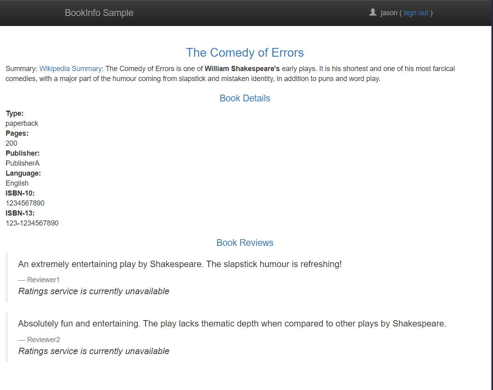

# Fault Injection

本部分主要对Istio的Fault Injection功能开展实验。

在进行实验之前，需做如下准备：

+ 安装Istio
+ 部署演示微服务程序Bookinfo，参考[此部分](bookinfo_example.md)
+ 查看Istio traffic management部分，参考[此处](../Istio_concepts/Istio_traffic_management.md)
+ 对Bookinfo部署应用如下流量配置
  
  ```
  kubectl apply -f samples/bookinfo/networking/virtual-service-all-v1.yaml
  kubectl apply -f samples/bookinfo/networking/virtual-service-reviews-test-v2.yaml
  ```

  应用上述流量配置后，用户请求流量如下：
  + productpage->reviews:v2->ratings (only for user jason)
  + productpage->reviews:v1 (for everyone else)

## Injecting an HTTP delay fault

本次实验是在reviews:v2以及ratings之间插入7s的延时，使用这种方式可探测到系统中的一个内部BUG

实验前已知信息是，reviews:v2在调用ratings时允许的延时为10s的硬编码连接超时，按照该已知信息，得到一个预期结果：即使在reviews:v2以及ratings之间插入7s延时也不影响整体应用的调用流程。

实验步骤如下：

1. 将7s延迟引入到ratings virtual services中
   
   ```
   kubectl apply -f samples/bookinfo/networking/virtual-service-ratings-test-delay.yaml
   ```

2. 确认规则生效
   
   ```
   kubectl get virtualservices.networking.istio.io ratings -o yaml
   ......
   spec:
     hosts:
     - ratings
     http:
     - fault:
         delay:
           fixedDelay: 7s
           percentage:
             value: 100
       match:
       - headers:
           end-user:
             exact: jason
       route:
       - destination:
           host: ratings
           subset: v1
     - route:
       - destination:
           host: ratings
           subset: v1 
   ```

### Testing the delay configuration

1. 通过浏览器访问bookinfo应用
   
   

2. 使用用户jason登录，持续一段时间后才刷新用户登录后页面
   
   

3. 使用chrome浏览器开发者工具，查看页面响应时间，可发现在6s后，应用才开始加载
   
   

### Understanding what happened

上述实验结果跟预期不符，说明该应用存在其他的隐形timeout设置，该timeout设置在productpage与reviews之间，被设置为在6s内隔3s进行一个重试，由于reviews与rating之间存在7s延迟，因此导致productpage与reviews之间超时，页面显示错误信息。

#### 一个思考

Bugs like this can occur in typical enterprise applications where different teams develop different microservices independently. Istio’s fault injection rules help you identify such anomalies without impacting end users.

## Injecting an HTTP abort fault

另外一种测试微服务可靠性的方式是引入一个HTTP abort fault，本次实验将针对用户jason调用链中的ratings微服务引入一个HTTP abort，为实验明显，本次引入的HTTP abort fault为100%，也即每次均引入一个HTTP abort fault。

1. 应用如下HTTP abort fault配置,samples/bookinfo/networking/virtual-service-ratings-test-abort.yaml
   
   ```yaml
   apiVersion: networking.istio.io/v1alpha3
   kind: VirtualService
   metadata:
     name: ratings
   spec:
     hosts:
     - ratings
     http:
     - match:
       - headers:
           end-user:
             exact: jason
       fault:
         abort:
           percentage:
             value: 100.0
           httpStatus: 500
       route:
       - destination:
           host: ratings
           subset: v1
     - route:
       - destination:
           host: ratings
           subset: v1
   ```

   ```
   kubectl apply -f samples/bookinfo/networking/virtual-service-ratings-test-abort.yaml
   ```

2. 确认配置生效
   
   ```
   kubectl get virtualservices.networking.istio.io ratings -o yaml
   ......
   spec:
     hosts:
     - ratings
     http:
     - fault:
         abort:
           httpStatus: 500
           percentage:
             value: 100
       match:
       - headers:
           end-user:
             exact: jason
       route:
       - destination:
           host: ratings
           subset: v1
     - route:
       - destination:
           host: ratings
           subset: v1
   ```

### Testing the abort configuration

1. 浏览器中打开bookinfo测试应用
   


2. 使用用户jason登录
   


可以发现，对于用户jason而言，其reviews:v2的微服务无法成功调用ratings微服务，导致页面直接报错`Ratings service is currently unavailable`
