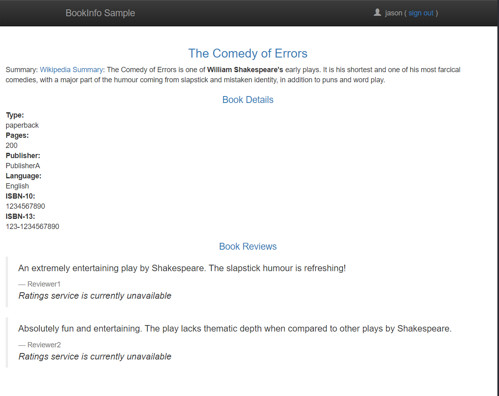

# Traffic Shifting

本部分将对Istio提供的流量迁移功能进行实验，在实验前应做如下准备：

+ 部署Istio
+ 部署测试范例bookinfo
+ 部署流量配置文件virtual-service-all-v1.yaml，该配置将流量导向微服务的各v1版本组件
+ 部署destination rules

## Apply weight-based routing

1. 部署如下流量配置virtual-service-reviews-50-v3.yaml
   
   ```yaml
   apiVersion: networking.istio.io/v1alpha3
   kind: VirtualService
   metadata:
     name: reviews
   spec:
     hosts:
       - reviews
     http:
     - route:
       - destination:
           host: reviews
           subset: v1
         weight: 50
       - destination:
           host: reviews
           subset: v3
         weight: 50
   ```

2. 检查配置是否生效
   
   ```
   kubectl get virtualservices.networking.istio.io reviews -o yaml
   ......
   spec:
     hosts:
     - reviews
     http:
     - route:
       - destination:
           host: reviews
           subset: v1
         weight: 50
       - destination:
           host: reviews
           subset: v3
         weight: 50
   ```

## Testing traffic shifting

1. 使用浏览器访问bookinfo
   
   

2. 刷新浏览器，可发现有红星没红星的50%机会出现
   
   

## Understanding what happened

In this task you migrated traffic from an old to new version of the reviews service using Istio’s weighted routing feature. Note that this is very different than doing version migration using the deployment features of container orchestration platforms, which use instance scaling to manage the traffic.

With Istio, you can allow the two versions of the reviews service to scale up and down independently, without affecting the traffic distribution between them.
