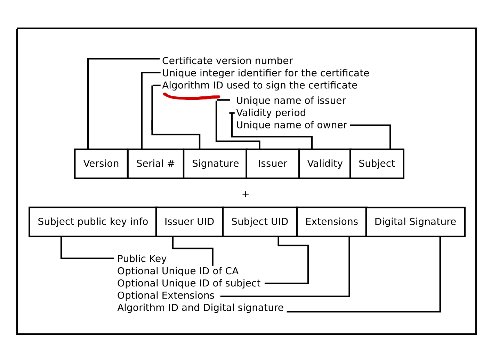
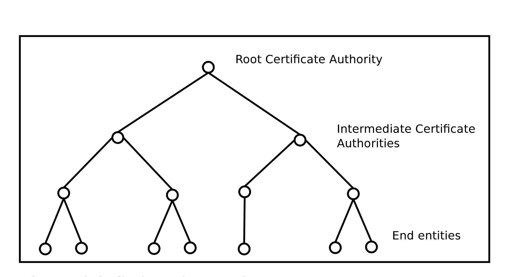
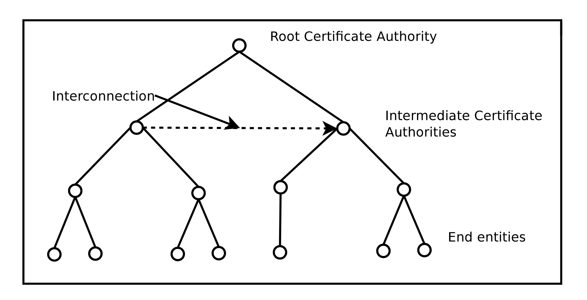

# Public key Infrastructure 公钥基础设施

- [Public key Infrastructure 公钥基础设施](#public-key-infrastructure-%e5%85%ac%e9%92%a5%e5%9f%ba%e7%a1%80%e8%ae%be%e6%96%bd)
  - [PKI定义](#pki%e5%ae%9a%e4%b9%89)
    - [PKI需要解决的问题](#pki%e9%9c%80%e8%a6%81%e8%a7%a3%e5%86%b3%e7%9a%84%e9%97%ae%e9%a2%98)
    - [PKI的优势](#pki%e7%9a%84%e4%bc%98%e5%8a%bf)
  - [PKI 核心服务](#pki-%e6%a0%b8%e5%bf%83%e6%9c%8d%e5%8a%a1)
    - [Authentication](#authentication)
      - [Entity Identification](#entity-identification)
      - [Data Origin Authentication](#data-origin-authentication)
    - [Integrity](#integrity)
    - [Confidentiality 机密性](#confidentiality-%e6%9c%ba%e5%af%86%e6%80%a7)
      - [key establishment](#key-establishment)
      - [key management](#key-management)
  - [PKI提供的其他服务](#pki%e6%8f%90%e4%be%9b%e7%9a%84%e5%85%b6%e4%bb%96%e6%9c%8d%e5%8a%a1)
    - [Secure timestamps](#secure-timestamps)
    - [Notarization公证](#notarization%e5%85%ac%e8%af%81)
    - [Non repudiation 不可抵赖](#non-repudiation-%e4%b8%8d%e5%8f%af%e6%8a%b5%e8%b5%96)
  - [Certificates](#certificates)
    - [证书的用途及CA的定义](#%e8%af%81%e4%b9%a6%e7%9a%84%e7%94%a8%e9%80%94%e5%8f%8aca%e7%9a%84%e5%ae%9a%e4%b9%89)
    - [证书存储信息](#%e8%af%81%e4%b9%a6%e5%ad%98%e5%82%a8%e4%bf%a1%e6%81%af)
    - [证书分类](#%e8%af%81%e4%b9%a6%e5%88%86%e7%b1%bb)
      - [X.509 证书格式](#x509-%e8%af%81%e4%b9%a6%e6%a0%bc%e5%bc%8f)
    - [证书生命周期](#%e8%af%81%e4%b9%a6%e7%94%9f%e5%91%bd%e5%91%a8%e6%9c%9f)
      - [Certificate Initialization](#certificate-initialization)
        - [RA定义](#ra%e5%ae%9a%e4%b9%89)
      - [Certificate Issuance](#certificate-issuance)
      - [Certificate Cancellation](#certificate-cancellation)
      - [Certificate Distribution](#certificate-distribution)
        - [Certificate Trust Models](#certificate-trust-models)
    - [VA定义](#va%e5%ae%9a%e4%b9%89)

## PKI定义

PKI是用于创建、管理、分发、使用、存储及撤销数字证书以及管理公钥加密的一组角色、策略、硬件、软件及过程的集合；

PKI的目的在于促进各种网络活动，如电子商务、网络银行以及加密电子邮件的电子信息安全传输。在简单密码已经无法满足认证需求，且需要更加严格的身份证明及传输信息验证情况下，PKI是必须的。

> 论文 An overview of Public Key Infrastructure中PKI定义：  
> *Public Key Infrastructure is a comprehensive system for generating, managing and distributing keys used in public key cryptography*  

### PKI需要解决的问题

按照PKI的定义，PKI针对的是公钥加密中的密钥生成、管理及分发需求，非对称加密算法避免了传统对称加密算法中对称密钥交换过程中问题。
> An overview of Public Key Infrastructure中描述对称加密算法的问题：  
> 1. How can the secret keys be exchanged between two entities spanned across geographic locations
> 2. How is a trust medium established in this case where the intended recipient might be previously unknow to the sender
> 3. scaling also becomes a problem here due to secretive nature of the encryption keys.

但公钥加密中仍然存在一个问题：如何相信某一公钥确实属于对应的实体。PKI就是要解决这些问题。

### PKI的优势

一个设计良好的PKI有如下优势：

1. Reduce maintenance overhead of multiple security solutions compared to a single point of administration of PKI
2. Reduce security complexity for end users by providing a single password or passphrase that transparently works across all other applications in the infrastructure rather than unique and error prone multiple security solutions
3. Optimize work flow and productivity
4. Reduce end user security requirements

## PKI 核心服务

PKI提供的核心服务——`Authentication`, `integrity`, `confidentiality`  

### Authentication

anthentication可进一步划分为两类：`entity identification`与`data origin authentication`

#### Entity Identification 

实体鉴别，**整个安全模型中最为重要的第一步**。验证某一实体的真假。

实体鉴别有两种方式：本地鉴别，远程鉴别

**本地鉴别：** 此时无需PKI

**远程鉴别：** 此时可使用PKI传输本地验证证明，比如较为典型的remote authentication技术——challenge-response protocols：

  

Alice发送challenge message给Bob，Bob使用其私钥进行加密然后将加密后的信息返回给Alice，Alice再使用Bob的公钥解密，如果可以成功解密则说明Bob身份正确。

上述条件基于的原则：
1. 非对称加密中私钥公钥一一对应，只有对应的密钥对才可互相加解密；
2. 在不泄露私钥的情况下，Bob的私钥只有本人才拥有；

#### Data Origin Authentication 

原始数据认证，验证原始数据的正确性。

> 论文An overview of Public Key Infrastructure中对于Data origin authentication的描述“verify authenticity of the origin of a specific piece of data”  

authentication作为PKI的核心服务的需求在于，只要某人/某实体经过认证后，其安全信息可以被整个系统传输使用。

### Integrity

完整性校验的目的在于确保数据传输过程中不会发生篡改。

常用的数据完整性校验方式有`CRC`(Cyclic Redundancy Checks)，`MAC`(Message Authentication Code)  

MAC是一种加盐Hash函数，在传输MAC加密密钥时可利用非对称加密进行传输。

  

1. Alice使用一个未使用过的对称加密密钥生成MAC；
2. Alice使用Bob的公钥加密对称密钥；
3. Alice将MAC与数据发送至Bob；
4. Bob使用私钥解密对称加密密钥；
5. Bob使用对称加密密钥独立计算MAC，完成数据完整性校验；

### Confidentiality 机密性

Confidentiality用于保证数据的隐私，更为准确的来说，数据的隐私通过两方面保证`encrypting data`和`securing its encryption key`。这两点也是`key establishment`和`key management`关注点。

#### key establishment

包括`authentication protocol`, `key establishment protocol`, `authenticated key establishment protocol`三部分。

**authentication protocol:** 用于两实体间的鉴别

**key establishment protocol and authenticated key establishment protocol:** 用于建立密钥

#### key management

分发建立的密钥

## PKI提供的其他服务

### Secure timestamps

为网络传输的特定数据提供时间线，可被用于确保由于窃听导致的数据传输时延，从而避免窃听。时间戳的验证方式如下例：

1. A initial timestamp is obtained from the clock of the host machine(to whatever accuracy is necessary)
2. This timestamp is attached to the outgoing message
3. The receiving entity upon getting this message calculates the difference between its time and the time the message was originally sent.
4. If the difference is above or less than a preset or acceptable threshold the message is invalidated.

使用secure timestamps时需要保证，各机器的时钟同步于一个时间（GPS clock or any other precise time system）

### Notarization公证

如同现实法律中的公证服务，在PKI系统中，notary认证某一数据是正确的。有两个内涵：

1. The notary service offered by a PKI system is trusted by other entities to verify the correctness of data.
2. This service relies on the PKI service of authentication and secure timestamping

### Non repudiation 不可抵赖

PKI保证任何实体不可拒绝某一行为不是其本人所谓

> Non repudiation is a terminology used in PKI to ensure that entites cannot deny that certain actions were not performed by them.

## Certificates

证书是PKI的核心组件，用于发布实体相关的信息，从本质上来说，**证书发布的是公钥相关的信息**

> Certificates are a core component of the PKI system and used to publish information about an entity. Basically, they publish information about public key valuess

**PKI的一个理想的特性：实体/用户的可公开信息是适合公开的**
> One of the ideal features of a PKI system is that the public information about an entity/person is publicly available.

但在公开相关信息时也面临风险，这些公开信息需要被保护，完整性需要校验以防篡改。**证书保证了公开信息的`data integrity`与`ownership`**。

### 证书的用途及CA的定义

证书即被用来将公钥与某一实体进行绑定

> A certificate is used to bind the public key associated with an entity's name  

证书某些时候也被称为`Public Key Certificate`

> A certificate also known as a *Public Key Certificate* is a entity that identifies the identity of the individual and a corresponding public key

公钥与证书绑定过程这一关系的确认是通过可信的`authority`进行的

> A public key is associated with an individual by using a certificate issued by a **trusting** `authority`

**上述情况中的一个被大多数人信任的authority被称为`Certificate Authority`， CA起着将公钥绑定至某一实体的操作**

> A authority that is trusted by a majority of the population is called *Certificate Authority*  
> The certifate authority performs the function or operation of binding a public key pair to a identity

存储证书的仓库被称为`Certificate Repository (CR)`，同样由CA进行维护

> A online repository where numerous amounts of freely available public key certificates can be stored is called as a `Certificate Repository`. It is maintained by the certificate authority  

### 证书存储信息

证书包含的典型信息包含四个部分：

+ Information about user
+ Information about the certificate authority which issued this certificate
+ Public key associated with the user's public/private key pair
+ Encryption algorithms used in the certificate
+ Validity, revocation status etc

### 证书分类

总的来说证书分为2类

+ Identity certificates
  + identity an entity called the *certificate subject*(证书主题) and list the public key associated with that entity
+ Credential certificates
  + other information such as permissions or credentials。

从证书格式来分可分为5类

+ X.509 public key certificates
+ Simple public key infrastructure certificates
+ Pretty good privacy (PGP) certificates
+ Attribute certificates

#### X.509 证书格式

一些域的含义

+ Serial Number
  + a unique identifier for every certificate
+ Signature
  + indicates the algorithm identifier used to calculate the digital signature
+ Issuer 
  + Distinguished Name of the certificate authority that issued the certificate
+ Subject
  + owner
+ Extensions
  + optional and private

### 证书生命周期

如同身份证和护照一样，证书信息同样存在过期的概念。这就牵涉到证书的生命周期了。
**证书的生命周期管理是任何提供PKI的安全系统的核心和强制性功能。**

证书的生命周期包括*initialization, issuance and cancellation*

#### Certificate Initialization

证书的初始化经历步骤如下：

1. registration process
   + 任何想使用PKI服务的entity必须将其自己注册至一个authority中
   > the autority here is an another entity which offers services such as certificate authorizations or registration authorizations
   + registration process将password或者pin码等secret key在authority与end user entity间共享
   > this secret key后续将被使用来辨别end user entity的真实性
2. generation of a private-public key pair
   + 从安全角度考虑，不同的服务最好使用不用的公钥私钥对
   + 公钥私钥对生成位置也是重点考虑的一环
   > 为避免抵赖，最好由受信任的源比如CA或者RA来生成
3. CA add key to a certificate

##### RA定义

PKI中扮演确保注册有效及正确角色的叫做` registration authority`（RA）。RA负责接收数字证书申请并对发起请求的实体进行认证。在微软的PKI中，RA通常被称为subordinate CA.

#### Certificate Issuance

证书发布

#### Certificate Cancellation

证书注销，当证书超出有效期后，该证书被注销

#### Certificate Distribution

在证书可被用来建立不同entities之间的信赖关系前，证书需要经过网络来进行分发，证书分发技术有下面几种：

+ Point to point delivery
  + not very reliable 
  + only work for very small or limited systems
  + over a reliable and secure channel
  + 典型技术*Pretty Good Privacy*和*OpenPGP*
+ Direct access using an online server
  + a central server provides certificates
  + **Upon request with the necessary cerdentials the public key of that entity if available is delivered**
  + over a secure or an unsecure channel
  + 典型技术*Lightweight Directory Access Protocol (LDAP)* and *File Transfer Protocol (FTP)*
+ Using systems which implicity guarantee authenticity of public information

##### Certificate Trust Models

证书可信性模型解决的问题:  
**which certificates can be trusted, how that trust is established and under what circumstances this trust can be limited or controlled**

X.509对可信性的定义：

*An entity can be said to trust a second entity when the first entity makes the assumption that the second entity will behave exactly as the first entity expects*

上述可信性定义未对可信性进行量化，无法测量，总是包含风险。

可信性模型对PKI十分重要，它规定了可信从哪开始到哪结束。PKI的可信性模型有下面几类：

+ Srict hierarchical configuration
  + 
  + The public key of the root CA is held by all other intermedia nodes as well as the end entited
  + The Root entity defines zero or more entities below it and every other entity has a copy of the public key of its leaf node
  + The trust relationship in this model flows downwards (**always flows downwards**)
+ Policy based hierarchical
  + In hierarchical model there is usually one root and this is the policy enforced by all its successive nodes
  + multiple roots to enfore multiple polices
  + In policy based hierachies, a CA may belong to mode than one hierachy
+ Distributed hierarchical
  + 
  + the trust is distributed between multiple certificate authorities in the *same level*
  + called the cross certification model
+ Mesh configuration
  + each CA can cross certify each other
+ Hub(中心) and spoke(轮辐) configuration
  + each CA cross certifies with a single central CA
  + central CA's purpose is to facilitate such actions
+ Web hierarchical
  + certificactes are pre-installed on modern web browsers
  + the cerificates act as the initial trust certificates authorities

### VA定义

在一个CA域内，基于各自的实体信息，各实体是唯一可识别的。第三方的VA`validation authority`可以代表CA提供该实体信息。

