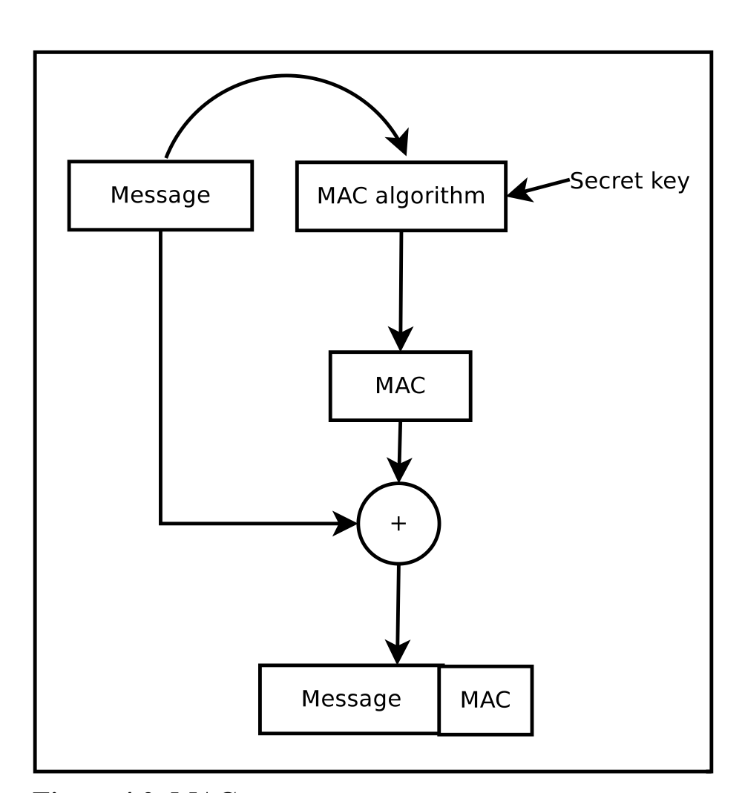

# Public key Infrastructure 公钥基础设施

- [Public key Infrastructure 公钥基础设施](#public-key-infrastructure-%e5%85%ac%e9%92%a5%e5%9f%ba%e7%a1%80%e8%ae%be%e6%96%bd)
  - [PKI定义](#pki%e5%ae%9a%e4%b9%89)
    - [PKI需要解决的问题](#pki%e9%9c%80%e8%a6%81%e8%a7%a3%e5%86%b3%e7%9a%84%e9%97%ae%e9%a2%98)
    - [PKI的优势](#pki%e7%9a%84%e4%bc%98%e5%8a%bf)
    - [PKI 核心服务](#pki-%e6%a0%b8%e5%bf%83%e6%9c%8d%e5%8a%a1)
      - [Authentication](#authentication)
        - [Entity Identification](#entity-identification)
        - [Data Origin Authentication](#data-origin-authentication)
      - [Integrity](#integrity)
      - [Confidentiality 机密性](#confidentiality-%e6%9c%ba%e5%af%86%e6%80%a7)
        - [key establishment](#key-establishment)
        - [key management](#key-management)
    - [PKI提供的其他服务](#pki%e6%8f%90%e4%be%9b%e7%9a%84%e5%85%b6%e4%bb%96%e6%9c%8d%e5%8a%a1)
    - [RA定义](#ra%e5%ae%9a%e4%b9%89)
    - [VA定义](#va%e5%ae%9a%e4%b9%89)
    - [数字证书](#%e6%95%b0%e5%ad%97%e8%af%81%e4%b9%a6)

## PKI定义

PKI是用于创建、管理、分发、使用、存储及撤销数字证书以及管理公钥加密的一组角色、策略、硬件、软件及过程的集合；

PKI的目的在于促进各种网络活动，如电子商务、网络银行以及加密电子邮件的电子信息安全传输。在简单密码已经无法满足认证需求，且需要更加严格的身份证明及传输信息验证情况下，PKI是必须的。

> 论文 An overview of Public Key Infrastructure中PKI定义：  
> *Public Key Infrastructure is a comprehensive system for generating, managing and distributing keys used in public key cryptography*  

### PKI需要解决的问题

按照PKI的定义，PKI针对的是公钥加密中的密钥生成、管理及分发需求，非对称加密算法避免了传统对称加密算法中对称密钥交换过程中问题。
> An overview of Public Key Infrastructure中描述对称加密算法的问题：  
> 1. How can the secret keys be exchanged between two entities spanned across geographic locations
> 2. How is a trust medium established in this case where the intended recipient might be previously unknow to the sender
> 3. scaling also becomes a problem here due to secretive nature of the encryption keys.

但公钥加密中仍然存在一个问题：如何相信某一公钥确实属于对应的实体。PKI就是要解决这些问题。

### PKI的优势

一个设计良好的PKI有如下优势：

1. Reduce maintenance overhead of multiple security solutions compared to a single point of administration of PKI
2. Reduce security complexity for end users by providing a single password or passphrase that transparently works across all other applications in the infrastructure rather than unique and error prone multiple security solutions
3. Optimize work flow and productivity
4. Reduce end user security requirements

### PKI 核心服务

PKI提供的核心服务——`Authentication`, `integrity`, `confidentiality`  

#### Authentication

anthentication可进一步划分为两类：`entity identification`与`data origin authentication`

##### Entity Identification 

实体鉴别，**整个安全模型中最为重要的第一步**。验证某一实体的真假。

实体鉴别有两种方式：本地鉴别，远程鉴别

**本地鉴别：** 此时无需PKI

**远程鉴别：** 此时可使用PKI传输本地验证证明，比如较为典型的remote authentication技术——challenge-response protocols：

  

Alice发送challenge message给Bob，Bob使用其私钥进行加密然后将加密后的信息返回给Alice，Alice再使用Bob的公钥解密，如果可以成功解密则说明Bob身份正确。

上述条件基于的原则：
1. 非对称加密中私钥公钥一一对应，只有对应的密钥对才可互相加解密；
2. 在不泄露私钥的情况下，Bob的私钥只有本人才拥有；

##### Data Origin Authentication 

原始数据认证，验证原始数据的正确性。

> 论文An overview of Public Key Infrastructure中对于Data origin authentication的描述“verify authenticity of the origin of a specific piece of data”  

authentication作为PKI的核心服务的需求在于，只要某人/某实体经过认证后，其安全信息可以被整个系统传输使用。

#### Integrity

完整性校验的目的在于确保数据传输过程中不会发生篡改。

常用的数据完整性校验方式有`CRC`(Cyclic Redundancy Checks)，`MAC`(Message Authentication Code)  

MAC是一种加盐Hash函数，在传输MAC加密密钥时可利用非对称加密进行传输。

  

1. Alice使用一个未使用过的对称加密密钥生成MAC；
2. Alice使用Bob的公钥加密对称密钥；
3. Alice将MAC与数据发送至Bob；
4. Bob使用私钥解密对称加密密钥；
5. Bob使用对称加密密钥独立计算MAC，完成数据完整性校验；

#### Confidentiality 机密性

Confidentiality用于保证数据的隐私，更为准确的来说，数据的隐私通过两方面保证`encrypting data`和`securing its encryption key`。这两点也是`key establishment`和`key management`关注点。

##### key establishment

包括`authentication protocol`, `key establishment protocol`, `authenticated key establishment protocol`三部分。

**authentication protocol:** 用于两实体间的鉴别

**key establishment protocol and authenticated key establishment protocol:** 用于建立密钥

##### key management

分发建立的密钥

### PKI提供的其他服务

### RA定义

PKI中扮演确保注册有效及正确角色的叫做` registration authority`（RA）。RA负责接收数字证书申请并对发起请求的实体进行认证。在微软的PKI中，RA通常被称为subordinate CA.

### VA定义

在一个CA域内，基于各自的实体信息，各实体是唯一可识别的。第三方的VA`validation authority`可以代表CA提供该实体信息。

### 数字证书

X.509标准是目前应用最广泛的数字证书格式标准

