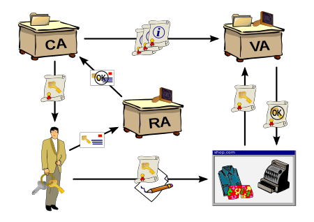

# Public key Infrastructure 公钥基础设施

- [Public key Infrastructure 公钥基础设施](#public-key-infrastructure-%e5%85%ac%e9%92%a5%e5%9f%ba%e7%a1%80%e8%ae%be%e6%96%bd)
  - [PKI定义](#pki%e5%ae%9a%e4%b9%89)
    - [RA定义](#ra%e5%ae%9a%e4%b9%89)
    - [VA定义](#va%e5%ae%9a%e4%b9%89)
    - [数字证书](#%e6%95%b0%e5%ad%97%e8%af%81%e4%b9%a6)

## PKI定义

PKI是用于创建、管理、分发、使用、存储及撤销数字证书以及管理公钥加密的一组角色、策略、硬件、软件及过程的集合；

PKI的目的在于促进各种网络活动，如电子商务、网络银行以及加密电子邮件的电子信息安全传输。在简单密码已经无法满足认证需求，且需要更加严格的身份证明及传输信息验证情况下，PKI是必须的。

在密码学中，PKI指的是将公钥与各实体（`entities`，如组织、个人）绑定的一种编排。这种绑定关系通过向CA注册证书以及由CA管理的证书发布过程建立。根据绑定关系不同的确认级别，上述过程通过自动化过程或在人工监视的情况下进行。

### RA定义

PKI中扮演确保注册有效及正确角色的叫做` registration authority`（RA）。RA负责接收数字证书申请并对发起请求的实体进行认证。在微软的PKI中，RA通常被称为subordinate CA.

### VA定义

在一个CA域内，基于各自的实体信息，各实体是唯一可识别的。第三方的VA`validation authority`可以代表CA提供该实体信息。

### 数字证书

X.509标准是目前应用最广泛的数字证书格式标准
