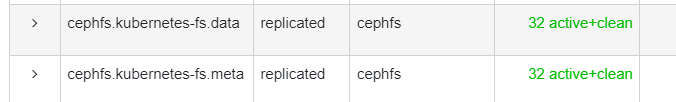
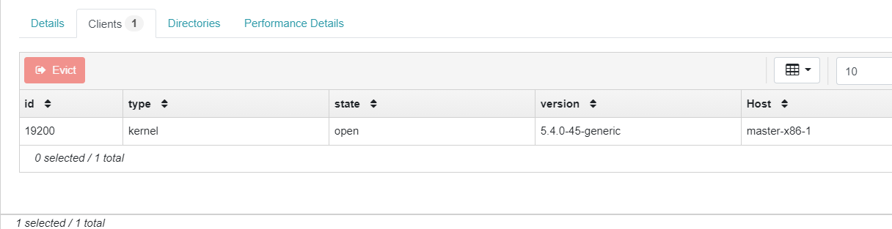

- [Install Ceph Use Cephadm](#install-ceph-use-cephadm)
    - [Environment](#environment)
  - [Procedure](#procedure)
    - [INSTALL CEPHADM](#install-cephadm)
    - [BOOTSTRAP A NEW CLUSTER](#bootstrap-a-new-cluster)
      - [USE CEPH CLI](#use-ceph-cli)
    - [ADD HOSTS TO THE CLUSTER](#add-hosts-to-the-cluster)
    - [DEPLOY ADDTIONAL MONITORS](#deploy-addtional-monitors)
      - [Set monitor numbers](#set-monitor-numbers)
      - [Use node label](#use-node-label)
      - [Manual depoly mon](#manual-depoly-mon)
    - [DEPLOY OSDS](#deploy-osds)
    - [DEPLOY ADDTIONAL MGR](#deploy-addtional-mgr)
      - [USE CEPH DASHBOARD](#use-ceph-dashboard)
    - [CEPH UPGRADE](#ceph-upgrade)
      - [存在的问题](#存在的问题)
  - [CEPH ORCH USAGE](#ceph-orch-usage)
  - [TEST](#test)
    - [CEPH FS TEST](#ceph-fs-test)
      - [CEPH CLUSTER OPERATIONS](#ceph-cluster-operations)
      - [CEPH CLIENT OPERATIONS](#ceph-client-operations)
    - [CEPH NFS TEST](#ceph-nfs-test)
      - [Procedure](#procedure-1)
    - [RBD Test](#rbd-test)
      - [可能存在的bug](#可能存在的bug)

# Install Ceph Use Cephadm

Cephadm通过使用容器技术与systemd，实现ceph集群的部署，在octopus版本后，ceph-depoly工具不再被官方支持，cephadm成为官方指定的部署工具，Cephadm具有下述特性

+ 仅支持Octopus版本以及其后版本的部署
+ cephadm完全使用新的orchestration API并支持全新的CLI与dashboard特性
+ cephadm使用podman或docker，因此需要节点上部署podman或docker

Cephadm使用的容器镜像为`docker.io/ceph/ceph:v15`，本次部署过程中已将其推送到本地镜像库`lxyustc.registrydomain.com:5000/ceph/ceph:v15`

ceph orch为cephadm前端，

### Environment

本次部署基本环境如下：

| hostname | IP | OS | lvm configure |
|:---:|:---:|:---:|:---:|
|worker-amd64-gpuceph-node1|10.10.197.200|Ubuntu 20.04 Server|ubuntu-vg/ceph-volume-1 100G </br> ubuntu-vg/ceph-volume-2 100G </br> ubuntu-vg/ceph-volume-3 100G </br> ubuntu-vg/ceph-volume-4 100G </br> ubuntu-vg/ceph-volume-5 100G </br> ubuntu-vg/ceph-volume-6 100G |
|worker-amd64-gpuceph-node2|10.10.197.201|Ubuntu 20.04 Server|ubuntu-vg/ceph-volume-1 100G </br> ubuntu-vg/ceph-volume-2 100G </br> ubuntu-vg/ceph-volume-3 100G </br> ubuntu-vg/ceph-volume-4 100G </br> ubuntu-vg/ceph-volume-5 100G </br> ubuntu-vg/ceph-volume-6 100G |
|worker-amd64-gpuceph-node3|10.10.197.202|Ubuntu 20.04 Server|ubuntu-vg/ceph-volume-1 100G </br> ubuntu-vg/ceph-volume-2 100G </br> ubuntu-vg/ceph-volume-3 100G </br> ubuntu-vg/ceph-volume-4 100G </br> ubuntu-vg/ceph-volume-5 100G </br> ubuntu-vg/ceph-volume-6 100G |
|woker-amd64-1|10.10.197.95|Ubuntu 20.04 Server|ubuntu-vg/ceph-volume-1 40G</br>ubuntu-vg/ceph-volume-2 40G</br>ubuntu-vg/ceph-volume-3 40G|

## Procedure

### INSTALL CEPHADM

1. 获取cephadm执行脚本，在此步骤时即可使用cephadm，**cephadm需要使用root权限运行**
   
   ```
   $ curl --silent --remote-name --location https://github.com/ceph/ceph/raw/octopus/src/cephadm/cephadm
   $ sudo chmod +x cephadm
   ```

2. （Ubuntu系统下不建议）安装cephadm，在Ubuntu 20.04系统下，cephadm add-repo会添加cephadm仓库的gpg认证密钥，此时会扰乱ubuntu仓库正常的密钥使用
   
   ```
   $ sudo ./cephadm add-repo --release octopus
   $ ./cephadm install
   ```

### BOOTSTRAP A NEW CLUSTER

1. 在woker-amd64-gpuceph-node1上运行命令：
   
   ```
   $ sudo mkdir -p /etc/ceph
   $ sudo ./cephadm --docker --image  lxyustc.registrydomain.com:5000/ceph/ceph:v15 bootstrap --mon-ip 10.10.197.200
   ```

上述命令执行如下效果：

+ 在worker-amd64-gpuceph-node1上创建monitor(`mon`)和manager daemon(`mgr`)
+ 产生访问ceph cluster的ssh key，并添加至`/root/.ssh/authorized_keys`文件中
+ 产生一个最小的访问集群的配置文件，路径为`/etc/ceph/ceph.conf`
+ 将client.admin的密钥写入`/etc/ceph/ceph.client.admin.keyring`文件下
+ 在`/etc/ceph/ceph.pub`中写入密钥的公钥，与`/root/.ssh/authorized_keys`中一致

关于cephadm bootstrap，可使用cephadm bootstrap -h进一步了解可选项。

#### USE CEPH CLI

cephadm通过使用容器，可直接在容器中使用ceph相关命令。默认情况下，位于文件夹`/etc/ceph`下的配置文件与密钥文件作为环境变量自动加载。但若在mon节点上运行cephadm shell，则容器将从mon容器中获取集群配置与密钥文件

### ADD HOSTS TO THE CLUSTER

> **该部分命令在cephadm shell中执行**

1. 分发集群访问公钥至待添加的节点，由于cephadm bootstrap使用默认配置，因此用户均为root
   
   ```
   # ssh-copy-id -f -i /etc/ceph/ceph.pub root@worker-amd64-gpuceph-node2 
   # ssh-copy-id -f -i /etc/ceph/ceph.pub root@worker-amd64-gpuceph-node3
   ```

2. 将节点添加至集群中，**在Ubuntu 20.04中，此处ceph orch host add运行时添加host IP地址，否则出现bug，无法连接目标host导致添加失败**
   
   ```
   # ceph orch host add worker-amd64-gpuceph-node2 10.10.197.201
   # ceph orch host add worker-amd64-gpuceph-node3 10.10.197.202
   # ceph orch host add worker-amd64-1 10.10.197.95
   ```

### DEPLOY ADDTIONAL MONITORS

> **该部分命令在ceph shell中执行**

基本的添加monitor的命令为ceph orch apply mon &lt;host1,host2,host3...&gt;其他几种方式也有

#### Set monitor numbers

使用如下命令可在集群中部署特定数量的monitors

```
# ceph orch apply mon <number-of-monitors>
```

#### Use node label

可通过node label方式在指定node集合上部署monitors

1. 设置node label
   
   ```
   # ceph orch host label add worker-amd64-gpuceph-node1 mon
   # ceph orch host label add worker-amd64-gpuceph-node2 mon
   # ceph orch host label add worker-amd64-gpuceph-node3 mon
   ```

2. 使用命令在具有mon label的节点上部署mon
   
   ```
   # ceph orch apply mon label:mon
   ```


#### Manual depoly mon

此处的Manual非手动在节点上部署，而是同样采用cephadm，但不使用cephadm的自动部署机制，手动指定mon的IP或子网

1. 禁用mon自动部署
   
   ```
   # ceph orch apply mon --unmanaged
   ```

2. 部署mon
   
   ```
   # ceph orch daemon add mon worker-amd64-gpuceph-node1:10.10.197.200
   # ceph orch daemon add mon worker-amd64-gpuceph-node2:10.10.196.0/23
   ```

### DEPLOY OSDS

当前版本15.2.4下cephadm部署osd时只支持无分区、无LVM配置、无挂载、无文件系统、无ceph bluestore osd、大小大于5GB的磁盘设备，因此在当前环境下，需手动配置ceph osd。已worker-amd64-cephgpu-node1为例。

> **本部分指令执行在宿主机环境而非容器中**

1. 安装ceph-osd软件包
   
   ```
   $ sudo apt install ceph-osd
   ```

2. 检查`/etc/ceph`文件夹下是否存在ceph.conf, ceph.pub, ceph.client.admin.keyring文件，若不存在，从bootstrap节点中将上述文件拷贝至当前节点
3. 在文件夹`/var/lib/ceph/bootstrap-osd`中检查bootstrap osd认证文件是否存在，若不存在执行如下命令，查找client.bootstrap-osd的认证key信息
   
   ```
   # ceph auth list 
   ...
   client.bootstrap-osd
        key: AQBUVlhfIuuwLRAAWha9ww8pgJovgrIJXFhKag==
        caps: [mon] allow profile bootstrap-osd
   ...
   ```

4. 在文件夹`/var/lib/ceph/bootstrap-osd`创建文件ceph.keyring，内容如下
   
   ```
   [client.bootstrap-osd]
   key = AQBUVlhfIuuwLRAAWha9ww8pgJovgrIJXFhKag==
   ```

5. 依次准备ceph osd
   
   ```
   # ceph-volume lvm prepare --bluestore --data ubuntu-vg/ceph-volume-1
   # ceph-volume lvm prepare --bluestore --data ubuntu-vg/ceph-volume-2
   # ceph-volume lvm prepare --bluestore --data ubuntu-vg/ceph-volume-3
   # ceph-volume lvm prepare --bluestore --data ubuntu-vg/ceph-volume-4
   # ceph-volume lvm prepare --bluestore --data ubuntu-vg/ceph-volume-5
   # ceph-volume lvm prepare --bluestore --data ubuntu-vg/ceph-volume-6
   ```

6. 查看此时ceph osd准备情况，确认osd准备完成
   
   ```
   # ceph-volume lvm list
   

   ====== osd.0 =======

     [block]       /dev/ubuntu-vg/ceph-volume-1

         block device              /dev/ubuntu-vg/ceph-volume-1
         block uuid                ZrDjBK-NnX7-RcII-510C-LBOb-Hhje-Doc0Za
         cephx lockbox secret
         cluster fsid              bc1f0b56-f252-11ea-8930-a9753a839177
         cluster name              ceph
         crush device class        None
         encrypted                 0
         osd fsid                  28ac0671-b3fe-42c9-8bd6-f871305893c0
         osd id                    0
         osdspec affinity
         type                      block
         vdo                       0
         devices                   /dev/sda3

   ====== osd.1 =======

     [block]       /dev/ubuntu-vg/ceph-volume-2

         block device              /dev/ubuntu-vg/ceph-volume-2
         block uuid                eV0cg7-TaS7-ywij-ekRU-xRq5-gQ8Y-8E5fp9
         cephx lockbox secret
         cluster fsid              bc1f0b56-f252-11ea-8930-a9753a839177
         cluster name              ceph
         crush device class        None
         encrypted                 0
         osd fsid                  875f4381-fb3d-4758-ae17-15b995183f99
         osd id                    1
         type                      block
         vdo                       0
         devices                   /dev/sda3

   ====== osd.2 =======

     [block]       /dev/ubuntu-vg/ceph-volume-3

         block device              /dev/ubuntu-vg/ceph-volume-3
         block uuid                8zLUFO-XNaY-3tjO-PxRk-TX90-hs7X-FPGC5l
         cephx lockbox secret
         cluster fsid              bc1f0b56-f252-11ea-8930-a9753a839177
         cluster name              ceph
         crush device class        None
         encrypted                 0
         osd fsid                  5bbd8c9e-c35a-4d8e-9095-3aba30fb548f
         osd id                    2
         osdspec affinity
         type                      block
         vdo                       0
         devices                   /dev/sda3

   ====== osd.3 =======

     [block]       /dev/ubuntu-vg/ceph-volume-4

         block device              /dev/ubuntu-vg/ceph-volume-4
         block uuid                QX6aaC-BqSN-i3Dg-mNVt-QTf4-WtFk-Xepp0B
         cephx lockbox secret
         cluster fsid              bc1f0b56-f252-11ea-8930-a9753a839177
         cluster name              ceph
         crush device class        None
         encrypted                 0
         osd fsid                  6801af37-47d3-4dfa-924c-c2619f261bfd
         osd id                    3
         osdspec affinity
         type                      block
         vdo                       0
         devices                   /dev/sda3

   ====== osd.4 =======

     [block]       /dev/ubuntu-vg/ceph-volume-5

         block device              /dev/ubuntu-vg/ceph-volume-5
         block uuid                p9rSO1-twZi-mfX4-obAO-Qcwm-CxJx-yoAA0F
         cephx lockbox secret
         cluster fsid              bc1f0b56-f252-11ea-8930-a9753a839177
         cluster name              ceph
         crush device class        None
         encrypted                 0
         osd fsid                  51547d14-a68d-483a-bcd2-6ab9d8c898a2
         osd id                    4
         osdspec affinity
         type                      block
         vdo                       0
         devices                   /dev/sda3

   ====== osd.5 =======

     [block]       /dev/ubuntu-vg/ceph-volume-6

         block device              /dev/ubuntu-vg/ceph-volume-6
         block uuid                rXhMWU-EWn4-kDIf-on0n-phqm-Vuf6-BOIBLr
         cephx lockbox secret
         cluster fsid              bc1f0b56-f252-11ea-8930-a9753a839177
         cluster name              ceph
         crush device class        None
         encrypted                 0
         osd fsid                  ceae899f-c948-4bf0-8c91-7305aaca45e3
         osd id                    5
         osdspec affinity
         type                      block
         vdo                       0
         devices                   /dev/sda3
   ```

7. 激活所有osd
   
   ```
   # ceph-volume lvm activate --all
   ```

8. 使用ceph osd tree查看osd添加状态
9. 将osd纳管至ceph orch中
    
   ```
   # cephadm --image lxyustc.registrydomain.com:5000/ceph/ceph:v15 adopt --style legacy --name osd.0
   # cephadm --image lxyustc.registrydomain.com:5000/ceph/ceph:v15 adopt --style legacy --name osd.1
   # cephadm --image lxyustc.registrydomain.com:5000/ceph/ceph:v15 adopt --style legacy --name osd.2
   # cephadm --image lxyustc.registrydomain.com:5000/ceph/ceph:v15 adopt --style legacy --name osd.3
   # cephadm --image lxyustc.registrydomain.com:5000/ceph/ceph:v15 adopt --style legacy --name osd.4
   # cephadm --image lxyustc.registrydomain.com:5000/ceph/ceph:v15 adopt --style legacy --name osd.5
   ```

10. 使用ceph orch ps worker-amd64-gpuceph-node1查看daemon运行状态

    ```
    # ceph orch ps worker-amd64-gpuceph-node1
    NAME                                      HOST                        STATUS         REFRESHED  AGE  VERSION  IMAGE NAME                                     IMAGE ID      CONTAINER ID
    alertmanager.worker-amd64-gpuceph-node1   worker-amd64-gpuceph-node1  running (2d)   8m ago     2d   0.20.0   prom/alertmanager:v0.20.0                      0881eb8f169f  5fe094216d49
    crash.worker-amd64-gpuceph-node1          worker-amd64-gpuceph-node1  running (2d)   8m ago     2d   15.2.4   lxyustc.registrydomain.com:5000/ceph/ceph:v15  852b28cb10de  05f9e4769057
    grafana.worker-amd64-gpuceph-node1        worker-amd64-gpuceph-node1  running (21h)  8m ago     2d   6.6.2    ceph/ceph-grafana:latest                       87a51ecf0b1c  c0d313f3355d
    mgr.worker-amd64-gpuceph-node1.hgenvr     worker-amd64-gpuceph-node1  running (2d)   8m ago     2d   15.2.4   lxyustc.registrydomain.com:5000/ceph/ceph:v15  852b28cb10de  d49eb9cf6aec
    mon.worker-amd64-gpuceph-node1            worker-amd64-gpuceph-node1  running (2d)   8m ago     2d   15.2.4   lxyustc.registrydomain.com:5000/ceph/ceph:v15  852b28cb10de  cbcc8fcede79
    node-exporter.worker-amd64-gpuceph-node1  worker-amd64-gpuceph-node1  running (2d)   8m ago     2d   0.18.1   prom/node-exporter:v0.18.1                     e5a616e4b9cf  37863870ebc0
    osd.0                                     worker-amd64-gpuceph-node1  running (22h)  8m ago     21h  15.2.4   lxyustc.registrydomain.com:5000/ceph/ceph:v15  852b28cb10de  e358d6777215
    osd.1                                     worker-amd64-gpuceph-node1  running (22h)  8m ago     21h  15.2.4   lxyustc.registrydomain.com:5000/ceph/ceph:v15  852b28cb10de  e8892443e90d
    osd.2                                     worker-amd64-gpuceph-node1  running (22h)  8m ago     21h  15.2.4   lxyustc.registrydomain.com:5000/ceph/ceph:v15  852b28cb10de  589abacc22ea
    osd.3                                     worker-amd64-gpuceph-node1  running (22h)  8m ago     21h  15.2.4   lxyustc.registrydomain.com:5000/ceph/ceph:v15  852b28cb10de  13945f14e897
    osd.4                                     worker-amd64-gpuceph-node1  running (22h)  8m ago     21h  15.2.4   lxyustc.registrydomain.com:5000/ceph/ceph:v15  852b28cb10de  22fa7df9d6c0
    osd.5                                     worker-amd64-gpuceph-node1  running (22h)  8m ago     21h  15.2.4   lxyustc.registrydomain.com:5000/ceph/ceph:v15  852b28cb10de  0c0a7a6b25c0
    ``` 

其他节点类似，此处不再重复介绍。

> **此处存在一个问题，节点上的osd准备前应手动创建lv。不然迁移时存在osd容器无法启动的问题**

### DEPLOY ADDTIONAL MGR

基于[DEPLOY ADDTIONAL MON](#deploy-addtional-monitors)步骤中添加的mon labels，本处部署额外的mgr时可使用如下命令

> **本部分命令在cephadm shell中执行**

```
# ceph orch apply mgr label:mon
```

查看mgr服务状态，确认是否启动完成

```
# ceph orch ls mgr
NAME  RUNNING  REFRESHED  AGE  PLACEMENT  IMAGE NAME                                     IMAGE ID
mgr       3/3  6m ago     4h   label:mon  lxyustc.registrydomain.com:5000/ceph/ceph:v15  852b28cb10de
```

#### USE CEPH DASHBOARD

ceph dashboard现在成为mgr的内置组件，在启动https时，默认情况下使用8443端口，使用前使用如下命令创建用户，创建一个名称为lxyustc，密码为XXX，角色为adminitrator的用户

```
# ceph dashboard ac-user-create lxyustc 81595390045lxy administrator
```

打开浏览器，输入当前mgr激活的地址，进入登陆页面后输入用户名、密码即可使用ceph dashboard

### CEPH UPGRADE

使用cephadm升级ceph较为简单，如下所示：

1. 检查待升级的版本（在cephadm shell中运行），check命令后后检查版本的容器镜像，本处为本地镜像，从docker.io/ceph/ceph中拉取
   
   ```
   # ceph orch upgrade check lxyustc.registrydomain.com:5000/ceph/ceph:v15.2.9
   ```

2. 运行升级命令（在cephadm shell中运行），--image参数允许指定升级用的镜像
   
   ```
   #  ceph orch upgrade start --image lxyustc.registrydomain.com:5000/ceph/ceph:v15.2.9
   ```

3. 在2过程中，使用如下命令监控升级状态
   
   ```
   # ceph -W cephadm
   ```

#### 存在的问题

1. Podman版本兼容性问题，对于Podman 2.1.0版本而言，Ubuntu系统升级后将导致Podman创建Ceph相关的daemon是报错，目前被证明有效的方法为升级Podman至3.0.1版本即可解决，该问题将导致节点上无法创建ceph相关容器。
   
   ```
   Error: sysctl "net.ipv4.ping_group_range" is not allowed in the hosts network namespace: OCI runtime error
   ```

2. cephadm日志存储路径为`/var/log/ceph/cephadm.log`，通过该日志，可查看cephadm相关行为，用于排错。

3. 截至2021年3月9日，目前仍然存在的问题，使用3.0.1版本的Podman节点上，cephadm的的daemon之一node-exporter:v0.18.1服务并未启动成功，原因待排查。
   
   > 上述问题原因未知，但目前已有解决方案，解决方案步骤如下：
   > 1. 修改node-export镜像，升级为最新版本1.1.2（在cephadm shell中运行）
   > 
   >   ```
   >   ceph config set mgr mgr/cephadm/container_image_node_exporter lxyustc.registrydomain.com:5000/prom/node-exporter:v1.1.2
   >   ```
   >
   > 2. 修改Prometheus镜像，升级为最新版本v2.25.0
   >
   >  ```
   >  ceph config set mgr mgr/cephadm/container_image_prometheus lxyustc.registrydomain.com:5000/prom/prometheus:v2.25.0
   >  ```
   >
   > 3. 重新部署Prometheus
   >
   > ```
   > ceph orch redepoly promethes
   > ```
   >
   > 4. 按照下述步骤对node-exporter进行处理
   >
   > ```
   > ceph orch redeploy node-exporter //使新版本镜像配置生效
   > ceph apply node-exporter 1 //缩容node-exporter
   > ceph apply node-exporter '*' //扩容node-exporter到所有节点
   > ```


## CEPH ORCH USAGE

从更本质上来说，cephadm作为ceph orch的后端，前端命令仍然使用ceph orch，相关指令参考此链接[ceph orch cli](https://docs.ceph.com/docs/master/mgr/orchestrator/)

## TEST

### CEPH FS TEST

#### CEPH CLUSTER OPERATIONS

本节对ceph fs进行测试，验证ceph fs服务是否正常，步骤如下

> **注：本节所有的命令均在容器中执行**

1. 创建fs volume
   
   ```
   # ceph fs volume create kubernetes-fs
   # ceph orch ls
   NAME                  RUNNING  REFRESHED  AGE  PLACEMENT                                                                                 IMAGE NAME                                     IMAGE ID
   alertmanager              1/1  107s ago   6d   count:1                                                                                   prom/alertmanager:v0.20.0                      0881eb8f169f
   crash                     4/4  110s ago   6d   *                                                                                         lxyustc.registrydomain.com:5000/ceph/ceph:v15  852b28cb10de
   grafana                   1/1  107s ago   6d   count:1                                                                                   ceph/ceph-grafana:latest                       87a51ecf0b1c
   mds.kubernetes-fs         2/2  110s ago   3d   count:2                                                                                   lxyustc.registrydomain.com:5000/ceph/ceph:v15  852b28cb10de
   mgr                       3/3  107s ago   4d   label:mon                                                                                 lxyustc.registrydomain.com:5000/ceph/ceph:v15  852b28cb10de
   mon                       3/3  107s ago   5d   label:mon                                                                                 lxyustc.registrydomain.com:5000/ceph/ceph:v15  852b28cb10de
   node-exporter             4/4  110s ago   6d   *                                                                                         mix                                            e5a616e4b9cf
   osd.19                   21/0  110s ago   -    <unmanaged>                                                                               lxyustc.registrydomain.com:5000/ceph/ceph:v15  852b28cb10de
   prometheus                3/3  107s ago   4d   worker-amd64-gpuceph-node1,worker-amd64-gpuceph-node2,worker-amd64-gpuceph-node3          prom/prometheus:v2.18.1                        de242295e225
   rgw.kubernetes.zone1      3/3  107s ago   3d   count:3 worker-amd64-gpuceph-node1,worker-amd64-gpuceph-node2,worker-amd64-gpuceph-node3  lxyustc.registrydomain.com:5000/ceph/ceph:v15  852b28cb10de
   ```

   > ceph fs命令创建一个CephFS file system以及存储数据和元数据的pools
   > 
   > 同时ceph fs命令会尝试使用ceph-mgr orchestrator module部署所需的MDS服务`mds.kubernetes-fs `
  
2. 查看此时的fs volume列表
   
   ```
   # ceph fs volume ls
   [
    {
        "name": "kubernetes-fs"
    }
   ]
   ```

#### CEPH CLIENT OPERATIONS

在使用cephfs filesystem之前需获取ceph cluster的集群配置，创建可使用cephfs的用户，并获取用户的认证密钥

> 注：
> 1. 本节操作在客户端中进行
> 2. 本节客户端直接使用Linux kernel中的cephfs驱动进行挂载

1. 获取ceph cluster的集群配置
   
   ```
   $ ssh root@10.10.197.201 "sudo ceph config generate-minimal-conf" | sudo tee /etc/ceph/ceph.conf
   ```

2. 生成kubernetes fs客户端账号，并获取访问密钥
   
   ```
   $ ssh root@10.10.197.201 "ceph fs authorize kubernetes-fs client.kubernetes / rw" | sudo tee /etc/ceph/ceph.client.kubernetes.keyring
   ```

3. 修改访问密钥权限
   
   ```
   $ sudo chmod 600 /etc/ceph/ceph.client.kubernetes.keyring
   ```

4. 创建cephfs filesystem挂载点
   
   ```
   $ sudo mkdir -p /mnt/remotecephfs/
   ```

5. 挂载cephfs filesystem
   
   ```
   $ sudo mount -t ceph :/ /mnt/remotecephfs -o name=kubernetes
   ```

6. 查看挂载状态
   
   ```
   $ sudo df -h
   Filesystem                                                  Size  Used Avail Use% Mounted on
   udev                                                         16G     0   16G   0% /dev
   tmpfs                                                       3.2G  2.9M  3.2G   1% /run
   /dev/mapper/vgmaster--x86-root                              457G   34G  400G   8% /
   tmpfs                                                        16G  8.0K   16G   1% /dev/shm
   tmpfs                                                       5.0M     0  5.0M   0% /run/lock
   tmpfs                                                        16G     0   16G   0% /sys/fs/cgroup
   /dev/sda1                                                   511M  7.8M  504M   2% /boot/efi
   overlay                                                     457G   34G  400G   8% /var/lib/docker/overlay2/920ee8e7b0c8de639a97f9360e95e7adafe7753f56cc80961c2bb854d8ef3f4b/merged
   shm                                                          64M     0   64M   0% /var/lib/docker/containers/30e1f5d23239be2aefd721cef0ea7678d7a0e099ad69b950b52d6b7f878fdba6/mounts/shm
   overlay                                                     457G   34G  400G   8% /var/lib/docker/overlay2/1a88c8d2fc9b889397608ac4f5623033f8ccf9cb66404556ba874c87931f5bbf/merged
   tmpfs                                                       3.2G     0  3.2G   0% /run/user/0
   10.10.197.200:6789,10.10.197.201:6789,10.10.197.202:6789:/  564G  228M  564G   1% /mnt/remotecephfs
   ```

7. 登陆ceph dashboard，查看kubernetes-fs客户端状态
   
   

8. 向挂载点写入测试文件
   
   ```
   $ echo "hello world" > hello 
   $ cat hello
   hello world
   ```

> 注：上述挂载命令通过`/etc/ceph/ceph.conf`以及`/etc/ceph/ceph.client.kubernetes.keyring`挂载cephfs无需指定集群信息与验证密钥存储位置，原因在于通过cephfs包安装了`mount.ceph`工具，该工具自动读取相关配置文件，因此若未安装cephfs包时需要手动指定相关信息
> 挂载cephfs的命令格式如下：
> ```
> mount -t ceph {device-string}:{path-to-mounted} {mount-point} -o {key-value-args} {other-args}
> ```
> 对于上述测试过程，手动指定的命令测试如下：
> ```
> mount -t ceph 10.10.197.200:6789,10.10.197.201:6789,10.10.197.202:6789:/ /mnt/remotecephfs -o name=kubernetes,secret=AQBOS1tfcdNwLxAAjL8l9zUpaCd8OkZIhL0RDA==
> ```

### CEPH NFS TEST

Ceph FS可通过`Ganesha`使用NFS协议将其导出为NFS服务，在ceph `15.2.5`版本后，添加新的volume nfs接口，可通过该接口实现NFS资源的统一管理

> **注：本处命令全部在容器环境中使用**

#### Procedure

1. 创建名称为ceph-fs的nfs集群
   
   ```
   ceph nfs cluster create cephfs ceph-fs
   ```

2. 导出nfs服务
   
   ```
   ceph nfs export create cephfs kubernetes-fs  ceph-fs /mnt/nfs --path=/test
   ```

3. 在客户端中挂载nfs
   
   ```
   $ sudo mount -t nfs -o port=2049 10.10.197.201:/mnt/nfs /mnt/remotecephfs/
   ```

4. 测试
   
   ```
   $ cd /mnt/remotecephfs
   $ cat hello 
   hello world from hello
   $ echo "test 1" > test1
   $ cat test1
   test 1
   ```

### RBD Test

已创建名称为kubernetes的osd pools，并在kubernetes pools中创建名称为test-image的Image

> **注：查看信息命令在容器环境下运行**

```
# rbd list kubernetes
test-image
# rbd info kubernetes/test-image
rbd image 'test-image':
        size 10 GiB in 2560 objects
        order 22 (4 MiB objects)
        snapshot_count: 0
        id: 14bdd8fce002a
        block_name_prefix: rbd_data.14bdd8fce002a
        format: 2
        features: layering
        op_features:
        flags:
        create_timestamp: Wed Sep 23 07:06:14 2020
        access_timestamp: Wed Sep 23 07:06:14 2020
        modify_timestamp: Wed Sep 23 07:06:14 2020
```

1. 创建具备使用kubernetes pool中的test-image使用权限的用户在
   > 容器运行环境中执行
   
   ```
   # ceph auth get-or-create client.kubernetes.block mon 'profile rbd' osd 'profile rbd pool=kubernetes' mgr 'profile rbd pool=kubernetes'
   ```

2. 获得1中创建的用户密钥
   > 容器运行环境中执行

   ```
   # ceph auth get client.kubernetes.block
   exported keyring for client.kubernetes.block
   [client.kubernetes.block]
           key = AQCG82pf3Q0xARAAcbwPn7B0xrr25FKLtZ03Hw==
           caps mgr = "profile rbd pool=kubernetes"
           caps mon = "profile rbd"
           caps osd = "profile rbd pool=kubernetes"
   ```

3. 在需要映射rbd块设备的客户端上配置ceph集群信息以及访问密钥信息
   
   集群配置信息`/etc/ceph/ceph.conf`

   ```conf
   # minimal ceph.conf for bc1f0b56-f252-11ea-8930-a9753a839177
   [global]
           fsid = bc1f0b56-f252-11ea-8930-a9753a839177
           mon_host = [v2:10.10.197.200:3300/0,v1:10.10.197.200:6789/0] [v2:10.10.197.201:3300/0,v1:10.10.197.201:6789/0] [v2:10.10.197.202:3300/0,v1:10.10.197.202:6789/0]
   ```

   访问密钥信息`/etc/ceph/ceph.client.kubernetes.block.keyring`

   ```
   [client.kubernetes.block]
        key = AQCG82pf3Q0xARAAcbwPn7B0xrr25FKLtZ03Hw==
   ```

4. ceph-common更新到15.2.5，执行映射命令
   
   ```
   $ sudo rbd device map kubernetes/test-image --id kubernetes.block
   /dev/rbd0
   $ rbd device list
   id  pool        namespace  image       snap  device
   0   kubernetes             test-image  -     /dev/rbd0
   ```

5. 创建文件系统并挂载至挂载点
6. 测试文件写入
   
   ```
   $ cd /mnt/remotecephfs
   $ echo "hello world" > hello
   $ cat hello
   hello world
   ```

7. 卸载块设备
   
   ```
   $ sudo umount /mnt/remotecephfs
   $ sudo rbd device unmap /dev/rbd/kubernetes/test-image
   $ rbd device list
   
   ```

#### 可能存在的bug

1. 客户端旧内核中的rbd模块不支持新特性，测试时禁用特性
   
   > 在容器环境下运行

   ```
   rbd feature disable kubernetes/test-image exclusive-lock, object-map, fast-diff, deep-flatten
   ```

   上述禁用特性命令中的特性可进行替换
