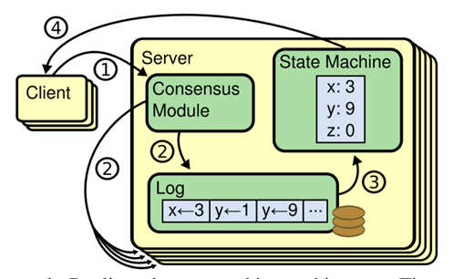
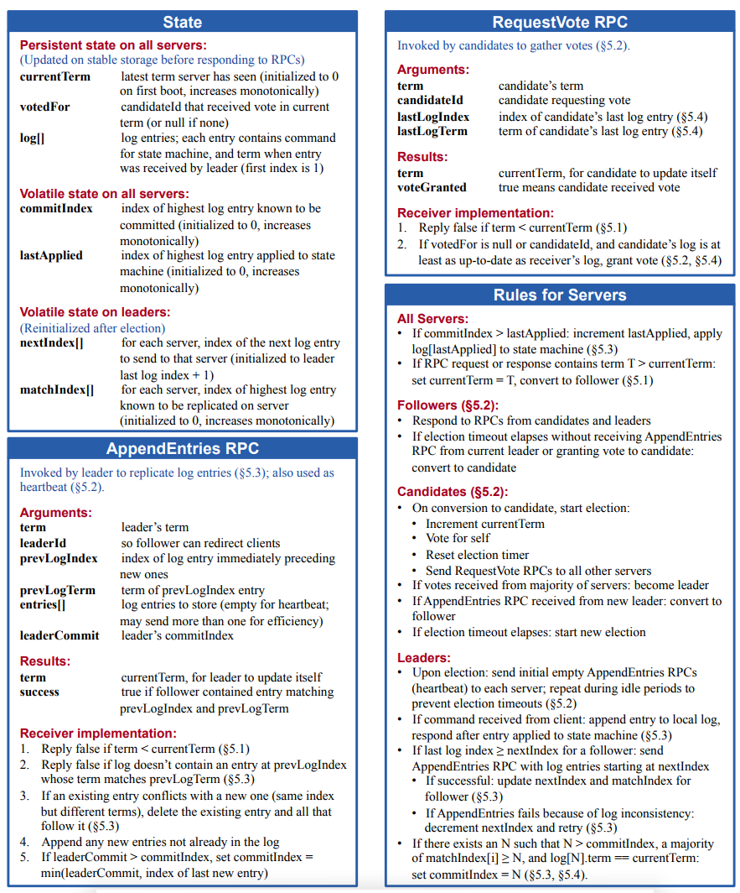
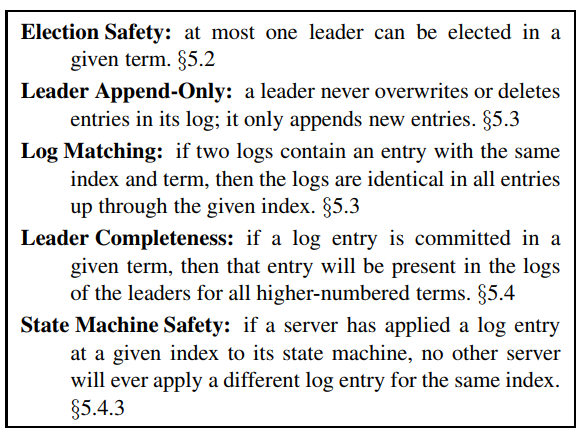
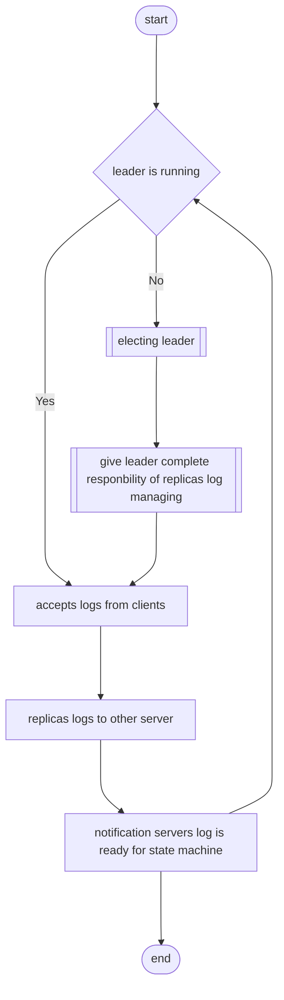
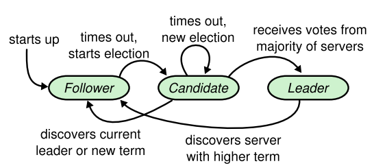
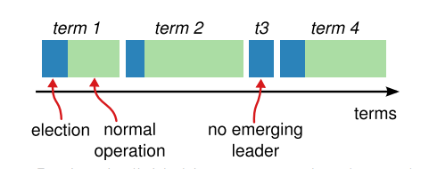
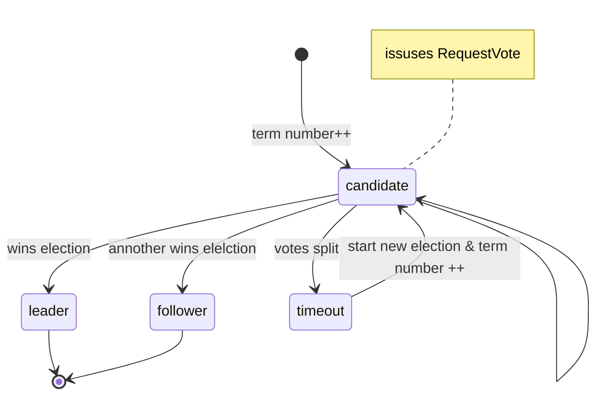
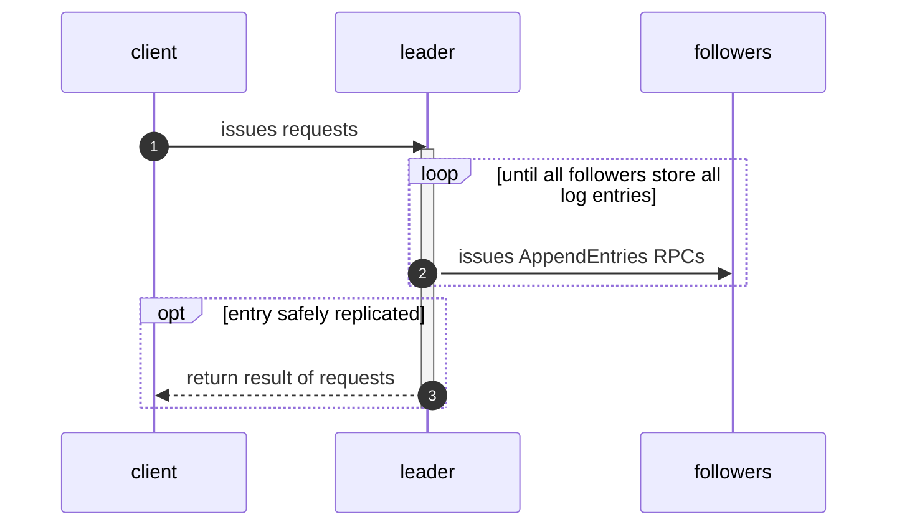

- [Raft](#raft)
  - [Raft算法提出目的](#raft算法提出目的)
  - [Replicated State Machines](#replicated-state-machines)
  - [What's wrong with Paxos](#whats-wrong-with-paxos)
  - [Designing for understandability](#designing-for-understandability)
  - [The Raft consensus algorithm](#the-raft-consensus-algorithm)
    - [Raft basics](#raft-basics)
    - [Leader election](#leader-election)
      - [1. Wins Election](#1-wins-election)
      - [2. Another server wins election](#2-another-server-wins-election)
      - [3. Votes split](#3-votes-split)
    - [Log replication](#log-replication)

# Raft

## Raft算法提出目的

**Understandability**，提供一个比Paxos更容易理解的分布式算法。

Raft算法的特点：

+ Strong leader
  + A stronger form of leadership than other consensus algorithms
+ Leader election
  + uses randomized timers to elect leaders
+ Membership changes
  + uses a new joint consensus approach where the majorities of two different configurations overlap during transitions. This allows the cluster to continue operating normally during configuration changes.

## Replicated State Machines

Replicated State Machines是一致性算法需要解决问题的核心所在

Replicated State Machines是将state machines一致性地复制到多个服务器上，这样即使若干个服务器宕机状态机仍可正常操作。

Replicated State Machines被广泛应用于分布式系统中的fault tolerance problems中

Replicated State Machines架构如下图所示：

如图中所示，**Replicated state machines通常使用replicated log实现**，每个服务器节点中存储一个包含一系列命令的log，不同服务器中的log的存储的命令顺序以及命令内容均一致，而状态机是确定的，各服务器中的状态机根据相同的log必然 产生相同的状态。

通过replicated log概念，分布式系统的consensus algorithm算法需要解决的问题即replicated log的一致性。运行在每个服务器上的consensus modules接收客户端的命令并将命令写入其log中，该服务器上的consensus module与其他服务器的consensus module进行通信，确保其他服务器上的replicated log以相同的顺序接收相同的请求。一旦客户端的命令被正确同步到不同机器上后，集群表现为一个具备高可靠性的state machine。

实际应用过程中consensus algorithms通常具有如下特性：

+ 在非拜占庭条件下（包括网络延迟，丢包，重排，分包等）确保正确性；
+ 全功能性，任何服务器集群中的主要部分是可操作的，并且可与集群中的其他服务器进行通信，可与客户端进行通信；
  +  Thus, a typical cluster of five servers can tolerate the failure of any two servers. Servers are assumed to fail by stopping; they may later recover from state on stable storage and rejoin the cluster.
+ 并不严格使用时间来确保日志的一致性，当然在极端条件下，错误的时钟以及极端的消息延迟将导致可用性问题；
+ 在通常情况下，当集群中的主要部分对单独调用进行响应后，该调用对应的命令立即完成，这样可以保证少数性能较慢的服务器不会影响系统性能。

## What's wrong with Paxos

Paxos是一门异常成功的分布式一致性算法，不过其具有两个重要的缺点：

+ exceptionally difficult to understand.
+ dose not provide a good foundation for building practical implementations.

## Designing for understandability

Raft设计目标有如下几个：

+ provide a complete and practical foundation for system building
+ must be safe under all conditions and available under typical  operating conditions
+ must be efficient for common operations
+ muast be understandability

设计过程中解决问题的方式：

+ problem decomposition, 问题分解
  + raft设计过程中分为4部分： leader election, log replication, safety, membership changes
+ simplify the state machines，降低状态机复杂度
  + reducing the number of states to consider
    + logs are not allower to have holes
    + limits the ways in which logs can become inconsistent with each other
    + introduce nondeterminism to improve understandability

## The Raft consensus algorithm

Raft consensus algorithm是一个用于管理replicated log的算法

Raft consensus Algorithm基本流程如下所示.

Raft将一致性问题分解为3个相对独立的子问题：

+ Leader election: a new leader must be chosen when an existing leader fails
+ Log replication: The leader must accept log entries from clients and replicate them accross the cluster, focing the other logs to agree with its own
+ Safety: **if any server has applied a particular log entry to its state machine, then no other server may apply a different command for the same log index.**

### Raft basics

Raft集群由若干服务器组成。通常情况下，5服务器是集群典型数量，此时，最多允许2服务器失效。

**在任何时间点，每个服务器处于3种状态之一**：

+ leader
+ follower
+ candidate

在普遍操作场景下，服务器集群中只有一个leader，其他的服务器均为follower；对于follower而言，其永远是被动的，自己不产生任何请求，仅对leader与candidate的请求进行响应。

leader负责处理所有客户端响应，即使某一客户端的请求发送至了follower，该follower会将该请求重链接至leader。

三种状态种的candidate仅用于进行新leader的选举。

上述3种状态间的转换如图所示。

在时间划分上，raft将时间划分为随意长度的`terms`，如下图所示。

terms以连续的整数进行标识，**每段term以`election`开始**，此时，一个或多个candidates尝试成为leader。一旦一个candidate赢得选举，则其将在剩余的term时间内，作为leader服务于集群。

某些情况下选举无法产生胜者，此时该段term直接终止，并重新开始一个新的term。**Raft总保证在任意的term内，最多只有一个leader**。

不同的server观察到的terms之间的状态变化可能不在同一时间点上，甚至无法观察到整个terms，因此需要引入某种机制确保各个server观察到的状态变化一致。

在Raft中，通过terms来保证，Terms扮演者逻辑时钟的作用（logical clock），通过Terms每个server可以删除过时信息，如陈旧的leader。

每个server存储一个current term number，这个数字随时间单调递增（increases monotonically），每个server在与其它server通信时，交换各自的current terms，交换时遵循如下规则：

+ if one server's current term is smaller than the other's, then it updates its current term to the larger value.
+ if a candidate or leader discovers that its term is out of date, it immediately reverts to follower state.
+ if a server receives a request with a stale term number, it rejects the request.

Raft服务器间使用RPC进行远程调用，对于Raft一致性算法而言，其仅需两类基本的RPC：`RequestVote`以及`AppendEntries`：

+ RequestVote：在选举期间被candidates调用
+ AppendEntries：被leader调用，用于分发logs

### Leader election

通过heartbeat（心跳机制）触发leader election

servers启动时，均以followers角色启动，当服务器处于可正常接收来自leader或candidates的RPC消息的时间内，其总保持follows状态。

leaders**定期向followers发送heartbeats（本质上是不含log entries的AppendEntries RPC）以维持其统治**。对于followers而言，若其在一段时间（这段时间被称为*election timeout*）内没有接收到该heartbeats，该followers将认为当前状态下没有一个合适的leader需要选举新的leader。

要开始一段新的选举，follower增加其`current term number`并将自身状态转换为candidate state。之后向自己投票，并发送RequestVote请求至集群中的其它服务器中，处于candidate状态的服务器器保持candidate状态直至下面三件事情成立：

+ it wins election
+ another server establishes itself as leader
+ a period of time goes by with no winner

#### 1. Wins Election

candidate赢得选举的条件是：该candidate在同一个term中获得集群中的大多数服务器的投票。（majority of servers），通过majority of servers，保证在任意特定的term内，最多只有一个服务器赢得选票。

集群中的服务器在进行投票时，**在同一个term中最多能向一个candidate进行投票**，（投票规则之一，基于first-come-first-served原则）

一旦某一candidate赢得选举，该candidate变为leader，并发送heartbeat给到其他所有的服务器，建立其统治，并阻止新的选举。

#### 2. Another server wins election

在等待投票的过程中，candidate可能从其他的服务器处获取声明其为leader的AppendEntries RPC，此时根据声明leader的term与自身term之间的关系存在两种情况：

+ 声明leader的term >= 自身的term
  + candidate承认声明的leader的合法性，并转换为follower
+ 声明leader的term < 自身的term
  + 拒绝承认声明leader的合法性，拒绝该AppendEntries RPC，保持状态为candidate

#### 3. Votes split

此时candidate并未赢得选举也未输掉选举，此种情况是由于同一时间过多的follower状态转变为candidate，导致没有任何一个candidate得票满足多数原则。此种情况发生时，每个candidate超时，并重新开始新的选举（term++ & issues RequestVote RPC）。

为防止split votes无限循环，Raft协议使用随机化election timeouts（randomized election timeouts）来确保split votes是少见情况，并确保即使出现split votes也能迅速解决，具体算法如下（[实现这两点的原则是同一个term中server最多能向1个candidate投票](#wins-election)）：

+ 在第一次选举时，在一个区间（interval）内随机化election timeouts，这种做法可以在大多数情况下确保最多有一个服务器timeout，此时该服务器赢得选举，并在其他的服务器timeout前发送heartbeat，建立起统治
+ 对于已发生的split votes时，每个candidate在重新开始新的election前的等待时间（election timeout）随机化，这样不同的candidate开始新的election的时间不一样，较早启动新的election的candidate有较大概率达到多数条件赢得选举，可以减少新选举周期中split vote情况的出现。

### Log replication

一旦产生leader，该leader便开始为client服务，响应client的请求。每个client请求包含一个replicated state machine执行的命令。client, leader以及follower的活动图如下所示。

流程如下：

1. leader appends client command to its log as a new entry
2. issues AppendEntries RPCs in parallel to each of the other servers to replicate the entry
3. when the entry has been safely replicated, the leader applies the entry to its state machine
   + leader retires AppendEntries RPCs indefinitrly until all followers eventually store all log entries
   + leader retires AppendEntries even after it has responded to the client 
4. returns the result of that execution to the client

