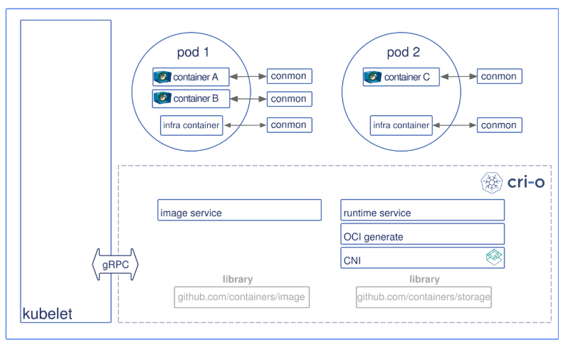

- [Use CRI-O as Container Runtime](#use-cri-o-as-container-runtime)
  - [CRI-O basic Concept](#cri-o-basic-concept)
    - [What is CRI-O](#what-is-cri-o)
    - [Architecture of CRI-O](#architecture-of-cri-o)
    - [CRI-O Components](#cri-o-components)
      - [OCI compatible runtime](#oci-compatible-runtime)
      - [Storage](#storage)
      - [Container images](#container-images)
      - [Networking](#networking)
      - [Monitoring](#monitoring)
      - [Security](#security)
  - [CRI-O setup](#cri-o-setup)
    - [CRI-O and Kubernetes Compatibility matrix](#cri-o-and-kubernetes-compatibility-matrix)
    - [Raspberry Pi 4 CRI-O配置](#raspberry-pi-4-cri-o配置)
      - [Install Dependence](#install-dependence)
      - [Get CRI-O Source Code](#get-cri-o-source-code)
      - [Get conmon](#get-conmon)
      - [Install CRI-O](#install-cri-o)
    - [Use CRI-O](#use-cri-o)
      - [Set Up crictl](#set-up-crictl)
      - [Pod action](#pod-action)
    - [CRI-O as kubernetes container runtime](#cri-o-as-kubernetes-container-runtime)
      - [相关bug](#相关bug)
  - [Upgrade CRIO](#upgrade-crio)

# Use CRI-O as Container Runtime

##  CRI-O basic Concept

### What is CRI-O

CRI-O是一个轻量级的实现Kubernetes CRI（Container Runtime Interface）的运行时环境，兼容OCI（Open Container Initiative）规范。

与Docker相比，由于无需docker daemon，其更为轻量化，目前已经支持`runc`与`Kata Contianers`作为其容器运行环境。

CRI-O支持OCI容器镜像，并可从任意`container registry`中拉取镜像

CRI-O的主要主导者：Red Hat，Intel，SUSE，Hyper，IBM


### Architecture of CRI-O



整体工作流程如下：

+ Kubernetes contacts the kubelet to launch a pod.
+ The kubelet forwards the request to the CRI-O daemon VIA kubernetes CRI (Container runtime interface) to launch the new POD.
+ CRI-O uses the `containers/image` library to pull the image from a container registry.
+ The downloaded image is unpacked into the container’s root filesystems, stored in COW file systems, using containers/storage library.
+ After the rootfs has been created for the container, CRI-O generates an OCI runtime specification json file describing how to run the container using the OCI Generate tools.
+ CRI-O then launches an OCI Compatible Runtime using the specification to run the container proceses. The default OCI Runtime is runc.
+ Each container is monitored by a separate `conmon` process. The `conmon` process holds the `pty` of the `PID1` of the container process. It handles logging for the container and records the exit code for the container process.
+ Networking for the pod is setup through use of CNI, so any CNI plugin can be used with CRI-O.

### CRI-O Components

CRI-O由如下组件组成：

+ OCI compatible runtime
+ containers/storage
+ containers/image
+ networking (CNI)
+ container monitoring (conmon)
+ security is provided by serverl core Linux capabilities

#### OCI compatible runtime

理论上而言，CRI-O兼容任意OCI兼容的容器运行时，目前官方已经测试`runc`与`Clear Containers`

#### Storage

库`containers/storage`负责管理镜像的layers并创建`Pods`中运行的容器的root file-systems。当前支持`Overlayfs`,` devicemapper`, `AUFS`以及`btrfs`，`Overlayfs`为默认的driver。

对网络文件系统如`NFS`, `GlusterFS`以及`CephFS`处于开发路线图中。

#### Container images

库`container/image`负责镜像的拉取，目前其支持Docker的`schema 2/version 1`与`schema 2/version 2`。

官方社区目前通过了所有的Docker与Kubernetes测试

#### Networking

默认试用CNI (Container Network Interface)为Pods设置网络，同时Flannel, Weave以及OpenShift-SDN同样经过官方测试

#### Monitoring

使用`conmon`监控容器，处理container process的日志，并对内存溢出Out of Memory(OOM)进行探测

#### Security

容器的安全与隔离策略使用Linux的一系列工具，包括`SELinux`, `Capabilities`, `seccomp`以及其他的的OCI规范中的策略。

## CRI-O setup

### CRI-O and Kubernetes Compatibility matrix

目前CRI-O的版本需与Kubernetes版本匹配，Kubernetes版本规范参考此[链接](https://github.com/kubernetes/community/blob/master/contributors/design-proposals/release/versioning.md)，匹配规则：CRI-O的主版本与小版本与Kubernetes的主版本与小版本一致。

更加具体的匹配规则

|Version-Branch|Kubernetes branch/version|Maintenance status|
|:---:|:---:|:---:|
|CRI-O 1.13.x - release-1.13|Kubernetes 1.13 branch, v1.13.x|=|
|CRI-O 1.14.x - release-1.14|Kubernetes 1.14 branch, v1.14.x|=|
|CRI-O 1.15.x - release-1.15|Kubernetes 1.15 branch, v1.15.x|=|
|CRI-O 1.16.x - release-1.16|Kubernetes 1.16 branch, v1.16.x|=|
|CRI-O 1.17.x - release-1.17|Kubernetes 1.17 branch, v1.17.x|=|
|CRI-O 1.18.x - release-1.18|Kubernetes 1.18 branch, v1.18.x|=|
|CRI-O HEAD - master|Kubernetes master branch|√|

### Raspberry Pi 4 CRI-O配置

本次使用的版本为CRI-O 1.18.0，在该版本使用时需要hugetlb子系统，**已确定为bug，bug详情参考[此链接](https://github.com/cri-o/cri-o/issues/3717)，目前已修复，源码升级后，CRIO版本变更为1.18.1**，树莓派4默认的内核中并未开启hugetlb子系统，需重新编译内核。内核编译参考此[链接](../../Linux/Ubuntu_kernel_compile.md)

本次采用源码构建方式安装

检查此时子系统

```terminal
# lssubsys
cpuset
cpu,cpuacct
blkio
memory
devices
freezer
net_cls,net_prio
perf_event
hugetlb
pids
rdma
```

确认此时hugetlb子系统已启用

#### Install Dependence

1. 安装go，本次使用golang的版本为1.13，ubuntu源中带的1.12版本无法编译CRI-O 1.18，下载go1.13.10.linux-arm64.tar.gz可执行程序，执行如下命令：
   
   ```terminal
   # tar -C /usr/local -xzvf go1.13.10.linux-arm64.tar.gz
   ```

   该命令执行完后，go安装到/usr/local/go文件夹下，go执行程序位于/usr/local/go/bin下。

   + 将/usr/local/go/bin添加至PATH环境变量中，编辑~/.profile文件，添加如下内容：
      
     ```bash
     export PATH=$PATH:/usr/local/go/bin
     ```
   
     使用`source ~/.profile`命令使环境变量生效

   + 验证安装
     
     ```terminal
     # go version
     go version go1.13.10 linux/arm64
     ```

   + 配置GOPATH，同样编辑~/.profile文件，添加如下内容
   
     ```bash
     export GOPATH=/root/go
     export PATH=$PATH:$GOPATH/bin
     ```

     使用`source ~/.profile`命令使环境变量生效

2. 将源Kubic添加至软件仓库中

   ```terminal 
   . /etc/os-release
   sudo sh -c "echo 'deb http://download.opensuse.org/repositories/devel:/kubic:/libcontainers:/stable/x${NAME}_${VERSION_ID}/ /' > /etc/apt/sources.list.d/devel:kubic:libcontainers:stable.list"
   wget -nv https://download.opensuse.org/repositories/devel:kubic:libcontainers:stable/x${NAME}_${VERSION_ID}/Release.key -O- | sudo apt-key add -
   ```
  
3. 安装依赖包

     ```terminal
     apt install btrfs-progs \
     containers-common \
     git \
     libassuan-dev \
     libdevmapper-dev \
     libglib2.0-dev \
     libc6-dev \
     libgpgme11-dev \
     libgpg-error-dev \
     libseccomp-dev \
     libsystemd-dev \
     libselinux1-dev \
     pkg-config \
     go-md2man \
     cri-o-runc \
     libudev-dev \
     software-properties-common \
     gcc \
     make
     ```

#### Get CRI-O Source Code

```terminal
git clone -b release-1.18 https://github.com/cri-o/cri-o.git
```

#### Get conmon

CRI-O使用conmon监控容器相关运行状态，需要安装conmon，否则启动cri-o时将报错

1. Get conmon source code
   
   ```terminal
   git clone https://github.com/containers/conmon
   ```

2. Build & Install
   
   ```terminal
   cd conmon
   make
   make install
   ```

#### Install CRI-O

1. Build
   
   ```terminal
   cd cri-o
   make
   make install
   ```

2. 查看安装版本
   
   ```terminal
   crio -v
   crio version
   Version:       1.18.0
   GitCommit:     dea34b9819984a1757215cfc70dacc4a1cb1a450
   GitTreeState:  clean
   BuildDate:     2020-05-09T01:58:31Z
   GoVersion:     go1.13.10
   Compiler:      gc
   Platform:      linux/arm64
   Linkmode:      dynamic
   ```

3. 设置CNI (Container Network Interface)
   
   + 获取源码
   
   ```terminal
   git clone https://github.com/containernetworking/plugins
   cd plugins
   git checkout v0.8.1
   ```

   + 编译
   
   ```termial
   ./build_linux.sh
   Building plugins
     bandwidth
     firewall
     flannel
     portmap
     sbr
     tuning
     bridge
     host-device
     ipvlan
     loopback
     macvlan
     ptp
     vlan
     dhcp
     host-local
     static
   ```

   + 安装
   
   ```terminal
   mkdir -p /opt/cni/bin
   cp bin/* /opt/cni/bin/
   ```

4. Config CRI-O
   
   运行命令生成CRI-O配置文件，配置文件的合法值参考[链接](https://github.com/cri-o/cri-o/blob/release-1.18/docs/crio.conf.5.md)
   
   ```terminal
   make install.config
   install  -d /usr/local/share/containers/oci/hooks.d
   install  -d /etc/crio/crio.conf.d
   install  -D -m 644 crio.conf /etc/crio/crio.conf
   install  -D -m 644 crio-umount.conf /usr/local/share/oci-umount/oci-umount.d/crio-umount.conf
   install  -D -m 644 crictl.yaml /etc
   ```

   + 镜像仓库配置，编辑/etc/containers/registries.conf，参照第一个进行相关配置即可，registries.insecure设置镜像仓库不考虑安全性，registries.block设置镜像仓库为禁止连接仓库
    
   ```terminal
   [registries.search]
   registries = ['registry.access.redhat.com', 'registry.fedoraproject.org', 'quay.io', 'docker.io']

   [registries.insecure]
   registries = []

   [registries.block]
   registries = []
   ```

   + **(可选)** 配置cgroup manager, 添加/etc/crio/crio.conf.d/01-cgroup-manager.conf，下列配置将cgroup_manager修改为systemd
   
   ```terminal
   [crio.runtime]
   cgroup_manager = "systemd"
   ```

   + **(可选)** 配置日志级别，添加/etc/crio/crio.conf.d/01-log-level.conf，下列配置将日志级别配置为info
   
   ```terminal
   [crio.runtime]
   log_level = "info"
   ```

   + **(可选)** 配置容器capabilities（容器与宿主机间的权限），以及sysclts，默认情况下cri-o使用的capabilities及sysctls如下：

   ```terminal
   default_capabilities = [
	"CHOWN",
	"DAC_OVERRIDE",
	"FSETID",
	"FOWNER",
	"SETGID",
	"SETUID",
	"SETPCAP",
	"NET_BIND_SERVICE",
	"KILL",
   ]

   default_sysctls = [
   ]
   ```

   + **配置pause镜像** （1.18.1版本的cri-o，不配置pause镜像，将可能导致kubelet无法创建pods，默认pause镜像需科学上网）
   
   ```terminal
   [crio.image]
   pause_image = "lxyustc.registrydomain.com:5000/google_containers/pause:3.2"
   ```

5. Start CRI-O
   
   使用如下命令将CRI-O安装为可启动服务

   ```terminal
   make install.systemd
   ```

   启动CRI-O服务

   ```terminal
   systemctl daemon-reload
   systemctl enable crio
   systemctl start crio
   ```

6. 查看CRI-O服务状态
   
   使用如下命令查看CRI-O服务状态

   ```terminal
   systemctl status crio
   May 10 17:46:00 slave-node2-arm systemd[1]: Starting Container Runtime Interface for OCI (CRI-O)...
   May 10 17:46:00 slave-node2-arm crio[2291]: time="2020-05-10 17:46:00.527351134+08:00" level=info msg="Using default capabilities: CAP_CHOWN, CAP_DAC_OVERRIDE, CAP_FSETID, CAP_FOWNER, CAP_SETGID, CAP_SETUID, CAP_SETPC
   May 10 17:46:00 slave-node2-arm crio[2291]: time="2020-05-10 17:46:00.528625428+08:00" level=warning msg="Skipping invalid hooks directory: stat /usr/share/containers/oci/hooks.d: no such file or directory"
   May 10 17:46:00 slave-node2-arm crio[2291]: time="2020-05-10 17:46:00.529569024+08:00" level=info msg="No seccomp profile specified, using the internal default"
   May 10 17:46:00 slave-node2-arm crio[2291]: time="2020-05-10 17:46:00.530138700+08:00" level=info msg="AppArmor is disabled by the system or at CRI-O build-time"
   May 10 17:46:00 slave-node2-arm crio[2291]: time="2020-05-10 17:46:00.546716079+08:00" level=info msg="Found CNI network cbr0 (type=flannel) at /etc/cni/net.d/10-flannel.conflist"
   May 10 17:46:00 slave-node2-arm crio[2291]: time="2020-05-10 17:46:00.546847354+08:00" level=info msg="Update default CNI network name to cbr0"
   ```

### Use CRI-O

通过命令行工具crictl使用CRI-O

#### Set Up crictl

1. 通过如下命令获取crictl
   
   ```terminal
   go get github.com/kubernetes-sigs/cri-tools/cmd/crictl
   ```

   crictl命令行工具安装至`$GOPATH/bin`路径下

2. 设置crictl命令行工具配置，可通过编辑/etc/crictl.yaml文件或设置环境变量`CONTAINER_RUNTIME_ENDPOINT`进行。
   
   /etc/crictl.yaml文件内容

   ```yaml
   runtime-endpoint: unix:///var/run/crio/crio.sock
   ```

   环境变量`CONTAINER_RUNTIME_ENDPOINT`值

   ```terminal
   unix:///var/run/crio/crio.sock
   ```

3. 验证crictl工具
   
   ```terminal
   crictl version
   Version:  0.1.0
   RuntimeName:  cri-o
   RuntimeVersion:  1.18.0
   RuntimeApiVersion:  v1alpha1
   ```

#### Pod action

使用默认CNI网络配置进行创建，默认配置为`100-crio-bridge.conf`, `200-loopback.conf`

100-crio-bridge.conf

```json
{
    "cniVersion": "0.3.1",
    "name": "crio-bridge",
    "type": "bridge",
    "bridge": "cni0",
    "isGateway": true,
    "ipMasq": true,
    "hairpinMode": true,
    "ipam": {
        "type": "host-local",
        "routes": [
            { "dst": "0.0.0.0/0" },
            { "dst": "1100:200::1/24" }
        ],
        "ranges": [
            [{ "subnet": "10.88.0.0/16" }],
            [{ "subnet": "1100:200::/24" }]
        ]
    }
}
```

200-loopback.conf

```json
{
    "cniVersion": "0.3.1",
    "type": "loopback"
}
```

在cri-o/test/testdata文件夹下操作

1. 创建Pod
   
   ```terminal
   POD_ID=$(crictl runp sandbox_config.json)
   ```

2. 查看Pod信息
   
   ```terminal
   crictl inspectp --output table $POD_ID
   Name: podsandbox1
   UID: redhat-test-crio
   Namespace: redhat.test.crio
   Attempt: 1
   Status: SANDBOX_READY
   Created: 2020-05-11 15:11:41.434725699 +0800 CST
   IP Address: 10.88.0.2
   Labels:
           group -> test
           io.kubernetes.container.name -> POD
   Annotations:
           owner -> hmeng
           security.alpha.kubernetes.io/seccomp/pod -> unconfined
   Info: map[]
   ```

3. 创建容器
   
   ```terminal
   crictl pull redis:alpine
   CONTAINER_ID=$(crictl create $POD_ID container_redis.json sandbox_config.json)
   ```

4. 启动容器
   
   ```terminal
   crictl start $CONTAINER_ID
   ```

5. 查看容器
   
   ```terminal
   crictl inspect $CONTAINER_ID
   {
     "status": {
       "id": "19b7277b9d905f981af64396c9c6bed34d39504ac63e53a75417cb5746887c21",
       "metadata": {
         "attempt": 0,
         "name": "podsandbox1-redis"
       },
       "state": "CONTAINER_RUNNING",
       "createdAt": "2020-05-11T15:41:33.787575825+08:00",
       "startedAt": "2020-05-11T15:43:02.863614501+08:00",
       "finishedAt": "1970-01-01T08:00:00+08:00",
       "exitCode": 0,
       "image": {
         "image": "docker.io/library/redis:alpine"
       },
       "imageRef": "docker.io/library/redis@sha256:1961f4617f243f9e5277fbdda907572aa587f6aae12444b30b6a19645b635f32",
       "reason": "",
       "message": "",
       "labels": {
         "tier": "backend"
       },
       "annotations": {
         "pod": "podsandbox1"
       },
       "mounts": [],
       "logPath": "/var/log/crio/pods/7d3258789e0084aff8a2081814991369df16b4ab6507f771e2737e5ba9bcf003/19b7277b9d905f981af64396c9c6bed34d39504ac63e53a75417cb5746887c21.log"
     },
     "info": {
       "sandboxID": "7d3258789e0084aff8a2081814991369df16b4ab6507f771e2737e5ba9bcf003",
       "pid": 11700,
       "runtimeSpec": {
         "ociVersion": "1.0.2",
         "process": {
           "user": {
             "uid": 0,
             "gid": 0,
             "additionalGids": [
               0,
               1,
               2,
               3,
               4,
               6,
               10,
               11,
               20,
               26,
               27
             ]
           },
           "args": [
             "docker-entrypoint.sh",
             "docker-entrypoint.sh",
             "redis-server"
           ],
           "env": [
             "PATH=/usr/local/sbin:/usr/local/bin:/usr/sbin:/usr/bin:/sbin:/bin",
             "TERM=xterm",
             "HOSTNAME=crictl_host",
             "PATH=/usr/local/sbin:/usr/local/bin:/usr/sbin:/usr/bin:/sbin:/bin",
             "TERM=xterm",
             "REDIS_VERSION=3.2.3",
             "REDIS_DOWNLOAD_URL=http://download.redis.io/releases/redis-3.2.3.tar.gz",
             "REDIS_DOWNLOAD_SHA1=92d6d93ef2efc91e595c8bf578bf72baff397507",
             "REDIS_DOWNLOAD_SHA=b8756e430479edc162ba9c44dc89ac394316cd482f2dc6b91bcd5fe12593f273"
           ],
           "cwd": "/data",
           "capabilities": {
             "bounding": [
               "CAP_SYS_ADMIN",
               "CAP_CHOWN",
               "CAP_DAC_OVERRIDE",
               "CAP_FSETID",
               "CAP_FOWNER",
               "CAP_SETGID",
               "CAP_SETUID",
               "CAP_SETPCAP",
               "CAP_NET_BIND_SERVICE",
               "CAP_KILL"
             ],
             "effective": [
               "CAP_SYS_ADMIN",
               "CAP_CHOWN",
               "CAP_DAC_OVERRIDE",
               "CAP_FSETID",
               "CAP_FOWNER",
               "CAP_SETGID",
               "CAP_SETUID",
               "CAP_SETPCAP",
               "CAP_NET_BIND_SERVICE",
               "CAP_KILL"
             ],
             "inheritable": [
               "CAP_SYS_ADMIN",
               "CAP_CHOWN",
               "CAP_DAC_OVERRIDE",
               "CAP_FSETID",
               "CAP_FOWNER",
               "CAP_SETGID",
               "CAP_SETUID",
               "CAP_SETPCAP",
               "CAP_NET_BIND_SERVICE",
               "CAP_KILL"
             ],
             "permitted": [
               "CAP_SYS_ADMIN",
               "CAP_CHOWN",
               "CAP_DAC_OVERRIDE",
               "CAP_FSETID",
               "CAP_FOWNER",
               "CAP_SETGID",
               "CAP_SETUID",
               "CAP_SETPCAP",
               "CAP_NET_BIND_SERVICE",
               "CAP_KILL"
             ]
           },
           "oomScoreAdj": 30
         },
         "root": {
           "path": "/var/lib/containers/storage/overlay/921af5ce8bca9ed3272765d0710817af823b5a22cb146ef1414bddfa4f5c60eb/merged"
         },
         "hostname": "crictl_host",
         "mounts": [
           {
             "destination": "/proc",
             "type": "proc",
             "source": "proc",
             "options": [
               "nosuid",
               "noexec",
               "nodev"
             ]
           },
           {
             "destination": "/dev",
             "type": "tmpfs",
             "source": "tmpfs",
             "options": [
               "nosuid",
               "strictatime",
               "mode=755",
               "size=65536k"
             ]
           },
           {
             "destination": "/dev/pts",
             "type": "devpts",
             "source": "devpts",
             "options": [
               "nosuid",
               "noexec",
               "newinstance",
               "ptmxmode=0666",
               "mode=0620",
               "gid=5"
             ]
           },
           {
             "destination": "/dev/mqueue",
             "type": "mqueue",
             "source": "mqueue",
             "options": [
               "nosuid",
               "noexec",
               "nodev"
             ]
           },
           {
             "destination": "/sys",
             "type": "sysfs",
             "source": "sysfs",
             "options": [
               "nosuid",
               "noexec",
               "nodev",
               "ro"
             ]
           },
           {
             "destination": "/sys/fs/cgroup",
             "type": "cgroup",
             "source": "cgroup",
             "options": [
               "nosuid",
               "noexec",
               "nodev",
               "relatime",
               "ro"
             ]
           },
           {
             "destination": "/dev/shm",
             "type": "bind",
             "source": "/var/run/containers/storage/overlay-containers/7d3258789e0084aff8a2081814991369df16b4ab6507f771e2737e5ba9bcf003/userdata/shm",
             "options": [
               "rw",
               "bind"
             ]
           },
           {
             "destination": "/etc/resolv.conf",
             "type": "bind",
             "source": "/var/run/containers/storage/overlay-containers/7d3258789e0084aff8a2081814991369df16b4ab6507f771e2737e5ba9bcf003/userdata/resolv.conf",
             "options": [
               "bind",
               "nodev",
               "nosuid",
               "noexec"
             ]
           },
           {
             "destination": "/etc/hostname",
             "type": "bind",
             "source": "/var/run/containers/storage/overlay-containers/7d3258789e0084aff8a2081814991369df16b4ab6507f771e2737e5ba9bcf003/userdata/hostname",
             "options": [
               "rw",
               "bind"
             ]
           }
         ],
         "annotations": {
           "io.container.manager": "cri-o",
           "io.kubernetes.cri-o.Annotations": "{\"pod\":\"podsandbox1\"}",
           "io.kubernetes.cri-o.ContainerID": "19b7277b9d905f981af64396c9c6bed34d39504ac63e53a75417cb5746887c21",
           "io.kubernetes.cri-o.ContainerType": "container",
           "io.kubernetes.cri-o.Created": "2020-05-11T15:41:33.580739286+08:00",
           "io.kubernetes.cri-o.IP.0": "10.88.0.2",
           "io.kubernetes.cri-o.IP.1": "1100:200::2",
           "io.kubernetes.cri-o.Image": "redis:alpine",
           "io.kubernetes.cri-o.ImageName": "docker.io/library/redis:alpine",
           "io.kubernetes.cri-o.ImageRef": "docker.io/library/redis@sha256:1961f4617f243f9e5277fbdda907572aa587f6aae12444b30b6a19645b635f32",
           "io.kubernetes.cri-o.Labels": "{\"tier\":\"backend\"}",
           "io.kubernetes.cri-o.LogPath": "/var/log/crio/pods/7d3258789e0084aff8a2081814991369df16b4ab6507f771e2737e5ba9bcf003/19b7277b9d905f981af64396c9c6bed34d39504ac63e53a75417cb5746887c21.log",
           "io.kubernetes.cri-o.Metadata": "{\"name\":\"podsandbox1-redis\"}",
           "io.kubernetes.cri-o.MountPoint": "/var/lib/containers/storage/overlay/921af5ce8bca9ed3272765d0710817af823b5a22cb146ef1414bddfa4f5c60eb/merged",
           "io.kubernetes.cri-o.Name": "k8s_podsandbox1-redis_podsandbox1_redhat.test.crio_redhat-test-crio_0",
           "io.kubernetes.cri-o.ResolvPath": "/var/run/containers/storage/overlay-containers/7d3258789e0084aff8a2081814991369df16b4ab6507f771e2737e5ba9bcf003/userdata/resolv.conf",
           "io.kubernetes.cri-o.SandboxID": "7d3258789e0084aff8a2081814991369df16b4ab6507f771e2737e5ba9bcf003",
           "io.kubernetes.cri-o.SandboxName": "k8s_podsandbox1_redhat.test.crio_redhat-test-crio_1",
           "io.kubernetes.cri-o.SeccompProfilePath": "",
           "io.kubernetes.cri-o.Stdin": "false",
           "io.kubernetes.cri-o.StdinOnce": "false",
           "io.kubernetes.cri-o.TTY": "false",
           "io.kubernetes.cri-o.Volumes": "[]",
           "pod": "podsandbox1",
           "tier": "backend"
         },
         "linux": {
           "resources": {
             "devices": [
               {
                 "allow": false,
                 "access": "rwm"
               }
             ],
             "memory": {
               "limit": 209715200
             },
             "cpu": {
               "shares": 512,
               "quota": 20000,
               "period": 10000,
               "cpus": "0",
               "mems": "0"
             },
             "pids": {
               "limit": 1024
             }
           },
           "cgroupsPath": "pod_123-456.slice:crio:19b7277b9d905f981af64396c9c6bed34d39504ac63e53a75417cb5746887c21",
           "namespaces": [
             {
               "type": "pid"
             },
             {
               "type": "network",
               "path": "/proc/7772/ns/net"
             },
             {
               "type": "ipc",
               "path": "/proc/7772/ns/ipc"
             },
             {
               "type": "uts",
               "path": "/proc/7772/ns/uts"
             },
             {
               "type": "mount"
             }
           ],
           "maskedPaths": [
             "/proc/acpi",
             "/proc/kcore",
             "/proc/keys",
             "/proc/latency_stats",
             "/proc/timer_list",
             "/proc/timer_stats",
             "/proc/sched_debug",
             "/proc/scsi",
             "/sys/firmware"
           ],
           "readonlyPaths": [
             "/proc/asound",
             "/proc/bus",
             "/proc/fs",
             "/proc/irq",
             "/proc/sys",
             "/proc/sysrq-trigger"
           ]
         }
       }
     }
   }
   ```

6. 测试运行的容器
   
   ```terminal
   telnet 10.88.0.2 6379
   Trying 10.88.0.2...
   Connected to 10.88.0.2.
   Escape character is '^]'.
   ```

   输入MONITOR
   
   ```terminal
   +OK
   ```

7. 删除容器及Pod
   
   ```terminal
   crictl stop $CONTAINER_ID
   19b7277b9d905f981af64396c9c6bed34d39504ac63e53a75417cb5746887c21
   crictl rm $CONTAINER_ID
   19b7277b9d905f981af64396c9c6bed34d39504ac63e53a75417cb5746887c21
   crictl ps -a
   CONTAINER ID        IMAGE               CREATED             STATE               NAME                ATTEMPT             POD ID
   crictl stopp $POD_ID
   Stopped sandbox 7d3258789e0084aff8a2081814991369df16b4ab6507f771e2737e5ba9bcf003
   crictl rmp $POD_ID
   Removed sandbox 7d3258789e0084aff8a2081814991369df16b4ab6507f771e2737e5ba9bcf003
   crictl pods
   POD ID              CREATED             STATE               NAME                NAMESPACE           ATTEMPT
   ```

### CRI-O as kubernetes container runtime

在使用CRI-O作为kubernetes的底层容器运行时时，由于kubernetes仅针对docker进行了`cgroup`的自动探测，此时，若要采用`systemd`作为`cgroup`，则需要手动指定`cgroup`配置

修改`kubelet`配置文件`/var/lib/kubelet/config.yaml`

在行

```yaml
kind: KubeletConfiguration
```

后

添加如下内容

```yaml
cgroupDriver: systemd
```

#### CRI-O network

对于controller plane而言，其所需的`kube-scheduler`, `kube-controller-manager`, `kube-apiserver`, `etcd`等组件部署时并不需要容器网络，因此在部署上述相关组件前`/etc/cni/net.d/`文件夹下内容可以为空

#### CRI-O flannel

kubernetes使用cni插件形式处理pods间网络问题，按照cni规定，在文件夹`/etc/cni/net.d/`下以字典序排列，顺序靠前的先生效

*If there are multiple CNI configuration files in the directory, the kubelet uses the configuration file that comes first by name in lexicographic order.*

[参考此处](https://kubernetes.io/docs/concepts/extend-kubernetes/compute-storage-net/network-plugins/#cni)

因此，若要使用flannel插件，需将flannel插件的文件名称靠前排列

#### 相关bug

1. Kubernetes 1.18.6 与 CRI-O 1.18.3下，此时，Kubernetes不能自动探测CRI-O使用的cgroup，除了在配置文件`/var/lib/kubelet/config.yaml`中指定`cgroup`的配置外，还需手动指定`kubelet`服务使用的cgroup，在`kubelet.service`配置文件下添加配置文件`11-cgroup.conf`，`/etc/systemd/system/kubelet.service.d/11-cgroups.conf`，若不进行上述配置，将报 *Failed to get kubelets cgroup: cpu and memory cgroup hierarchy not unified. Cpu:/, memory: /system.slice/kubelet.service.* 错误
   
   ```conf
   [Service]
   CPUAccounting=true
   MemoryAccounting=true
   ```

2. ARM64架构下，Kubernetes 1.18.6 与 CRI-O 1.18.3下，由于ARM64架构CPU缺乏1 2级缓存，因此kubelet运行时会报出错误 *failed to get cache information for node 0: open /sys/devices/system/cpu/cpu0/cache: no such file or directory* 基于目前观察并未有相关影响。

3. AMD64架构下，CRI-O 1.18.3与kubelet 1.18.6，`kubelet`报出错误 *Failed to get system container stats for "/system.slice/kubelet.service": failed to get cgroup stats for "/system.slice/kubelet.service": failed to get cgroup stats for "/system.slice/kubelet.service": failed to get container info for "/system.slice/kubelet.service": unknown container "/system.slice/kubelet.service"*，该错误使用2的方式可暂时解决

## Upgrade CRIO

使用源码方式升级CRIO

1. 获取仓库源码更新
   
   ```git
   git fetch origin release-1.18
   git merge origin/release-1.18
   ```

2. 重新编译安装
   
   ```
   make clean
   make
   make install
   make install.systemd
   ```

3. 重载服务
   
   ```
   systemctl daemon-reload
   systemctl restart crio
   ```

4. 查看版本
   
   ```
   crictl version
   Version:  0.1.0
   RuntimeName:  cri-o
   RuntimeVersion:  1.18.1
   RuntimeApiVersion:  v1alpha1
   ```
