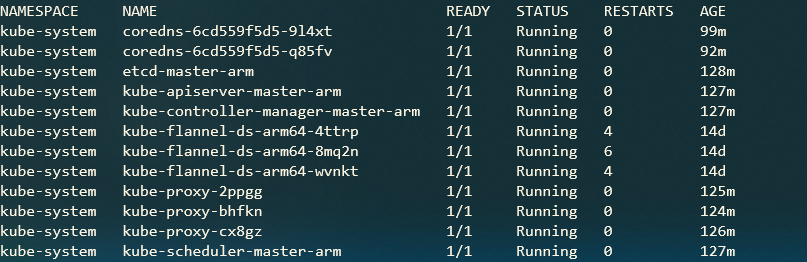

# 升级Kubernetes集群

- [升级Kubernetes集群](#%e5%8d%87%e7%ba%a7kubernetes%e9%9b%86%e7%be%a4)
  - [升级前kubernetes集群配置](#%e5%8d%87%e7%ba%a7%e5%89%8dkubernetes%e9%9b%86%e7%be%a4%e9%85%8d%e7%bd%ae)
  - [升级master](#%e5%8d%87%e7%ba%a7master)
  - [升级work](#%e5%8d%87%e7%ba%a7work)


## 升级前kubernetes集群配置
本次升级以arm64部署的kubernetes集群为对象，将kubernetes版本从1.16.3升级为1.17.0

升级前集群状态信息

<table>
    <tr>
        <th>节点</th>
        <th>kubeadm版本</th>
        <th>kubectl版本</th>
        <th>kubelet版本</th>
    </tr>
    <tr>
        <td>master-arm</td>
        <td>1.16.3-00</td>
        <td>1.16.3-00</td>
        <td>1.16.3-00</td>
    </tr>
    <tr>
        <td>slave-node1-arm</td>
        <td>1.16.3-00</td>
        <td>1.16.3-00</td>
        <td>1.16.3-00</td>
    </tr>
    <tr>
        <td>slave-node2-arm</td>
        <td>1.16.3-00</td>
        <td>1.16.3-00</td>
        <td>1.16.3-00</td>
    </tr>
</table>


## 升级master

1. 使用`kubectl drain`命令将控制节点从调度资源池中排除，并将控制节点上的`pods`驱除出去。
   
   ```terminal
   # kubectl drain master-arm 
   node/master-arm already cordoned
   WARNING: ignoring DaemonSet-managed Pods: kube-system/kube-flannel-ds-arm64-8mq2n, kube-system/kube-proxy-fbszf
   evicting pod "coredns-667f964f9b-lf6sq"
   evicting pod "coredns-667f964f9b-2n5wh"
   pod/coredns-667f964f9b-2n5wh evicted
   pod/coredns-667f964f9b-lf6sq evicted
   node/master-arm evicted
   ```
   > **Note:** 本集群已安装kubernetes-dashboard，该插件使用了本地存储，在使用`kubectl drain`前，需将kubernetes-dashboard插件删除，否则执行失败

2. 更新kubeadm  
   ```terminal
   # apt-mark unhold kubeadm
   # apt install kubeadm=1.17.0-00
   # apt-mark hold kubeadm
   ```
   确认kubeadm版本
   ```terminal
   # kubeadm version
   kubeadm version: &version.Info{Major:"1", Minor:"17", GitVersion:"v1.17.0", GitCommit:"70132b0f130acc0bed193d9ba59dd186f0e634cf", GitTreeState:"clean", BuildDate:"2019-12-07T21:17:50Z", GoVersion:"go1.13.4", Compiler:"gc", Platform:"linux/arm64"}
   ```

3. 使用`kubeadm upgrade plan`命令检查当前集群可否升级
   ```terminal
   # kubeadm upgrade plan
   [upgrade/config] Making sure the configuration is correct:
   [upgrade/config] Reading configuration from the cluster...
   [upgrade/config] FYI: You can look at this config file with 'kubectl -n kube-system get cm kubeadm-config -oyaml'
   [preflight] Running pre-flight checks.
   [upgrade] Making sure the cluster is healthy:
   [upgrade] Fetching available versions to upgrade to
   [upgrade/versions] Cluster version: v1.16.3
   [upgrade/versions] kubeadm version: v1.17.0
   W1220 17:24:02.514574   18372 version.go:101] could not fetch a Kubernetes version from the internet: unable to get URL "https://dl.k8s.io/release/stable.txt": Get https://dl.k8s.io/release/stable.txt: net/http: request canceled while waiting for connection (Client.Timeout exceeded while awaiting headers)
   W1220 17:24:02.514726   18372 version.go:102] falling back to the local client version: v1.17.0
   [upgrade/versions] Latest stable version: v1.17.0
   W1220 17:24:12.585294   18372 version.go:101] could not fetch a Kubernetes version from the internet: unable to get URL "https://dl.k8s.io/release/stable-1.16.txt": Get https://dl.k8s.io/release/stable-1.16.txt: net/http: request canceled while waiting for connection (Client.Timeout exceeded while awaiting headers)
   W1220 17:24:12.585410   18372 version.go:102] falling back to the local client version: v1.17.0
   [upgrade/versions] Latest version in the v1.16 series: v1.17.0

   Components that must be upgraded manually after you have upgraded the control plane with 'kubeadm upgrade apply':
   COMPONENT   CURRENT       AVAILABLE
   Kubelet     3 x v1.16.3   v1.17.0

   Upgrade to the latest version in the v1.16 series:

   COMPONENT            CURRENT   AVAILABLE
   API Server           v1.16.3   v1.17.0
   Controller Manager   v1.16.3   v1.17.0
   Scheduler            v1.16.3   v1.17.0
   Kube Proxy           v1.16.3   v1.17.0
   CoreDNS              1.6.2     1.6.5
   Etcd                 3.3.15    3.4.3-0

   You can now apply the upgrade by executing the following command:

           kubeadm upgrade apply v1.17.0

   _____________________________________________________________________
   ```
   > **Note:** kubeadm upgrade命令无需指定镜像仓库地址，原因在于上述命令会查看`kubeadm init`命令执行时的配置。通过命令`kubectl -n kube-system get cm kubeadm-config -oyaml`手动查看，内容如下：
   ```yaml
   apiVersion: v1
   data:
     ClusterConfiguration: |
       apiServer:
         extraArgs:
           authorization-mode: Node,RBAC
         timeoutForControlPlane: 4m0s
       apiVersion: kubeadm.k8s.io/v1beta2
       certificatesDir: /etc/kubernetes/pki
       clusterName: kubernetes
       controllerManager: {}
       dns:
         type: CoreDNS
       etcd:
         local:
           dataDir: /var/lib/etcd
       imageRepository: gcr.azk8s.cn/google_containers
       kind: ClusterConfiguration
       kubernetesVersion: v1.16.3
       networking:
         dnsDomain: cluster.local
         podSubnet: 10.244.0.0/16
         serviceSubnet: 10.96.0.0/12
       scheduler: {}
     ClusterStatus: |
       apiEndpoints:
         master-arm:
           advertiseAddress: 10.10.197.97
           bindPort: 6443
       apiVersion: kubeadm.k8s.io/v1beta2
       kind: ClusterStatus
   kind: ConfigMap
   metadata:
     creationTimestamp: "2019-12-06T09:31:14Z"
     name: kubeadm-config
     namespace: kube-system
     resourceVersion: "154"
     selfLink: /api/v1/namespaces/kube-system/configmaps/kubeadm-config
     uid: 8f4c6281-e694-44f0-8819-9414ac2990e4
   ```
   > 可见配置文件已经记录`imageRepository`信息了。

4. 使用命令`kubeadm upgrade apply`更新集群
   ```terminal
   # kubeadm upgrade apply v1.17.0
   [upgrade/config] Making sure the configuration is correct:
   [upgrade/config] Reading configuration from the cluster...
   [upgrade/config] FYI: You can look at this config file with 'kubectl -n kube-system get cm kubeadm-config -oyaml'
   [preflight] Running pre-flight checks.
   [upgrade] Making sure the cluster is healthy:
   [upgrade/version] You have chosen to change the cluster version to "v1.17.0"
   [upgrade/versions] Cluster version: v1.16.3
   [upgrade/versions] kubeadm version: v1.17.0
   [upgrade/confirm] Are you sure you want to proceed with the upgrade? [y/N]: y
   [upgrade/prepull] Will prepull images for components [kube-apiserver kube-controller-manager kube-scheduler etcd]
   [upgrade/prepull] Prepulling image for component etcd.
   [upgrade/prepull] Prepulling image for component kube-apiserver.
   [upgrade/prepull] Prepulling image for component kube-controller-manager.
   [upgrade/prepull] Prepulling image for component kube-scheduler.
   [apiclient] Found 0 Pods for label selector k8s-app=upgrade-prepull-kube-scheduler
   [apiclient] Found 1 Pods for label selector k8s-app=upgrade-prepull-kube-apiserver
   [apiclient] Found 1 Pods for label selector k8s-app=upgrade-prepull-kube-controller-manager
   [apiclient] Found 0 Pods for label selector k8s-app=upgrade-prepull-etcd
   [apiclient] Found 1 Pods for label selector k8s-app=upgrade-prepull-kube-scheduler
   [apiclient] Found 1 Pods for label selector k8s-app=upgrade-prepull-etcd
   [upgrade/prepull] Prepulled image for component kube-controller-manager.
   [upgrade/prepull] Prepulled image for component kube-scheduler.
   [upgrade/prepull] Prepulled image for component etcd.
   [upgrade/prepull] Prepulled image for component kube-apiserver.
   [upgrade/prepull] Successfully prepulled the images for all the control plane components
   [upgrade/apply] Upgrading your Static Pod-hosted control plane to version "v1.17.0"...
   Static pod: kube-apiserver-master-arm hash: 143da34bccdf82a4cd3b41b7753b6cdc
   Static pod: kube-controller-manager-master-arm hash: 81f5028cf1348036fbefd2e5f207ca08
   Static pod: kube-scheduler-master-arm hash: 8abfe947f8f4e810a2308b65bb933780
   [upgrade/etcd] Upgrading to TLS for etcd
   Static pod: etcd-master-arm hash: d5549b69bf53666723035e746ab54e0b
   [upgrade/staticpods] Preparing for "etcd" upgrade
   [upgrade/staticpods] Renewing etcd-server certificate
   [upgrade/staticpods] Renewing etcd-peer certificate
   [upgrade/staticpods] Renewing etcd-healthcheck-client certificate
   [upgrade/staticpods] Moved new manifest to "/etc/kubernetes/manifests/etcd.yaml" and backed up old manifest to "/etc/kubernetes/tmp/kubeadm-backup-manifests-2019-12-20-17-27-54/etcd.yaml"
   [upgrade/staticpods] Waiting for the kubelet to restart the component
   [upgrade/staticpods] This might take a minute or longer depending on the component/version gap (timeout 5m0s)
   Static pod: etcd-master-arm hash: d5549b69bf53666723035e746ab54e0b
   Static pod: etcd-master-arm hash: d5549b69bf53666723035e746ab54e0b
   Static pod: etcd-master-arm hash: d5549b69bf53666723035e746ab54e0b
   Static pod: etcd-master-arm hash: 253f5e3ab205c6298a3ca2f36da60290
   [apiclient] Found 1 Pods for label selector component=etcd
   [upgrade/staticpods] Component "etcd" upgraded successfully!
   [upgrade/etcd] Waiting for etcd to become available
   [upgrade/staticpods] Writing new Static Pod manifests to "/etc/kubernetes/tmp/kubeadm-upgraded-manifests531771791"
   W1220 17:28:13.972803   18607 manifests.go:214] the default kube-apiserver authorization-mode is "Node,RBAC"; using "Node,RBAC"
   [upgrade/staticpods] Preparing for "kube-apiserver" upgrade
   [upgrade/staticpods] Renewing apiserver certificate
   [upgrade/staticpods] Renewing apiserver-kubelet-client certificate
   [upgrade/staticpods] Renewing front-proxy-client certificate
   [upgrade/staticpods] Renewing apiserver-etcd-client certificate
   [upgrade/staticpods] Moved new manifest to "/etc/kubernetes/manifests/kube-apiserver.yaml" and backed up old manifest to "/etc/kubernetes/tmp/kubeadm-backup-manifests-2019-12-20-17-27-54/kube-apiserver.yaml"
   [upgrade/staticpods] Waiting for the kubelet to restart the component
   [upgrade/staticpods] This might take a minute or longer depending on the component/version gap (timeout 5m0s)
   Static pod: kube-apiserver-master-arm hash: 143da34bccdf82a4cd3b41b7753b6cdc
   Static pod: kube-apiserver-master-arm hash: a50ce13e363768da8e92e319da373ab7
   [apiclient] Found 1 Pods for label selector component=kube-apiserver
   [upgrade/staticpods] Component "kube-apiserver" upgraded successfully!
   [upgrade/staticpods] Preparing for "kube-controller-manager" upgrade
   [upgrade/staticpods] Renewing controller-manager.conf certificate
   [upgrade/staticpods] Moved new manifest to "/etc/kubernetes/manifests/kube-controller-manager.yaml" and backed up old manifest to "/etc/kubernetes/tmp/kubeadm-backup-manifests-2019-12-20-17-27-54/kube-controller-manager.yaml"
   [upgrade/staticpods] Waiting for the kubelet to restart the component
   [upgrade/staticpods] This might take a minute or longer depending on the component/version gap (timeout 5m0s)
   Static pod: kube-controller-manager-master-arm hash: 81f5028cf1348036fbefd2e5f207ca08
   Static pod: kube-controller-manager-master-arm hash: 81f5028cf1348036fbefd2e5f207ca08
   Static pod: kube-controller-manager-master-arm hash: c24e66148004878156e57ad948fba383
   [apiclient] Found 1 Pods for label selector component=kube-controller-manager
   [upgrade/staticpods] Component "kube-controller-manager" upgraded successfully!
   [upgrade/staticpods] Preparing for "kube-scheduler" upgrade
   [upgrade/staticpods] Renewing scheduler.conf certificate
   [upgrade/staticpods] Moved new manifest to "/etc/kubernetes/manifests/kube-scheduler.yaml" and backed up old manifest to "/etc/kubernetes/tmp/kubeadm-backup-manifests-2019-12-20-17-27-54/kube-scheduler.yaml"
   [upgrade/staticpods] Waiting for the kubelet to restart the component
   [kubelet-start] Writing kubelet configuration to file "/var/lib/kubelet/config.yaml"
   [bootstrap-token] configured RBAC rules to allow Node Bootstrap tokens to post CSRs in order for nodes to get long term certificate credentials
   [bootstrap-token] configured RBAC rules to allow the csrapprover controller automatically approve CSRs from a Node Bootstrap Token
   [bootstrap-token] configured RBAC rules to allow certificate rotation for all node client certificates in the cluster
   [addons]: Migrating CoreDNS Corefile
   [addons] Applied essential addon: CoreDNS
   [addons] Applied essential addon: kube-proxy

   [upgrade/successful] SUCCESS! Your cluster was upgraded to "v1.17.0". Enjoy!

   [upgrade/kubelet] Now that your control plane is upgraded, please proceed with upgrading your kubelets if you haven't already done so.
   ```

5. 使用`kubectl uncordon`命令重新将控制节点放入资源编排池中
   ```terminal
   # kubectl uncordon master-arm
   node/master-arm uncordoned
   ```

6. 更新`kubectl`, `kubelet`  
   完成上述步骤后查看节点信息
   ```terminal
   # kubectl get nodes
   ```
     

   可发现节点版本为v1.16.3，这是由于kubelet未升级导致，其实kubernetes系统应用pods已更新

   ```terminal
   # kubectl get pods -A
   ```
   

   使用如下命令更新`kubectl`与`kubelet`

   ```terminal
   # apt-mark unhold kubelet kubectl
   # apt install kubelet=1.17.0-00 kubectl=1.17.0-00
   # apt-mark hold kubelet kubectl
   # systemctl restart kubelet
   ```

   再次查看节点信息
   ```terminal
   # kubectl get nodes
   ```

   

   上述命令说明，控制节点更新成功

## 升级work

对于work升级而言，`kubeadm`升级步骤类似此处不再重复。下面以slave-node1-arm为例说明升级过程

1. 使用`kubectl drain`命令将slave-node1-arm移除出资源调度池，并驱除slave-node1-arm上的pods
   ```terminal
   # kubectl drain slave-node1-arm --ignore-daemonsets
   node/slave-node1-arm cordoned
   evicting pod "coredns-6cd559f5d5-2fbqh"
   pod/coredns-6cd559f5d5-2fbqh evicted
   node/slave-node1-arm evicted
   ```
   > **Note:** 命令在master上执行，因为work上未配置集群访问权限

2. 更新work
   ```terminal
   # kubeadm upgrade node
   [upgrade] Reading configuration from the cluster...
   [upgrade] FYI: You can look at this config file with 'kubectl -n kube-system get cm kubeadm-config -oyaml'
   [upgrade] Skipping phase. Not a control plane node.
   [kubelet-start] Downloading configuration for the kubelet from the "kubelet-config-1.17" ConfigMap in the kube-system namespace
   [kubelet-start] Writing kubelet configuration to file "/var/lib/kubelet/config.yaml"
   [upgrade] The configuration for this node was successfully updated!
   [upgrade] Now you should go ahead and upgrade the kubelet package using your package manager.
   ```

3. 将slave-node1-arm重新加入至资源调度池中
   ```
   # kubectl uncordon slave-node1-arm
   node/slave-node1-arm uncordoned
   ```
   > **Note:** 命令在master上执行，因为work上未配置集群访问权限

4. 更新`kubectl`以及`kubelet`
   
   与master类似，此处不再详述

5. 按照上述步骤更新`slave-node2-arm`


最终的集群状态



