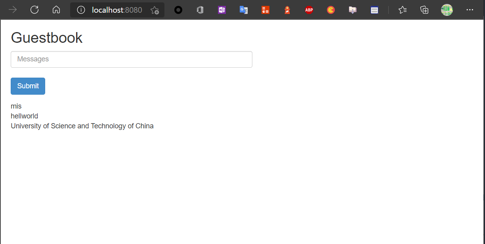

- [Example: Depolying PHP Guestbook application with MongoDB](#example-depolying-php-guestbook-application-with-mongodb)
  - [Start up the Mongo Database](#start-up-the-mongo-database)
    - [Creating the Mongo Deployment](#creating-the-mongo-deployment)
    - [Creating the MongoDB Service](#creating-the-mongodb-service)
  - [Set up and Expose the Guestbook Frontend](#set-up-and-expose-the-guestbook-frontend)
    - [Creating the Guestbook Frontend Deployment](#creating-the-guestbook-frontend-deployment)
    - [Creating the Frontend Service](#creating-the-frontend-service)
      - [Viewing the Frontend Service via kubectl port-forward](#viewing-the-frontend-service-via-kubectl-port-forward)
  - [Scale the Web Frontend](#scale-the-web-frontend)

# Example: Depolying PHP Guestbook application with MongoDB

本部分将常见一个简单的实验性质的multier web application，该部分包含两个部分：

+ A single-instance MongoDB to store guestbook entries
+ Multiple web frontend instances

## Start up the Mongo Database

### Creating the Mongo Deployment

创建如下部署文件描述mongo-deployment.yaml的Mongo Deployment

```yaml
apiVersion: apps/v1
kind: Deployment
metadata:
  name: mongo
  labels:
    app.kubernetes.io/name: mongo
    app.kubernetes.io/component: backend
  namespace: k8s-samples
spec:
  selector:
    matchLabels:
      app.kubernetes.io/name: mongo
      app.kubernetes.io/component: backend
  replicas: 1
  template:
    metadata:
      labels:
        app.kubernetes.io/name: mongo
        app.kubernetes.io/component: backend
    spec:
      containers:
      - name: mongo
        image: mongo:4.2
        args:
          - --bind_ip
          - 0.0.0.0
        resources:
          requests:
            cpu: 100m
            memory: 100Mi
        ports:
        - containerPort: 27017
```

使用kubectl命令确认mongo部署状态

```
kubectl get pods -n k8s-samples 
......
mongo-75f59d57f4-mzzkn   1/1     Running            0          11m
```

使用kubectl logs命令查看mongo日志

```
kubectl logs -n k8s-samples mongo-75f59d57f4-mzzkn
2021-04-16T06:44:12.302+0000 I  CONTROL  [main] Automatically disabling TLS 1.0, to force-enable TLS 1.0 specify --sslDisabledProtocols 'none'
2021-04-16T06:44:12.304+0000 W  ASIO     [main] No TransportLayer configured during NetworkInterface startup
2021-04-16T06:44:12.305+0000 I  CONTROL  [initandlisten] MongoDB starting : pid=1 port=27017 dbpath=/data/db 64-bit host=mongo-75f59d57f4-mzzkn
2021-04-16T06:44:12.305+0000 I  CONTROL  [initandlisten] db version v4.2.13
2021-04-16T06:44:12.305+0000 I  CONTROL  [initandlisten] git version: 82dd40f60c55dae12426c08fd7150d79a0e28e23
2021-04-16T06:44:12.305+0000 I  CONTROL  [initandlisten] OpenSSL version: OpenSSL 1.1.1  11 Sep 2018
2021-04-16T06:44:12.305+0000 I  CONTROL  [initandlisten] allocator: tcmalloc
2021-04-16T06:44:12.305+0000 I  CONTROL  [initandlisten] modules: none
2021-04-16T06:44:12.305+0000 I  CONTROL  [initandlisten] build environment:
2021-04-16T06:44:12.305+0000 I  CONTROL  [initandlisten]     distmod: ubuntu1804
2021-04-16T06:44:12.305+0000 I  CONTROL  [initandlisten]     distarch: x86_64
2021-04-16T06:44:12.305+0000 I  CONTROL  [initandlisten]     target_arch: x86_64
2021-04-16T06:44:12.305+0000 I  CONTROL  [initandlisten] options: { net: { bindIp: "0.0.0.0" } }
......
```

### Creating the MongoDB Service

guestbook应用使用MongoDB作为其数据库存储，因此需要将MongoDB发布为服务。

创建部署文件mongo-service.yaml描述的Service

```yaml
apiVersion: v1
kind: Service
metadata:
  name: mongo
  labels:
    app.kubernetes.io/name: mongo
    app.kubernetes.io/component: backend
  namespace: k8s-samples
spec:
  ports:
  - port: 27017
    targetPort: 27017
  selector:
    app.kubernetes.io/name: mongo
    app.kubernetes.io/component: backend
```

查看服务部署状态：

```
kubectl get svc -n k8s-samples
......
mongo       ClusterIP   10.105.48.20    <none>        27017/TCP           34s
```

## Set up and Expose the Guestbook Frontend

guestbook application有一个web前端负责处理HTTP请求，以PHP语言编写，该应用被配置为连接到`mongo` service，用以存储Guestbook entries

### Creating the Guestbook Frontend Deployment

```yaml
apiVersion: apps/v1
kind: Deployment
metadata:
  name: frontend
  labels:
    app.kubernetes.io/name: guestbook
    app.kubernetes.io/component: frontend
spec:
  selector:
    matchLabels:
      app.kubernetes.io/name: guestbook
      app.kubernetes.io/component: frontend
  replicas: 3
  template:
    metadata:
      labels:
        app.kubernetes.io/name: guestbook
        app.kubernetes.io/component: frontend
    spec:
      containers:
      - name: guestbook
        image: paulczar/gb-frontend:v5
        # image: gcr.io/google-samples/gb-frontend:v4
        resources:
          requests:
            cpu: 100m
            memory: 100Mi
        env:
        - name: GET_HOSTS_FROM
          value: dns
        ports:
        - containerPort: 80
```

使用kubectl查看部署状态

```
kubectl get pods -l app.kubernetes.io/name=guestbook -l app.kubernetes.io/component=frontend -n k8s-samples
NAME                       READY   STATUS    RESTARTS   AGE
frontend-848d88c7c-2fmsl   1/1     Running   0          3m46s
frontend-848d88c7c-ggkxk   1/1     Running   0          3m46s
frontend-848d88c7c-lgbkp   1/1     Running   0          3m46s
```

### Creating the Frontend Service

按照如下文件部署frontend service，该service使用clusterIP，虽然不可被Kubernetes外部网络访问，但此处仅作为测试，可以使用kube-proxy的port-forward进行测试。

```yaml
apiVersion: v1
kind: Service
metadata:
  name: frontend
  labels:
    app.kubernetes.io/name: guestbook
    app.kubernetes.io/component: frontend
spec:
  ports:
  - port: 80
  selector:
    app.kubernetes.io/name: guestbook
    app.kubernetes.io/component: frontend
```

使用kubectl获取此时frontend service状态

```
kubectl get svc -n k8s-samples frontend
NAME       TYPE        CLUSTER-IP      EXTERNAL-IP   PORT(S)   AGE
frontend   ClusterIP   10.107.119.64   <none>        80/TCP    6m21s
```

#### Viewing the Frontend Service via kubectl port-forward

使用kubectl命令将frontend的80端口映射到本机的8080端口上

```
kubectl port-forward svc/frontend 8080:80 -n k8s-samples
Forwarding from 127.0.0.1:8080 -> 80
Forwarding from [::1]:8080 -> 80
```

通过浏览器访问本机8080端口



## Scale the Web Frontend

使用kubectl命令扩展frontend的Pods

```
kubectl scale deployment frontend -n k8s-samples --replicas=5
```

查看此时web frontend的Pods运行状态

```
kubectl get pods -n k8s-samples -l app.kubernetes.io/component=frontend
NAME                       READY   STATUS    RESTARTS   AGE
frontend-848d88c7c-2fmsl   1/1     Running   0          39m
frontend-848d88c7c-4v5lb   1/1     Running   0          3m18s
frontend-848d88c7c-549cf   1/1     Running   0          3m17s
frontend-848d88c7c-ggkxk   1/1     Running   0          39m
frontend-848d88c7c-lgbkp   1/1     Running   0          39m
```

使用kubectl命令降低frontend的Pods

```
kubectl scale deployment frontend --replicas=2 -n k8s-samples
```

查看此时web frontend的Pods的运行状态

```
kubectl get pods -n k8s-samples -l app.kubernetes.io/component=frontend
NAME                       READY   STATUS    RESTARTS   AGE
frontend-848d88c7c-2fmsl   1/1     Running   0          41m
frontend-848d88c7c-ggkxk   1/1     Running   0          41m
```


