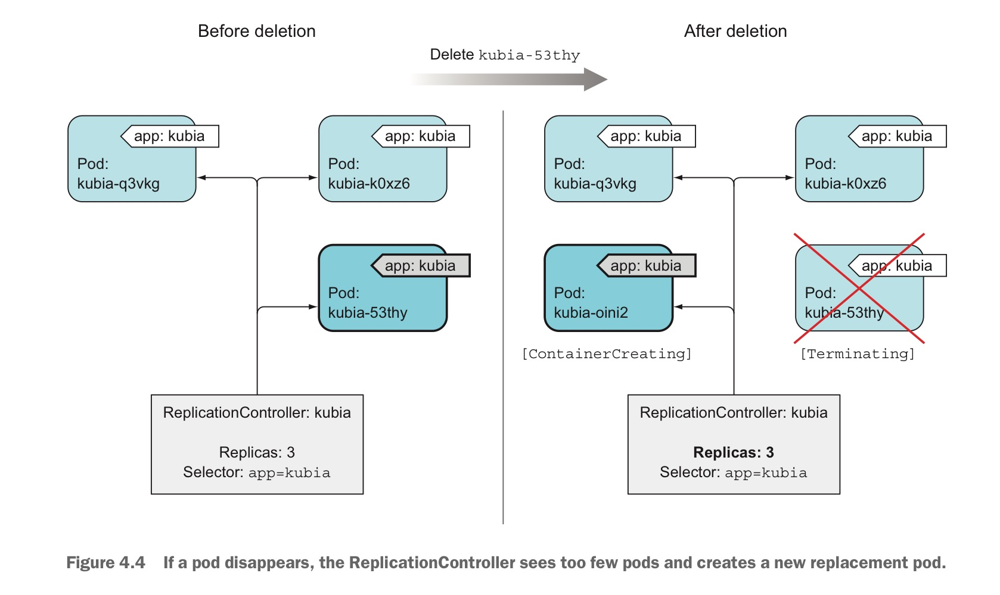

- [Kubernetes Controllers Actions](#kubernetes-controllers-actions)
  - [Liveness Probes](#liveness-probes)
    - [Creating an HTTP-based liveness probe](#creating-an-http-based-liveness-probe)
    - [Configuring addtional properties of the liveness probe](#configuring-addtional-properties-of-the-liveness-probe)
  - [ReplicationControllers](#replicationcontrollers)
    - [Creating ReplicationControllers](#creating-replicationcontrollers)
      - [Deleting Pods maintained by ReplicationControllers](#deleting-pods-maintained-by-replicationcontrollers)
      - [No Specify selector](#no-specify-selector)
      - [Pod Template's labels are inconsistent with selector](#pod-templates-labels-are-inconsistent-with-selector)
    - [Understanding what caused the controller to Create a New Pod](#understanding-what-caused-the-controller-to-create-a-new-pod)

# Kubernetes Controllers Actions

`Kubernetes controllers`提供了`pods`管理机制，确保`pods`的健康与持续运行，并按照用户指定的伸缩要求动态伸缩Pod数目

## Liveness Probes

关于Probe的详细介绍，参照链接[Probe](../kubernetes_concept/Kubernetes_pods.md##container-probe)

### Creating an HTTP-based liveness probe

创建一个演示的demo

```js
const http = require('http');
const os = require('os');

console.log("lxyustc server starting...");

var requestCount = 0;

var handler = function(request, response){
    console.log("Recevied request from " + request.connection.remoteAddress);
    requestCount++;
    if(requestCount > 5) {
        response.writeHead(500);
        response.end("Need to be restarted");
        return;
    }
    response.writeHead(200);
    response.end("You've hit " + os.hostname() + "\n");
};

var www = http.createServer(handler);
www.listen(8080);
```

该demo在第五次请求时反馈500状态码，并输出信息"Need to be restarted"

该demo已制成docker镜像 `lxyustc.registrydomain.com:5000/test-image-liveness-demo`

docker镜像dockerfile

```Dockerfile
FROM node:13.10.1-stretch
ADD app.js /app.js
ENTRYPOINT [ "node", "app.js"]
```

创建一个liveness probe demo演示yaml，[liveness-probe-demo](kubernetes_actions_workspace/lxyustc-pod-liveness-probe-demo.yaml)

```yaml
apiVersion: v1
kind: Pod
metadata:
  name: liveness-probe-demo-pod
  labels:
    probe: http-based-liveness-probe
spec:
  containers:
  - name: liveness-probe-demo-pod-container
    image: lxyustc.registrydomain.com:5000/test-image-liveness-demo:v0.1
    livenessProbe:
        httpGet:
          path: /
          port: 8080
    resources:
      limits:
        memory: "128Mi"
        cpu: "500m"
    ports:
      - containerPort: 8080
```

上述配置文件中，添加了liveness probe方式为httpGetAction，端口号为8080，路径为/

使用命令启动pods

```terminal
# kubectl apply -f lxyustc-pod-liveness-probe-demo.yaml
```

使用命令查看pod描述

```terminal
# kubectl describe pods liveness-probe-demo-pod
Name:         liveness-probe-demo-pod
Namespace:    default
Priority:     0
Node:         slave-node2-arm/10.10.197.99
Start Time:   Mon, 20 Apr 2020 11:38:06 +0800
Labels:       probe=http-based-liveness-probe
Annotations:  Status:  Running
IP:           10.244.2.91
IPs:
  IP:  10.244.2.91
Containers:
  liveness-probe-demo-pod-container:
    Container ID:   docker://d8ceb0a47938e79974703154c378aec64321254c91faed8c4cc5cabfabe1e910
    Image:          lxyustc.registrydomain.com:5000/test-image-liveness-demo:v0.1
    Image ID:       docker-pullable://lxyustc.registrydomain.com:5000/test-image-liveness-demo@sha256:24c256ca8c51f010f6be77ef0e315eff15f7fd8556c0bcfac5abca7add9805aa
    Port:           8080/TCP
    Host Port:      0/TCP
    State:          Running
      Started:      Mon, 20 Apr 2020 11:48:14 +0800
    Last State:     Terminated
      Reason:       Error
      Exit Code:    137
      Started:      Mon, 20 Apr 2020 11:46:24 +0800
      Finished:     Mon, 20 Apr 2020 11:48:13 +0800
    Ready:          True
    Restart Count:  6
    Limits:
      cpu:     500m
      memory:  128Mi
    Requests:
      cpu:        500m
      memory:     128Mi
    Liveness:     http-get http://:8080/ delay=0s timeout=1s period=10s #success=1 #failure=3
    Environment:  <none>
    Mounts:
      /var/run/secrets/kubernetes.io/serviceaccount from default-token-s86f4 (ro)
Conditions:
  Type              Status
  Initialized       True
  Ready             True
  ContainersReady   True
  PodScheduled      True
Volumes:
  default-token-s86f4:
    Type:        Secret (a volume populated by a Secret)
    SecretName:  default-token-s86f4
    Optional:    false
QoS Class:       Guaranteed
Node-Selectors:  <none>
Tolerations:     node.kubernetes.io/not-ready:NoExecute for 300s
                 node.kubernetes.io/unreachable:NoExecute for 300s
Events:
  Type     Reason     Age                    From                      Message
  ----     ------     ----                   ----                      -------
  Normal   Scheduled  <unknown>              default-scheduler         Successfully assigned default/liveness-probe-demo-pod to slave-node2-arm
  Normal   Pulling    11m                    kubelet, slave-node2-arm  Pulling image "lxyustc.registrydomain.com:5000/test-image-liveness-demo:v0.1"
  Normal   Pulled     11m                    kubelet, slave-node2-arm  Successfully pulled image "lxyustc.registrydomain.com:5000/test-image-liveness-demo:v0.1"
  Normal   Killing    6m59s (x3 over 9m49s)  kubelet, slave-node2-arm  Container liveness-probe-demo-pod-container failed liveness probe, will be restarted
  Normal   Created    6m29s (x4 over 11m)    kubelet, slave-node2-arm  Created container liveness-probe-demo-pod-container
  Normal   Started    6m28s (x4 over 11m)    kubelet, slave-node2-arm  Started container liveness-probe-demo-pod-container
  Warning  Unhealthy  5m29s (x10 over 10m)   kubelet, slave-node2-arm  Liveness probe failed: HTTP probe failed with statuscode: 500
  Normal   Pulled     59s (x6 over 9m19s)    kubelet, slave-node2-arm  Container image "lxyustc.registrydomain.com:5000/test-image-liveness-demo:v0.1" already present on machine
```

在详细描述中可以看到liveness probe详细描述：

```
Liveness:     http-get http://:8080/ delay=0s timeout=1s period=10s #success=1 #failure=3
```

在上述描述文件中可进一步发现如下信息:

1. *Exit Code:    137*，即该container被外部信号终止，137=128+9，9对应信号`SIGKILL`
2. *Restart Count:  6*，即重启6次
   > 程序在响应第五次请求时返回500，HttpGetAction检测时会发送请求，占用一次次数，因此在用户不进行访问时容器仍然会强制重启

### Configuring addtional properties of the liveness probe

在前面的pod描述中可以发现如下内容：

```
Liveness:     http-get http://:8080/ delay=0s timeout=1s period=10s #success=1 #failure=3
```

其中的`delay`, `timeout`, `period`, `success` 以及 `failure`均可编辑，对应的域如下：

| 域名 | 配置项 | 物理含义 |
| :----: | :---- | :---- |
| `initialDelaySeconds` | delay | Number of seconds **after the container** has started **before liveness probes are initiated**. |
| `timeoutSeconds` | timeout | Number of seconds **after which the probe times out**. Defaults to 1 second. Minimum value is 1 |
| `periodSeconds` | period | How often (in seconds) to perform the probe. Default to 10 seconds. Minimum value is 1 |
| `successThreshold` | success | Minimum consecutive successes for the probe to be considered successful after having failed. Defaults to 1. **Must be 1 for liveness and startup**. Minimum value is 1. |
| `failureThreshold` | failure | Minimum consecutive failures for the probe to be considered failed after having succeeded. Defaults to 3. Minimum value is 1. |

修改配置文件为[lxyustc-pod-liveness-probe-demo-v2.yaml](kubernetes_actions_workspace/lxyustc-pod-liveness-probe-demo-v2.yaml)

```yaml
apiVersion: v1
kind: Pod
metadata:
  name: liveness-probe-demo-pod-v2
  labels:
    probe: http-based-liveness-probe
spec:
  containers:
  - name: liveness-probe-demo-pod-container
    image: lxyustc.registrydomain.com:5000/test-image-liveness-demo:v0.1
    livenessProbe:
        httpGet:
          path: /
          port: 8080
        initialDelaySeconds: 20
        failureThreshold: 4
    resources:
      limits:
        memory: "128Mi"
        cpu: "500m"
    ports:
      - containerPort: 8080
```

使用命令创建pod

```terminal
# kubectl apply -f lxyustc-pod-liveness-probe-demo-v2.yaml
```

查看此时的pod

```terminal
# kubectl describe pods liveness-probe-demo-pod-v2
Name:         liveness-probe-demo-pod-v2
Namespace:    default
Priority:     0
Node:         slave-node2-arm/10.10.197.99
Start Time:   Mon, 20 Apr 2020 14:57:22 +0800
Labels:       probe=http-based-liveness-probe
Annotations:  Status:  Running
IP:           10.244.2.92
IPs:
  IP:  10.244.2.92
Containers:
  liveness-probe-demo-pod-container:
    Container ID:   docker://3724c358986d8235670fa5ecdc0f74c9e45327508bd3b137928137853945c58a
    Image:          lxyustc.registrydomain.com:5000/test-image-liveness-demo:v0.1
    Image ID:       docker-pullable://lxyustc.registrydomain.com:5000/test-image-liveness-demo@sha256:24c256ca8c51f010f6be77ef0e315eff15f7fd8556c0bcfac5abca7add9805aa
    Port:           8080/TCP
    Host Port:      0/TCP
    State:          Running
      Started:      Mon, 20 Apr 2020 14:59:39 +0800
    Last State:     Terminated
      Reason:       Error
      Exit Code:    137
      Started:      Mon, 20 Apr 2020 14:57:24 +0800
      Finished:     Mon, 20 Apr 2020 14:59:39 +0800
    Ready:          True
    Restart Count:  1
    Limits:
      cpu:     500m
      memory:  128Mi
    Requests:
      cpu:        500m
      memory:     128Mi
    Liveness:     http-get http://:8080/ delay=20s timeout=1s period=10s #success=1 #failure=4
    Environment:  <none>
    Mounts:
      /var/run/secrets/kubernetes.io/serviceaccount from default-token-s86f4 (ro)
Conditions:
  Type              Status
  Initialized       True
  Ready             True
  ContainersReady   True
  PodScheduled      True
Volumes:
  default-token-s86f4:
    Type:        Secret (a volume populated by a Secret)
    SecretName:  default-token-s86f4
    Optional:    false
QoS Class:       Guaranteed
Node-Selectors:  <none>
Tolerations:     node.kubernetes.io/not-ready:NoExecute for 300s
                 node.kubernetes.io/unreachable:NoExecute for 300s
Events:
  Type     Reason     Age                  From                      Message
  ----     ------     ----                 ----                      -------
  Normal   Scheduled  <unknown>            default-scheduler         Successfully assigned default/liveness-probe-demo-pod-v2 to slave-node2-arm
  Warning  Unhealthy  62s (x4 over 92s)    kubelet, slave-node2-arm  Liveness probe failed: HTTP probe failed with statuscode: 500
  Normal   Killing    62s                  kubelet, slave-node2-arm  Container liveness-probe-demo-pod-container failed liveness probe, will be restarted
  Normal   Pulled     32s (x2 over 2m48s)  kubelet, slave-node2-arm  Container image "lxyustc.registrydomain.com:5000/test-image-liveness-demo:v0.1" already present on machine
  Normal   Created    32s (x2 over 2m47s)  kubelet, slave-node2-arm  Created container liveness-probe-demo-pod-container
  Normal   Started    32s (x2 over 2m47s)  kubelet, slave-node2-arm  Started container liveness-probe-demo-pod-container
```

> **对于liveness probe而言，一定要设置域`initialDelaySeconds`，以避免出现pods中的contianer都未准备好服务时，由于超过liveness probe的探测成功条件而导致的不必要重启引起服务崩溃**

## ReplicationControllers

关于`ReplicationControllers`介绍，参照此链接[ReplicationControllers](../kubernetes_concept/kubernetes_controllers/kubernetes_replicationcontroller.md)

关于`ReplicationControllers`的API请求结构，参照此链接[ReplicationControllers API](https://kubernetes.io/docs/reference/generated/kubernetes-api/v1.18/#replicationcontroller-v1-core)

其对象由4个域组成：

|Field|Description|
|:----:|:---|
|`apiVerison`</br>*String*|APIVersion defines the versioned schema of this representation of an object. Servers should convert recognized schemas to the latest internal value, and may reject unrecognized values. More info: https://git.k8s.io/community/contributors/devel/sig-architecture/api-conventions.md#resources|
|`kind`</br>*string*|Kind is a string value representing the REST resource this object represents. Servers may infer this from the endpoint the client submits requests to. Cannot be updated. In CamelCase. More info: https://git.k8s.io/community/contributors/devel/sig-architecture/api-conventions.md#types-kinds|
|`metadata`</br>*ObjectMeta*|If the Labels of a ReplicationController are empty, they are defaulted to be the same as the Pod(s) that the replication controller manages. Standard object's metadata. More info: https://git.k8s.io/community/contributors/devel/sig-architecture/api-conventions.md#metadata|
|`spec`</br>*[ReplicationControllerSpec](https://kubernetes.io/docs/reference/generated/kubernetes-api/v1.18/#objectmeta-v1-meta)*|Spec defines the specification of the desired behavior of the replication controller. More info: https://git.k8s.io/community/contributors/devel/sig-architecture/api-conventions.md#spec-and-status|
|`status`</br>*ReplicationControllerStatus*|Status is the most recently observed status of the replication controller. This data may be out of date by some window of time. Populated by the system. Read-only. More info: https://git.k8s.io/community/contributors/devel/sig-architecture/api-conventions.md#spec-and-status|

> ReplicationControllers关键三要素`label selector`, `template`, `replica counts`属于spec域


### Creating ReplicationControllers

编辑yaml描述文件[lxyustc-replication-controllers-test.yaml](kubernetes_actions_workspace/lxyustc-replication-controllers-test.yaml)

```yaml
apiVersion: v1
kind: ReplicationController
metadata:
  name: test-replicationcontroller
spec:
  replicas: 3
  selector:
    kubernetes.actions.rc-app: lxyustc-test-app
  template:
    metadata:
      name: lxyustc
      labels:
        kubernetes.actions.rc-app: lxyustc-test-app
    spec:
      containers:
        - name: lxyustc-container
          image: lxyustc.registrydomain.com:5000/test-image:v0.1
          ports:
            - containerPort: 8080
```

使用命令创建ReplicationControllers：

```terminal
# kubectl apply -f lxyustc-replication-controllers-test.yaml
```

查看此时的Pods

```terminal
# kubectl get pods
test-replicationcontroller-22qks   1/1     Running   0          9s
test-replicationcontroller-skdlb   1/1     Running   0          9s
test-replicationcontroller-xqgmh   1/1     Running   0          9s
```

查看此时的replicationcontrollers详细信息

```terminal
# kubectl describe rc test-replicationcontroller
Name:         test-replicationcontroller
Namespace:    default
Selector:     kubernetes.actions.rc-app=lxyustc-test-app
Labels:       kubernetes.actions.rc-app=lxyustc-test-app
Annotations:  Replicas:  3 current / 3 desired
Pods Status:  3 Running / 0 Waiting / 0 Succeeded / 0 Failed
Pod Template:
  Labels:  kubernetes.actions.rc-app=lxyustc-test-app
  Containers:
   lxyustc-container:
    Image:        lxyustc.registrydomain.com:5000/test-image:v0.1
    Port:         8080/TCP
    Host Port:    0/TCP
    Environment:  <none>
    Mounts:       <none>
  Volumes:        <none>
Events:
  Type    Reason            Age   From                    Message
  ----    ------            ----  ----                    -------
  Normal  SuccessfulCreate  15m   replication-controller  Created pod: test-replicationcontroller-skdlb
  Normal  SuccessfulCreate  15m   replication-controller  Created pod: test-replicationcontroller-22qks
  Normal  SuccessfulCreate  15m   replication-controller  Created pod: test-replicationcontroller-xqgmh
```

#### Deleting Pods maintained by ReplicationControllers

使用命令删除1个Pods

```terminal
# kubectl delete pods test-replicationcontroller-22qks
```

查看此时的pods

```terminal
# kubectl get pods
Every 2.0s: kubectl get pods                                                                                                                                                         master-arm: Sun Apr 26 12:03:03 2020
NAME                               READY   STATUS        RESTARTS   AGE
test-replicationcontroller-22qks   1/1     Terminating   0          19m
test-replicationcontroller-9fr4x   1/1     Running       0          5s
test-replicationcontroller-skdlb   1/1     Running       0          19m
test-replicationcontroller-xqgmh   1/1     Running       0          19m
```

可发现终止Pods的同时，立马创建一个新的Pods

查看ReplicationControllers描述

```terminal
# kubectl describe rc  test-replicationcontroller
Name:         test-replicationcontroller
Namespace:    default
Selector:     kubernetes.actions.rc-app=lxyustc-test-app
Labels:       kubernetes.actions.rc-app=lxyustc-test-app
Annotations:  Replicas:  3 current / 3 desired
Pods Status:  3 Running / 0 Waiting / 0 Succeeded / 0 Failed
Pod Template:
  Labels:  kubernetes.actions.rc-app=lxyustc-test-app
  Containers:
   lxyustc-container:
    Image:        lxyustc.registrydomain.com:5000/test-image:v0.1
    Port:         8080/TCP
    Host Port:    0/TCP
    Environment:  <none>
    Mounts:       <none>
  Volumes:        <none>
Events:
  Type    Reason            Age    From                    Message
  ----    ------            ----   ----                    -------
  Normal  SuccessfulCreate  22m    replication-controller  Created pod: test-replicationcontroller-skdlb
  Normal  SuccessfulCreate  22m    replication-controller  Created pod: test-replicationcontroller-22qks
  Normal  SuccessfulCreate  22m    replication-controller  Created pod: test-replicationcontroller-xqgmh
  Normal  SuccessfulCreate  3m15s  replication-controller  Created pod: test-replicationcontroller-9fr4x
```

可以发现对于`ReplicationControllers`而言，在未指定其`labels`的情况下，会将Pod `Template`的`labels`作为自己的`labels`

#### No Specify selector

不指定`ReplicationControllers`的selector，编写`ReplicationControllers`的描述文件[lxyustc-replication-controllers-without-selector](kubernetes_actions_workspace/lxyustc-replication-controllers-without-selector-test.yaml)

```yaml
apiVersion: v1
kind: ReplicationController
metadata:
  name: test-replicationcontroller-without-selector
spec:
  replicas: 3
  template:
    metadata:
      name: lxyustc
      labels:
        kubernetes.actions.rc-app: lxyustc-test-app
    spec:
      containers:
        - name: lxyustc-container
          image: lxyustc.registrydomain.com:5000/test-image:v0.1
          ports:
            - containerPort: 8080
```

创建此ReplicationControllers

```terminal
# kubectl apply -f lxyustc-replication-controllers-without-selector-test.yaml
replicationcontroller/test-replicationcontroller-without-selector created
```

查看此ReplicationControllers

```terminal
# kubectl describe rc test-replicationcontroller-without-selector
Name:         test-replicationcontroller-without-selector
Namespace:    default
Selector:     kubernetes.actions.rc-app=lxyustc-test-app
Labels:       kubernetes.actions.rc-app=lxyustc-test-app
Annotations:  Replicas:  3 current / 3 desired
Pods Status:  3 Running / 0 Waiting / 0 Succeeded / 0 Failed
Pod Template:
  Labels:  kubernetes.actions.rc-app=lxyustc-test-app
  Containers:
   lxyustc-container:
    Image:        lxyustc.registrydomain.com:5000/test-image:v0.1
    Port:         8080/TCP
    Host Port:    0/TCP
    Environment:  <none>
    Mounts:       <none>
  Volumes:        <none>
Events:
  Type    Reason            Age    From                    Message
  ----    ------            ----   ----                    -------
  Normal  SuccessfulCreate  2m15s  replication-controller  Created pod: test-replicationcontroller-without-selector-vtdlh
  Normal  SuccessfulCreate  2m15s  replication-controller  Created pod: test-replicationcontroller-without-selector-lsjr4
  Normal  SuccessfulCreate  2m15s  replication-controller  Created pod: test-replicationcontroller-without-selector-dddw5
```

可发现虽然未指定`selector`，但kubernetes从Pod `template`的labels推断`selector`

#### Pod Template's labels are inconsistent with selector

创建一个新的`ReplicationControllers`描述文件[lxyustc-replication-controllers-inconsisitent.yaml]

```yaml
apiVersion: v1
kind: ReplicationController
metadata:
  name: test-replicationcontroller-inconsisitent
spec:
  replicas: 3
  selector:
    kubernetes.actions.rc-app: lxyustc-test-app-1
  template:
    metadata:
      name: lxyustc
      labels:
        kubernetes.actions.rc-app: lxyustc-test-app
    spec:
      containers:
        - name: lxyustc-container
          image: lxyustc.registrydomain.com:5000/test-image:v0.1
          ports:
            - containerPort: 8080
```

创建ReplicationControllers

```terminal
# kubectl apply -f lxyustc-replication-controllers-inconsisitent.yaml
The ReplicationController "test-replicationcontroller-inconsisitent" is invalid: spec.template.metadata.labels: Invalid value: map[string]string{"kubernetes.actions.rc-app":"lxyustc-test-app"}: `selector` does not match template `labels`
```

**直接报错，说明`ReplicationControllers`启动时存在校验，必须保证selector与pod template的labels一致。**

### Understanding what caused the controller to Create a New Pod

<span style="border-bottom: 2px solid red; font-weight: bold">需要再次的明确的是：删除pods这一动作并不是引起Controllers响应的原因，Controllers响应的原因在于当前的Pods集合中的数量与replicas值不一致</span>

当`ReplicationControllers`管理的某一`Pods`被删除后导致集群资源状态发生变化，该变化将通知ReplicationControllers，ReplicationControllers接到通知后检查当前状态实际的Pods数量，发现不一致，进行处理


