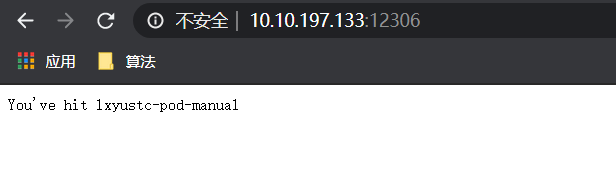
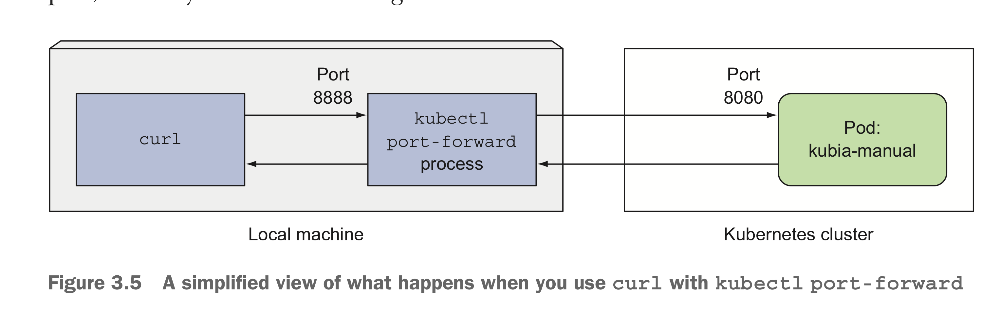
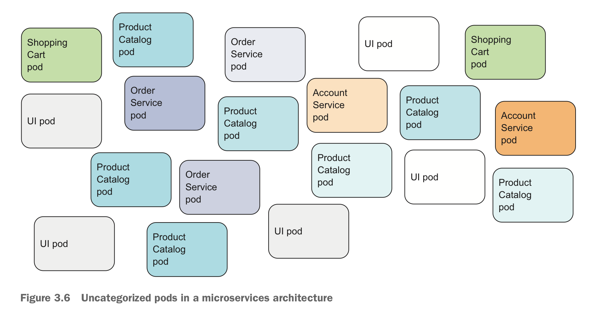
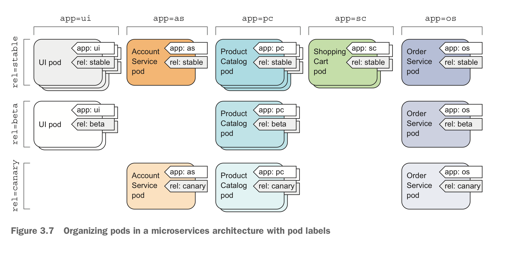
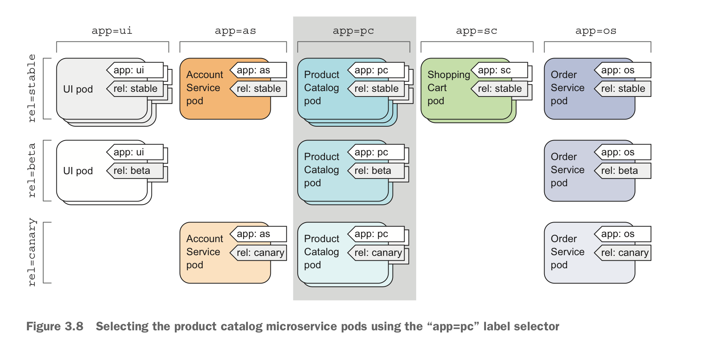
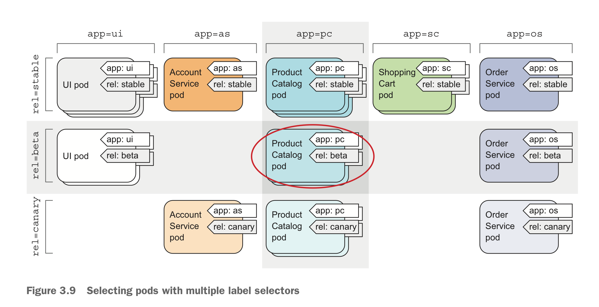

- [Kubernetes Pods Action](#kubernetes-pods-action)
  - [查看已存在的Pod yaml描述文件](#%e6%9f%a5%e7%9c%8b%e5%b7%b2%e5%ad%98%e5%9c%a8%e7%9a%84pod-yaml%e6%8f%8f%e8%bf%b0%e6%96%87%e4%bb%b6)
  - [通过yaml描述文件创建一个单独的pod](#%e9%80%9a%e8%bf%87yaml%e6%8f%8f%e8%bf%b0%e6%96%87%e4%bb%b6%e5%88%9b%e5%bb%ba%e4%b8%80%e4%b8%aa%e5%8d%95%e7%8b%ac%e7%9a%84pod)
  - [向pod发送请求](#%e5%90%91pod%e5%8f%91%e9%80%81%e8%af%b7%e6%b1%82)
  - [使用labels组织pods](#%e4%bd%bf%e7%94%a8labels%e7%bb%84%e7%bb%87pods)
    - [在创建pod时指定pod的labels](#%e5%9c%a8%e5%88%9b%e5%bb%bapod%e6%97%b6%e6%8c%87%e5%ae%9apod%e7%9a%84labels)
    - [修改现有Pods的Labels](#%e4%bf%ae%e6%94%b9%e7%8e%b0%e6%9c%89pods%e7%9a%84labels)
    - [使用label selectors选择pods集合](#%e4%bd%bf%e7%94%a8label-selectors%e9%80%89%e6%8b%a9pods%e9%9b%86%e5%90%88)
      - [使用label selectors列出Pods](#%e4%bd%bf%e7%94%a8label-selectors%e5%88%97%e5%87%bapods)
    - [使用lables和selectors约束pods调度](#%e4%bd%bf%e7%94%a8lables%e5%92%8cselectors%e7%ba%a6%e6%9d%9fpods%e8%b0%83%e5%ba%a6)
      - [调度pods至特定节点](#%e8%b0%83%e5%ba%a6pods%e8%87%b3%e7%89%b9%e5%ae%9a%e8%8a%82%e7%82%b9)
  - [Annotating 注释](#annotating-%e6%b3%a8%e9%87%8a)
    - [查看现有Kubernetes object的annotation](#%e6%9f%a5%e7%9c%8b%e7%8e%b0%e6%9c%89kubernetes-object%e7%9a%84annotation)
    - [添加修改annotations](#%e6%b7%bb%e5%8a%a0%e4%bf%ae%e6%94%b9annotations)
  - [Using Namespaces to group resources](#using-namespaces-to-group-resources)
    - [create a namespace](#create-a-namespace)
- [kubectl get namespaces](#kubectl-get-namespaces)
- [kubectl get pods -n lxyustc-namespace](#kubectl-get-pods--n-lxyustc-namespace)
- [kubectl get pods -A](#kubectl-get-pods--a)
- [kubectl apply -f lxyustc-pod-test.yaml -n lxyustc-namespace](#kubectl-apply--f-lxyustc-pod-testyaml--n-lxyustc-namespace)
- [kubectl get pods -n lxyustc-namespace](#kubectl-get-pods--n-lxyustc-namespace-1)

# Kubernetes Pods Action

查看Kubernetes API参考文档 https://kubernetes.io/docs/reference/generated/kubernetes-api/v1.18/#pod-v1-core

## 查看已存在的Pod yaml描述文件

```terminal
kubectl get pods <pod-name> -o yaml
```

输入

```terminal
kubectl get pods test-replicator-9fwcc -o yaml
```

输出

```yaml
apiVersion: v1
kind: Pod
metadata:
  creationTimestamp: "2020-03-31T01:46:50Z"
  generateName: test-replicator-
  labels:
    run: test-replicator
  managedFields:
  - apiVersion: v1
    fieldsType: FieldsV1
    fieldsV1:
      f:metadata:
        f:generateName: {}
        f:labels:
          .: {}
          f:run: {}
        f:ownerReferences:
          .: {}
          k:{"uid":"84f88a6d-ee3c-462b-a7e5-84302d92f785"}:
            .: {}
            f:apiVersion: {}
            f:blockOwnerDeletion: {}
            f:controller: {}
            f:kind: {}
            f:name: {}
            f:uid: {}
      f:spec:
        f:containers:
          k:{"name":"test-replicator"}:
            .: {}
            f:image: {}
            f:imagePullPolicy: {}
            f:name: {}
            f:ports:
              .: {}
              k:{"containerPort":8080,"protocol":"TCP"}:
                .: {}
                f:containerPort: {}
                f:protocol: {}
            f:resources: {}
            f:terminationMessagePath: {}
            f:terminationMessagePolicy: {}
        f:dnsPolicy: {}
        f:enableServiceLinks: {}
        f:restartPolicy: {}
        f:schedulerName: {}
        f:securityContext: {}
        f:terminationGracePeriodSeconds: {}
    manager: kube-controller-manager
    operation: Update
    time: "2020-03-31T01:46:50Z"
  - apiVersion: v1
    fieldsType: FieldsV1
    fieldsV1:
      f:status:
        f:conditions:
          k:{"type":"ContainersReady"}:
            .: {}
            f:lastProbeTime: {}
            f:lastTransitionTime: {}
            f:status: {}
            f:type: {}
          k:{"type":"Initialized"}:
            .: {}
            f:lastProbeTime: {}
            f:lastTransitionTime: {}
            f:status: {}
            f:type: {}
          k:{"type":"Ready"}:
            .: {}
            f:lastProbeTime: {}
            f:lastTransitionTime: {}
            f:status: {}
            f:type: {}
        f:containerStatuses: {}
        f:hostIP: {}
        f:phase: {}
        f:podIP: {}
        f:podIPs:
          .: {}
          k:{"ip":"10.244.1.86"}:
            .: {}
            f:ip: {}
        f:startTime: {}
    manager: kubelet
    operation: Update
    time: "2020-03-31T01:46:56Z"
  name: test-replicator-9fwcc
  namespace: default
  ownerReferences:
  - apiVersion: v1
    blockOwnerDeletion: true
    controller: true
    kind: ReplicationController
    name: test-replicator
    uid: 84f88a6d-ee3c-462b-a7e5-84302d92f785
  resourceVersion: "15372099"
  selfLink: /api/v1/namespaces/default/pods/test-replicator-9fwcc
  uid: 4a87be15-d08c-49ce-94b7-6dd588dafd52
spec:
  containers:
  - image: lxyustc.registrydomain.com:5000/test-image:v0.1
    imagePullPolicy: IfNotPresent
    name: test-replicator
    ports:
    - containerPort: 8080
      protocol: TCP
    resources: {}
    terminationMessagePath: /dev/termination-log
    terminationMessagePolicy: File
    volumeMounts:
    - mountPath: /var/run/secrets/kubernetes.io/serviceaccount
      name: default-token-s86f4
      readOnly: true
  dnsPolicy: ClusterFirst
  enableServiceLinks: true
  nodeName: slave-node1-arm
  priority: 0
  restartPolicy: Always
  schedulerName: default-scheduler
  securityContext: {}
  serviceAccount: default
  serviceAccountName: default
  terminationGracePeriodSeconds: 30
  tolerations:
  - effect: NoExecute
    key: node.kubernetes.io/not-ready
    operator: Exists
    tolerationSeconds: 300
  - effect: NoExecute
    key: node.kubernetes.io/unreachable
    operator: Exists
    tolerationSeconds: 300
  volumes:
  - name: default-token-s86f4
    secret:
      defaultMode: 420
      secretName: default-token-s86f4
status:
  conditions:
  - lastProbeTime: null
    lastTransitionTime: "2020-03-31T01:46:50Z"
    status: "True"
    type: Initialized
  - lastProbeTime: null
    lastTransitionTime: "2020-03-31T01:46:56Z"
    status: "True"
    type: Ready
  - lastProbeTime: null
    lastTransitionTime: "2020-03-31T01:46:56Z"
    status: "True"
    type: ContainersReady
  - lastProbeTime: null
    lastTransitionTime: "2020-03-31T01:46:50Z"
    status: "True"
    type: PodScheduled
  containerStatuses:
  - containerID: docker://8f57e560c28c70ee250ec0543daff2fc4d105f0482d5b626fc0ea6d67e09655e
    image: lxyustc.registrydomain.com:5000/test-image:v0.1
    imageID: docker-pullable://lxyustc.registrydomain.com:5000/test-image@sha256:eef4bb12589bbb75ab39b78676fbfdedde03446dd387efcecc109e17cb87bfb7
    lastState: {}
    name: test-replicator
    ready: true
    restartCount: 0
    started: true
    state:
      running:
        startedAt: "2020-03-31T01:46:55Z"
  hostIP: 10.10.197.98
  phase: Running
  podIP: 10.244.1.86
  podIPs:
  - ip: 10.244.1.86
  qosClass: BestEffort
  startTime: "2020-03-31T01:46:50Z"
```

上述文件中的几个域

<table>
    <tr>
        <th>Field </th>
        <th>Description</th>
    </tr>
    <tr>
        <td>apiVersion <br> string</td>
        <td>APIVersion defines the versioned schema of this representation of an object. Servers should convert recognized schemas to the latest internal value, and may reject unrecognized values. More info: https://git.k8s.io/community/contributors/devel/sig-architecture/api-conventions.md#resources</td>
    </tr>
    <tr>
        <td>kind<br>string</td>
        <td>Kind is a string value representing the REST resource this object represents. Servers may infer this from the endpoint the client submits requests to. Cannot be updated. In CamelCase. More info: https://git.k8s.io/community/contributors/devel/sig-architecture/api-conventions.md#types-kinds</td>
    </tr>
    <tr>
        <td>metadata<br>ObjectMeta</td>
        <td>Standard object's metadata. More info: https://git.k8s.io/community/contributors/devel/sig-architecture/api-conventions.md#metadata</td>
    </tr>
    <tr>
        <td>spec<br>PodSpec</td>
        <td>Specification of the desired behavior of the pod. More info: https://git.k8s.io/community/contributors/devel/sig-architecture/api-conventions.md#spec-and-status</td>
    </tr>
    <tr>
        <td>status<br>PodStatus</td>
        <td>Most recently observed status of the pod. This data may not be up to date. Populated by the system. Read-only. More info: https://git.k8s.io/community/contributors/devel/sig-architecture/api-conventions.md#spec-and-status</td>
    </tr>
</table>

## 通过yaml描述文件创建一个单独的pod

[lxyustc-pod-test.yaml](kubernetes_actions_workspace/lxyustc-pod-test.yaml)

内容如下

```yaml
apiVersion: v1
kind: Pod
metadata:
  name: lxyustc-pod-manual
spec:
  containers:
  - name: lxyustc-pod-manual
    image: lxyustc.registrydomain.com:5000/test-image:v0.1
    resources:
      limits:
        memory: "128Mi"
        cpu: "500m"
    ports:
      - containerPort: 8080
        protocol: TCP
```

输入如下命令

```terminal
kubectl create -f lxyustc-pod-test.yaml
```

该命令按照描述创建名称为lxyustc-pod-manual的pod

查看该pod信息

```terminal
kubectl get pods lxyustc-pod-test -o yaml
```

输出如下

```yaml
apiVersion: v1
kind: Pod
metadata:
  creationTimestamp: "2020-03-31T09:35:43Z"
  managedFields:
  - apiVersion: v1
    fieldsType: FieldsV1
    fieldsV1:
      f:spec:
        f:containers:
          k:{"name":"lxyustc-pod-manual"}:
            .: {}
            f:image: {}
            f:imagePullPolicy: {}
            f:name: {}
            f:ports:
              .: {}
              k:{"containerPort":8080,"protocol":"TCP"}:
                .: {}
                f:containerPort: {}
                f:protocol: {}
            f:resources:
              .: {}
              f:limits:
                .: {}
                f:cpu: {}
                f:memory: {}
              f:requests:
                .: {}
                f:cpu: {}
                f:memory: {}
            f:terminationMessagePath: {}
            f:terminationMessagePolicy: {}
        f:dnsPolicy: {}
        f:enableServiceLinks: {}
        f:restartPolicy: {}
        f:schedulerName: {}
        f:securityContext: {}
        f:terminationGracePeriodSeconds: {}
    manager: kubectl.exe
    operation: Update
    time: "2020-03-31T09:35:43Z"
  - apiVersion: v1
    fieldsType: FieldsV1
    fieldsV1:
      f:status:
        f:conditions:
          k:{"type":"ContainersReady"}:
            .: {}
            f:lastProbeTime: {}
            f:lastTransitionTime: {}
            f:status: {}
            f:type: {}
          k:{"type":"Initialized"}:
            .: {}
            f:lastProbeTime: {}
            f:lastTransitionTime: {}
            f:status: {}
            f:type: {}
          k:{"type":"Ready"}:
            .: {}
            f:lastProbeTime: {}
            f:lastTransitionTime: {}
            f:status: {}
            f:type: {}
        f:containerStatuses: {}
        f:hostIP: {}
        f:phase: {}
        f:podIP: {}
        f:podIPs:
          .: {}
          k:{"ip":"10.244.2.71"}:
            .: {}
            f:ip: {}
        f:startTime: {}
    manager: kubelet
    operation: Update
    time: "2020-03-31T09:35:45Z"
  name: lxyustc-pod-manual
  namespace: default
  resourceVersion: "15440319"
  selfLink: /api/v1/namespaces/default/pods/lxyustc-pod-manual
  uid: 45bae9db-6197-4770-9fcd-641ba2e57176
spec:
  containers:
  - image: lxyustc.registrydomain.com:5000/test-image:v0.1
    imagePullPolicy: IfNotPresent
    name: lxyustc-pod-manual
    ports:
    - containerPort: 8080
      protocol: TCP
    resources:
      limits:
        cpu: 500m
        memory: 128Mi
      requests:
        cpu: 500m
        memory: 128Mi
    terminationMessagePath: /dev/termination-log
    terminationMessagePolicy: File
    volumeMounts:
    - mountPath: /var/run/secrets/kubernetes.io/serviceaccount
      name: default-token-s86f4
      readOnly: true
  dnsPolicy: ClusterFirst
  enableServiceLinks: true
  nodeName: slave-node2-arm
  priority: 0
  restartPolicy: Always
  schedulerName: default-scheduler
  securityContext: {}
  serviceAccount: default
  serviceAccountName: default
  terminationGracePeriodSeconds: 30
  tolerations:
  - effect: NoExecute
    key: node.kubernetes.io/not-ready
    operator: Exists
    tolerationSeconds: 300
  - effect: NoExecute
    key: node.kubernetes.io/unreachable
    operator: Exists
    tolerationSeconds: 300
  volumes:
  - name: default-token-s86f4
    secret:
      defaultMode: 420
      secretName: default-token-s86f4
status:
  conditions:
  - lastProbeTime: null
    lastTransitionTime: "2020-03-31T09:35:43Z"
    status: "True"
    type: Initialized
  - lastProbeTime: null
    lastTransitionTime: "2020-03-31T09:35:45Z"
    status: "True"
    type: Ready
  - lastProbeTime: null
    lastTransitionTime: "2020-03-31T09:35:45Z"
    status: "True"
    type: ContainersReady
  - lastProbeTime: null
    lastTransitionTime: "2020-03-31T09:35:43Z"
    status: "True"
    type: PodScheduled
  containerStatuses:
  - containerID: docker://2e51b4dc7191aa82d6bddd1de28ace61551fcfc4b9e5b89c4e80031b9ff165d6
    image: lxyustc.registrydomain.com:5000/test-image:v0.1
    imageID: docker-pullable://lxyustc.registrydomain.com:5000/test-image@sha256:eef4bb12589bbb75ab39b78676fbfdedde03446dd387efcecc109e17cb87bfb7
    lastState: {}
    name: lxyustc-pod-manual
    ready: true
    restartCount: 0
    started: true
    state:
      running:
        startedAt: "2020-03-31T09:35:45Z"
  hostIP: 10.10.197.99
  phase: Running
  podIP: 10.244.2.71
  podIPs:
  - ip: 10.244.2.71
  qosClass: Guaranteed
  startTime: "2020-03-31T09:35:43Z"
```

查看pods日志

```terminal
# kubectl logs lxyustc-pod-manual 
Kubia server starting...
```

查看pod中指定容器的日志

```terminal
# kubectl logs lxyustc-pod-manual -c lxyustc-pod-manual
Kubia server starting...
```

## 向pod发送请求

使用`port-forward`命令将请求转发至pod中，该命令允许不将pod发布为服务的条件下，将请求转发至pod中，满足调试或其他原因导致的访问需求。

```terminal
# kubectl port-forward lxyustc-pod-manual 12306:8080 --address=10.10.197.133
```

> **Note**: 上述命令执行时需在机器中配置好kubectl访问配置，即Kubeconfig，且IP地址为命令执行所在机器的IP地址或`localhost`，结合示意图可以很好理解，本质上**是通过kubectl port-forward命令**建立一个**请求转发路径**，建立转发路径所需的参数认证信息包含在kubectl命令行所需的kubeconfig或其他参数中。

浏览器中打开 http://10.10.197.133:12306



`kubectl port-forward`命令执行的基本示意图：



## 使用labels组织pods

`labels`：一种将`pods`及其他`Kubernetes objects`组织为不同**组groups**的机制；

在面对数量庞大的Kubernetes objects时，若无组织机制将出现下图场景，给管理工作带来复杂及混乱



labels为键值对，可通过label selectors进行选择和使用，概念介绍可参考下面链接[label](../kubernetes_concept/Kubernetes_Object.md#labels-and-selectors)

通过labels将pods组织成如下图所示形式，使用了两个labels：`app`和`rel`



### 在创建pod时指定pod的labels

[lxyustc-pod-test-with-labels](kubernetes_actions_workspace/lxyustc-pod-test-with-labels.yaml)

```yaml
apiVersion: v1
kind: Pod
metadata:
  name: lxyustc-pod-manual-v2
  labels:
    creation_method: manual
    env: prod
spec:
  containers:
  - name: lxyustc-pod-manual-v2
    image: lxyustc.registrydomain.com:5000/test-image:v0.1
    resources:
      limits:
        memory: "128Mi"
        cpu: "500m"
    ports:
      - containerPort: 8080
        protocol: TCP
```

创建Pod

```terminal
# kubectl apply -f lxyustc-pod-test-with-labels.yaml
```

查看pods的labels

```terminal
# kubectl get pods --show-labels
NAME                     READY   STATUS    RESTARTS   AGE     LABELS
lxyustc-pod-manual       1/1     Running   0          47h     <none>
lxyustc-pod-manual-v2    1/1     Running   0          2m32s   creation_method=manual,env=prod
nginx-5564cc57cd-68k6k   1/1     Running   0          2d6h    app=nginx,pod-template-hash=5564cc57cd
nginx-5564cc57cd-zl7fs   1/1     Running   0          2d6h    app=nginx,pod-template-hash=5564cc57cd
test-replicator          1/1     Running   0          25h     run=test-replicator
test-replicator-w6xm8    1/1     Running   0          23h     app=httpd
```

通过-L选项，选择特定的labels进行展示

```terminal
# kubectl get pods -L creation_method,env
NAME                     READY   STATUS    RESTARTS   AGE     CREATION_METHOD   ENV
lxyustc-pod-manual       1/1     Running   0          47h
lxyustc-pod-manual-v2    1/1     Running   0          6m42s   manual            prod
nginx-5564cc57cd-68k6k   1/1     Running   0          2d6h
nginx-5564cc57cd-zl7fs   1/1     Running   0          2d6h
test-replicator          1/1     Running   0          26h
test-replicator-w6xm8    1/1     Running   0          23h
```

### 修改现有Pods的Labels

通过`kubectl label`命令向现有pods添加标签

```terminal
# kubectl label pods lxyustc-pod-manual creation_method=manual
pod/lxyustc-pod-manual labeled
```

查看此时的label

```terminal
# kubectl get pods -L creation_method,env
NAME                     READY   STATUS    RESTARTS   AGE    CREATION_METHOD   ENV
lxyustc-pod-manual       1/1     Running   0          47h    manual
lxyustc-pod-manual-v2    1/1     Running   0          11m    manual            prod
nginx-5564cc57cd-68k6k   1/1     Running   0          2d7h
nginx-5564cc57cd-zl7fs   1/1     Running   0          2d7h
test-replicator          1/1     Running   0          26h
test-replicator-w6xm8    1/1     Running   0          23h
```

通过`kubectl label`命令修改现有pods的指定标签，**修改现有标签的值时需要添加`--overwrite`选项**

```terminal
# kubectl label pods lxyustc-pod-manual-v2  env=debug --overwrite
pod/lxyustc-pod-manual-v2 labeled
```

查看此时的label

```terminal
# kubectl get pods -L creation_method,env
NAME                     READY   STATUS    RESTARTS   AGE    CREATION_METHOD   ENV
lxyustc-pod-manual       1/1     Running   0          47h    manual
lxyustc-pod-manual-v2    1/1     Running   0          17m    manual            debug
nginx-5564cc57cd-68k6k   1/1     Running   0          2d7h
nginx-5564cc57cd-zl7fs   1/1     Running   0          2d7h
test-replicator          1/1     Running   0          26h
test-replicator-w6xm8    1/1     Running   0          23h
```

### 使用label selectors选择pods集合

关于label selector介绍，查看此链接[label selector](../kuberete_concept/../kubernetes_concept/Kubernetes_Object.md#label-selector
)

#### 使用label selectors列出Pods

使用命令`kubectl get pods -l <labels>`列出特定label中的pods，注意此处**是`-l`而非`-L`**

列出包含`env`标签的pods

```terminal
# kubectl get pods -l env
NAME                    READY   STATUS    RESTARTS   AGE
lxyustc-pod-manual-v2   1/1     Running   0          17h
```

列出**不**包含`env`标签的pods

```terminal
# kubectl get pods -l '!env'
NAME                     READY   STATUS    RESTARTS   AGE
lxyustc-pod-manual       1/1     Running   0          2d16h
nginx-5564cc57cd-68k6k   1/1     Running   0          3d
nginx-5564cc57cd-zl7fs   1/1     Running   0          3d
test-replicator          1/1     Running   0          43h
test-replicator-w6xm8    1/1     Running   0          41h
```



可以使用组合条件选择pods，组合条件以`,`分隔。



### 使用lables和selectors约束pods调度

在异构集群中，某些特定条件下需要将pods调度至特定节点上，如GPU、SSD节点。此时可通过`node labels`及`node label selectors`进行。

> **Note**: `node labels`与`node label selectors`出发点并不是指定某一特定node而是提供一种Pod调度时的node需求，调度本身还是通过kubernetes按照`node labels`与`node label selectors`要求进行。

通过kubectl label命令为`node`添加`node labels`

```terminal
# kubectl label nodes slave-node1-arm arch=arm64
node/slave-node1-arm labeled
```

查看此时node的labels

```terminal
# kubectl get nodes -L arch
NAME              STATUS   ROLES    AGE    VERSION   ARCH
master-arm        Ready    master   118d   v1.18.0
slave-node1-arm   Ready    <none>   118d   v1.18.0   arm64
slave-node2-arm   Ready    <none>   118d   v1.18.0
```

#### 调度pods至特定节点

pod描述文件[lxyustc-pod-test-arm64](kubernetes_actions_workspace/lxyustc-pod-test-arm64.yaml)

```yaml
apiVersion: v1
kind: Pod
metadata:
  name: lxyustc-pod-test-arm64
  labels:
    arch: arm64
spec:
  nodeSelector:
    arch: arm64
  containers:
  - name: lxyustc-pod-test-arm64
    image: lxyustc.registrydomain.com:5000/test-image:v0.1
    resources:
      limits:
        memory: "128Mi"
        cpu: "500m"
    ports:
      - containerPort: 8080
```

创建pod

```teminal
# kubectl apply -f lxyustc-pod-test-arm64.yaml
```

查看pods
```terminal
# kubectl get pods -o wide
NAME                     READY   STATUS    RESTARTS   AGE     IP            NODE              NOMINATED NODE   READINESS GATES
lxyustc-pod-manual       1/1     Running   0          2d17h   10.244.2.71   slave-node2-arm   <none>           <none>
lxyustc-pod-manual-v2    1/1     Running   0          18h     10.244.1.90   slave-node1-arm   <none>           <none>
lxyustc-pod-test-arm64   1/1     Running   0          3m46s   10.244.1.91   slave-node1-arm   <none>           <none>
nginx-5564cc57cd-68k6k   1/1     Running   0          3d1h    10.244.1.82   slave-node1-arm   <none>           <none>
nginx-5564cc57cd-zl7fs   1/1     Running   0          3d1h    10.244.1.85   slave-node1-arm   <none>           <none>
test-replicator          1/1     Running   0          44h     10.244.2.72   slave-node2-arm   <none>           <none>
test-replicator-w6xm8    1/1     Running   0          41h     10.244.1.89   slave-node1-arm   <none>           <none>
```

删掉node的arch这一label后，再次创建pod，使用命令查看pod创建状态：
```terminal
# kubectl describe pods lxyustc-pod-test-arm64
Name:         lxyustc-pod-test-arm64
Namespace:    default
Priority:     0
Node:         <none>
Labels:       arch=arm64
Annotations:  Status:  Pending
IP:
IPs:          <none>
Containers:
  lxyustc-pod-test-arm64:
    Image:      lxyustc.registrydomain.com:5000/test-image:v0.1
    Port:       8080/TCP
    Host Port:  0/TCP
    Limits:
      cpu:     500m
      memory:  128Mi
    Requests:
      cpu:        500m
      memory:     128Mi
    Environment:  <none>
    Mounts:
      /var/run/secrets/kubernetes.io/serviceaccount from default-token-s86f4 (ro)
Conditions:
  Type           Status
  PodScheduled   False
Volumes:
  default-token-s86f4:
    Type:        Secret (a volume populated by a Secret)
    SecretName:  default-token-s86f4
    Optional:    false
QoS Class:       Guaranteed
Node-Selectors:  arch=arm64
Tolerations:     node.kubernetes.io/not-ready:NoExecute for 300s
                 node.kubernetes.io/unreachable:NoExecute for 300s
Events:
  Type     Reason            Age        From               Message
  ----     ------            ----       ----               -------
  Warning  FailedScheduling  <unknown>  default-scheduler  0/3 nodes are available: 3 node(s) didn't match node selector.
  Warning  FailedScheduling  <unknown>  default-scheduler  0/3 nodes are available: 3 node(s) didn't match node selector.
```

## Annotating 注释

除了Labels外，Kubernetes对象还可以拥有注释`annotation`，`annotations`本身也是键值对，但与labels不同在于，annotation无法用于组织kubernetes object，`annotation`注释详细介绍内容参考[annotation](../kubernetes_concept/Kubernetes_Object.md#Annotation)

kubernetes默认情况下自动为kubernetes Object添加特定的`annotations`

### 查看现有Kubernetes object的annotation

```terminal
# kubectl get pods lxyustc-pod-manual -o yaml
apiVersion: v1
kind: Pod
metadata:
  annotations:
    kubectl.kubernetes.io/last-applied-configuration: |
      {"apiVersion":"v1","kind":"Pod","metadata":{"annotations":{},"name":"lxyustc-pod-manual","namespace":"default"},"spec":{"containers":[{"image":"lxyustc.registrydomain.com:5000/test-image:v0.1","name":"lxyustc-po
d-manual","ports":[{"containerPort":8080,"protocol":"TCP"}],"resources":{"limits":{"cpu":"500m","memory":"128Mi"}}}]}}
......
```

### 添加修改annotations

使用`kubectl annotate`命令编辑`kubernetes object`的annotations

```terminal
# kubectl annotate pods lxyustc-pod-manual createmethod=mannual
```

查看pod的annotation

```terminal
# kubectl get pods lxyustc-pod-manual -o yaml
apiVersion: v1
kind: Pod
metadata:
  annotations:
    createmethod: mannual
    kubectl.kubernetes.io/last-applied-configuration: |
      {"apiVersion":"v1","kind":"Pod","metadata":{"annotations":{},"name":"lxyustc-pod-manual","namespace":"default"},"spec":{"containers":[{"image":"lxyustc.registrydomain.com:5000/test-image:v0.1","name":"lxyustc-po
d-manual","ports":[{"containerPort":8080,"protocol":"TCP"}],"resources":{"limits":{"cpu":"500m","memory":"128Mi"}}}]}}
```

## Using Namespaces to group resources

关于namespaces的详细介绍参考[Namespace](../kubernetes_concept/Kubernetes_Object.md#Namespaces)


### create a namespace

通过yaml描述文件创建namespace，[lxyustc-namespace.yaml](kubernetes_actions_workspace/lxyustc-namespace.yaml)

```yaml
apiVersion: v1
kind: namespace
metadata:
    name: lxyustc-namespace
```

创建namespace

```terminal
# kubectl apply -f lxyutc-namespace.yaml
```

查看namespace

```terminal
# kubectl get namespaces
NAME                   STATUS   AGE
default                Active   132d
kube-node-lease        Active   132d
kube-public            Active   132d
kube-system            Active   132d
kubernetes-dashboard   Active   17d
lxyustc-namespace      Active   2m5s
```

也可通过`kubectl`命令行工具创建namespace

```terminal
# kubectl create namespace test-namespace
```

查看namespace

```terminal
# kubectl get namespaces
查看namespace

```terminal
# kubectl get namespaces
NAME                   STATUS   AGE
default                Active   132d
kube-node-lease        Active   132d
kube-public            Active   132d
kube-system            Active   132d
kubernetes-dashboard   Active   17d
lxyustc-namespace      Active   2m5s
```

### managing objects in other namespace

通过指定`kubernetes object`的metadata域中的namespace即可将`kubernetes object`创建在特定的namespace中。

编写配置文件[lxyustc-pod-test-namespace](kubernetes_actions_workspace/lxyustc-pod-test-namespace.yaml)

```yaml
apiVersion: v1
kind: Pod
metadata:
  name: lxyustc-pod-manual
  namespace: lxyustc-namespace
spec:
  containers:
  - name: lxyustc-pod-manual
    image: lxyustc.registrydomain.com:5000/test-image:v0.1
    resources:
      limits:
        memory: "128Mi"
        cpu: "500m"
    ports:
      - containerPort: 8080
        protocol: TCP
```

查看namespace中的pod

```terminal
# kubectl get pods -n lxyustc-namespace
NAME                 READY   STATUS    RESTARTS   AGE
lxyustc-pod-manual   1/1     Running   0          12s
```

查看所有的pods

```terminal
# kubectl get pods -A
NAMESPACE              NAME                                        READY   STATUS    RESTARTS   AGE
default                lxyustc-pod-manual                          1/1     Running   2          16d
default                lxyustc-pod-manual-v2                       1/1     Running   2          15d
default                lxyustc-pod-test-arm64                      1/1     Running   0          107m
default                nginx-5564cc57cd-68k6k                      1/1     Running   2          17d
default                nginx-5564cc57cd-zl7fs                      1/1     Running   2          17d
default                test-replicator                             1/1     Running   2          16d
default                test-replicator-w6xm8                       1/1     Running   2          15d
kube-system            coredns-6fbfdf9657-9n7bp                    1/1     Running   5          17d
kube-system            coredns-6fbfdf9657-jtn44                    1/1     Running   2          17d
kube-system            etcd-master-arm                             1/1     Running   4          17d
kube-system            kube-apiserver-master-arm                   1/1     Running   5          17d
kube-system            kube-controller-manager-master-arm          1/1     Running   4          17d
kube-system            kube-flannel-ds-arm64-4ttrp                 1/1     Running   15         132d
kube-system            kube-flannel-ds-arm64-8mq2n                 1/1     Running   21         132d
kube-system            kube-flannel-ds-arm64-wvnkt                 1/1     Running   18         132d
kube-system            kube-proxy-6qgfw                            1/1     Running   2          17d
kube-system            kube-proxy-fjjcs                            1/1     Running   4          17d
kube-system            kube-proxy-j7tn8                            1/1     Running   3          17d
kube-system            kube-scheduler-master-arm                   1/1     Running   4          17d
kubernetes-dashboard   dashboard-metrics-scraper-dc6947fbf-bngnp   1/1     Running   3          17d
kubernetes-dashboard   kubernetes-dashboard-64686c4bf9-xptps       1/1     Running   4          17d
lxyustc-namespace      lxyustc-pod-manual                          1/1     Running   0          8s
```

可观察到不同的namespace间可存在同样的pod名称

也可通过kubectl命令行的-n参数直接指定创建pod的namespace

```terminal
# kubectl apply -f lxyustc-pod-test.yaml -n lxyustc-namespace
```

查看namespace中的pod

```terminal
# kubectl get pods -n lxyustc-namespace
NAME                 READY   STATUS    RESTARTS   AGE
lxyustc-pod-manual   1/1     Running   0          8s
```
