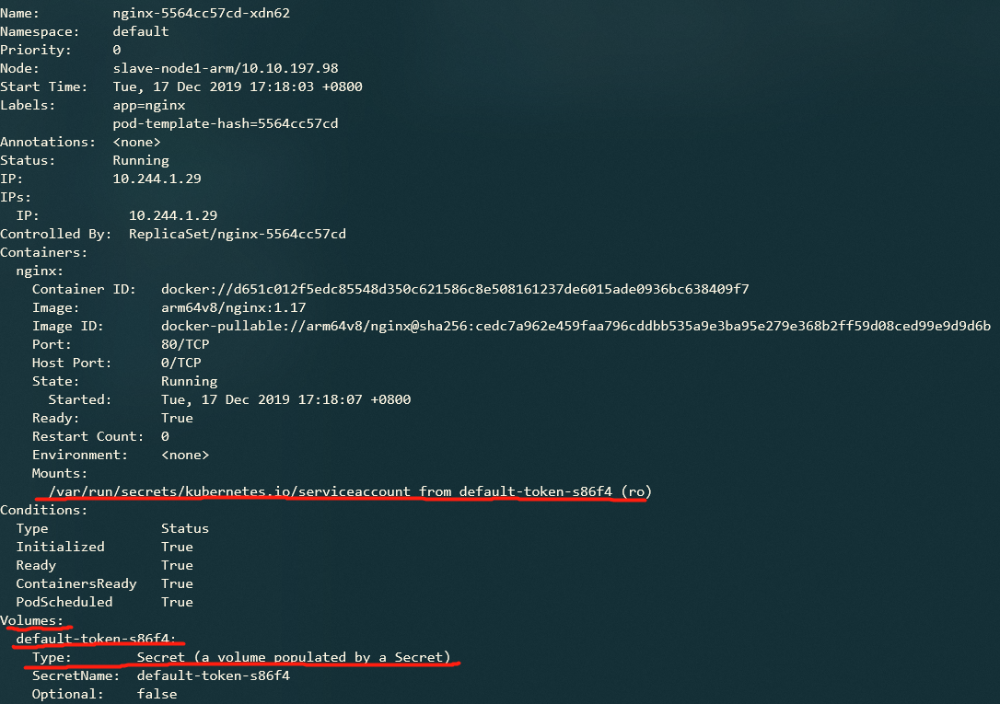

# Authenticating

- [Authenticating](#authenticating)
  - [Users in Kubernetes, Kubernetes用户](#users-in-kubernetes-kubernetes%e7%94%a8%e6%88%b7)
  - [Authentication strategies, 认证策略](#authentication-strategies-%e8%ae%a4%e8%af%81%e7%ad%96%e7%95%a5)
    - [X509 Client Certs](#x509-client-certs)

## Users in Kubernetes, Kubernetes用户
所有的Kubernetes集群拥有两类用户：
+ Service accounts，由Kubernetes管理
  + 通过Kubernetes API管理
  + 绑定至特定的Namespace
  + 由API server自动创建或通过手动调用API创建
  + service accounts绑定至存储在`Secrets`证书集合中，该集合在pods创建时，自动挂载至pods中，这样可以允许在集群内部与Kubernetes API通信
  
+ normal users，普通用户，一般由外部独立的用户管理服务管理
  + 外部用户管理服务可以通过管理员私钥分配，或者通过类似于keystone或者Google Accounts用户存储服务，甚至一个包含用户名和口令的文件进行管理；
  + Kubernetes本身无对象代表普通用户账号，因此普通用户无法通过集群API添加；

一个API请求认证从来源而言可以分为三类：
1. normal user，普通用户；
2. service account，系统账号；
3. anonymous request，匿名请求；

不论在集群内部还是外部，任何通过使用`kubectl`命令向节点上的`kubelets`，control plane的组件发出的请求均要通过认证，否则将被视为匿名请求

## Authentication strategies, 认证策略
Kubernetes通过authentication插件提供的`client certificates`(客户证书), `bearer tokens`(不记名令牌), `authenticating proxy`(认证代理), 或者`HTTP basic auth`(HTTP基本身份验证)机制对API请求进行认证。

任何HTTP请求达到API Server时，认证插件将尝试附加下列属性至请求中：

+ Username, 字符串，用于辨别终端用户，典型值为`kube-admin`或者`XX@xx.com`
+ UID，终端用户标识符
+ Groups，用户属于的用户组集合
+ Extra fields，额外的字符串map，存储在认证过程中需要使用到的额外信息。

上述值对于认证系统而言是不透明的，且仅被认证者解释后才有具体含义。

用户可同时使用多种认证方法，通常而言，用户至少会使用两种认证方式：

+ 对于`service accounts`而言，使用`service account token`作为认证方式；
+ 对于普通用户而言，至少使用一种其他的用户认证方式；

### X509 Client Certs

