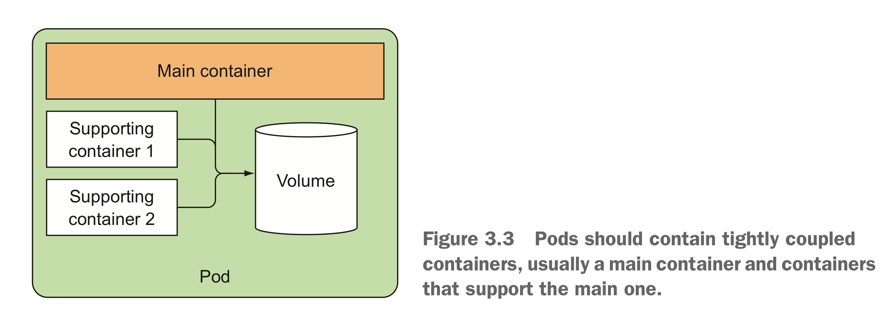
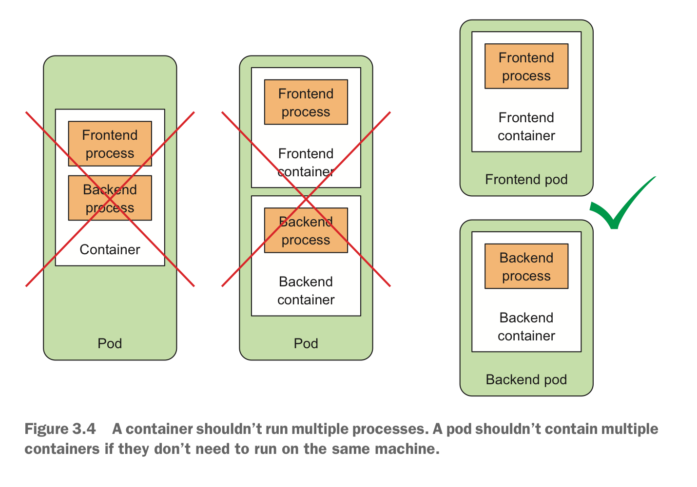

- [Kubernetes Pods](#kubernetes-pods)
  - [Inter-Pod network](#inter-pod-network)
  - [Pods一种理解角度](#pods%e4%b8%80%e7%a7%8d%e7%90%86%e8%a7%a3%e8%a7%92%e5%ba%a6)
- [Pods的合适组织方式](#pods%e7%9a%84%e5%90%88%e9%80%82%e7%bb%84%e7%bb%87%e6%96%b9%e5%bc%8f)
  - [Pods中运行多个Container的建议设计模式](#pods%e4%b8%ad%e8%bf%90%e8%a1%8c%e5%a4%9a%e4%b8%aacontainer%e7%9a%84%e5%bb%ba%e8%ae%ae%e8%ae%be%e8%ae%a1%e6%a8%a1%e5%bc%8f)

# Kubernetes Pods

Pods是kubernetes最基本的`kubernetes objects`，kubernetes采用pods这一概念的原因：

1. container本身提供了强力隔离机制，而且一个container中只运行一个进程，但某些时候需要一组container完成特定任务，此时希望这一组contianer之间可以进行`namespace`共享；
2. kubernetes pods提供了这种机制，通过配置Kubernetes pods内的container容器之间共享部分`namespaces`，如`Network`，`UTS`，`IPC`甚至于`PID`（默认情况下不开启）；
3. kubernetes pods提出的目的就在于获得隔离和整体的平衡~balance；
4. kubernetes pods内的container之间的文件系统通过volume共享；

同一个Pod中的所有`Container`共享同一个`network namespace`，同一个`IP地址`，同一个`port空间`。同一个Pod中的Container中的进程在使用网络端口时需要考虑端口占用问题，避免出现端口冲突。

同样的，同一个Pod中的`Container`共享网络接口，因此他们共享同一个`loopback network interface`，因此可以通过**localhost**进行通信。

## Inter-Pod network

Pod之间的网络是一个扁平结构**flat network**，各Pod拥有独立的IP地址，位于同一个二层网络中，之间不存在NAT转换。

## Pods一种理解角度

1. ***在逻辑上而言，pods是一种logical hosts，举止行为表现为物理机或者虚拟机***；
2. ***运行在pods中的进程，就像物理机或者虚拟机中的进程一样，唯一不同的在于，pods中运行的进程每个均运行在独立的Container中***；

# Pods的合适组织方式

如前所述，一个Pod可以视为一个主机，但由于其轻量化特性，并且从应用松耦合角度出发，应该尽量将应用分散至不同的Pods中，而非全部集中在同一个Pod里。遵循两个原则：

1. Spliting Multi-Tier Apps into Multiple Pods
2. Spliting into Multiple Pods to Enable Individual Scaling

## Pods中运行多个Container的建议设计模式

Pods中运行多个Container的建议模式是，应用由一个主进程与多个协助进程组成，如下图所示。

多个Container运行在同一个Pods中的考虑出发点可基于如下出发点进行考虑：

+ Do they need to be run together or can they run on different hosts?
+ Do they represent a single whole or are they independent components?
+ Must they be scaled together or individually?

