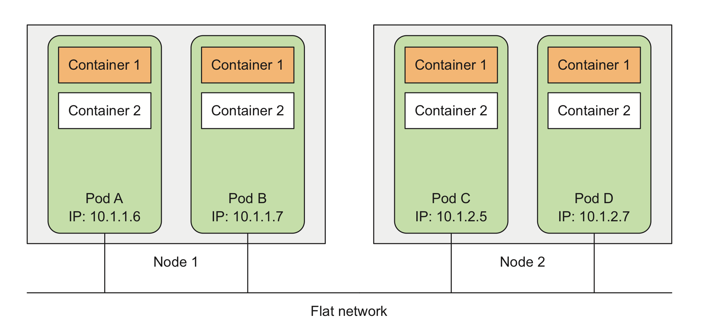

- [Kubernetes Pods](#kubernetes-pods)
  - [Inter-Pod network](#inter-pod-network)
  - [Pods一种理解角度](#pods%e4%b8%80%e7%a7%8d%e7%90%86%e8%a7%a3%e8%a7%92%e5%ba%a6)
- [Pods的合适组织方式](#pods%e7%9a%84%e5%90%88%e9%80%82%e7%bb%84%e7%bb%87%e6%96%b9%e5%bc%8f)
  - [Pods中运行多个Container的建议设计模式](#pods%e4%b8%ad%e8%bf%90%e8%a1%8c%e5%a4%9a%e4%b8%aacontainer%e7%9a%84%e5%bb%ba%e8%ae%ae%e8%ae%be%e8%ae%a1%e6%a8%a1%e5%bc%8f)
- [Container Probe](#container-probe)

# Kubernetes Pods

Pods是kubernetes最基本的`kubernetes objects`，kubernetes采用pods这一概念的原因：

1. container本身提供了强力隔离机制，而且一个container中只运行一个进程，但某些时候需要一组container完成特定任务，此时希望这一组contianer之间可以进行`namespace`共享；
2. kubernetes pods提供了这种机制，通过配置Kubernetes pods内的container容器之间共享部分`namespaces`，如`Network`，`UTS`，`IPC`甚至于`PID`（默认情况下不开启）；
3. kubernetes pods提出的目的就在于获得隔离和整体的平衡~balance；
4. kubernetes pods内的container之间的文件系统通过volume共享；

同一个Pod中的所有`Container`共享同一个`network namespace`，同一个`IP地址`，同一个`port空间`。同一个Pod中的Container中的进程在使用网络端口时需要考虑端口占用问题，避免出现端口冲突。

同样的，同一个Pod中的`Container`共享网络接口，因此他们共享同一个`loopback network interface`，因此可以通过**localhost**进行通信。

## Inter-Pod network

Pod之间的网络是一个扁平结构**flat network**，各Pod拥有独立的IP地址，位于同一个二层网络中，之间不存在NAT转换。

## Pods一种理解角度

1. ***在逻辑上而言，pods是一种logical hosts，举止行为表现为物理机或者虚拟机***；
2. ***运行在pods中的进程，就像物理机或者虚拟机中的进程一样，唯一不同的在于，pods中运行的进程每个均运行在独立的Container中***；

# Pods的合适组织方式

如前所述，一个Pod可以视为一个主机，但由于其轻量化特性，并且从应用松耦合角度出发，应该尽量将应用分散至不同的Pods中，而非全部集中在同一个Pod里。遵循两个原则：

1. Spliting Multi-Tier Apps into Multiple Pods
2. Spliting into Multiple Pods to Enable Individual Scaling

## Pods中运行多个Container的建议设计模式

Pods中运行多个Container的建议模式是，应用由一个主进程与多个协助进程组成，如下图所示。

多个Container运行在同一个Pods中的考虑出发点可基于如下出发点进行考虑：

+ Do they need to be run together or can they run on different hosts?
+ Do they represent a single whole or are they independent components?
+ Must they be scaled together or individually?

# Container Probe

Container Probe是一个探测器，由`kubelet`执行探测活动，在执行`Probe`时，`kubelet`调用由Container实现的Handler。对于Handler而言，可分为三类：

1. ExcAction
   + 执行指定的命令，当命令成功执行并返回0时，探测被认为成功
2. TCPSocketAction
   + 在Container的IP地址的特定端口上执行TCP链接检测，当端口处于打开状态时，探测被认为成功
3. HTTPGetAction
   + 在Conatiner的IP地址的特定端口及路径上执行HTTP GET请求，如果相应状态码大于等于200或小于400，则探测被认为成功

每个`Probe`由三种结果：

1. Success: Container通过检测
2. Failure: Container未通过检测
3. Unknown: 探测失败，无需采取行动

对于处于运行状态的`container`而言，kubelet可选择执行及响应3类probes：

+ `livenessProbe`: Indicates whether the Container is running. If the liveness probe fails, the kubelet kills the Container, and the Container is subjected to its restart policy. If a Container does not provide a liveness probe, the default state is `Success`.
+ `readinessProbe`: Indicates whether the Container is ready to service requests. If the readiness probe fails, the endpoints controller removes the Pod’s IP address from the endpoints of all Services that match the Pod. The default state of readiness before the initial delay is `Failure`. If a Container does not provide a readiness probe, the default state is `Success`.
+ `startupProbe`: Indicates whether the application within the Container is started. All other probes are disabled if a startup probe is provided, until it succeeds. If the startup probe fails, the kubelet kills the Container, and the Container is subjected to its restart policy. If a Container does not provide a startup probe, the default state is `Success`.

