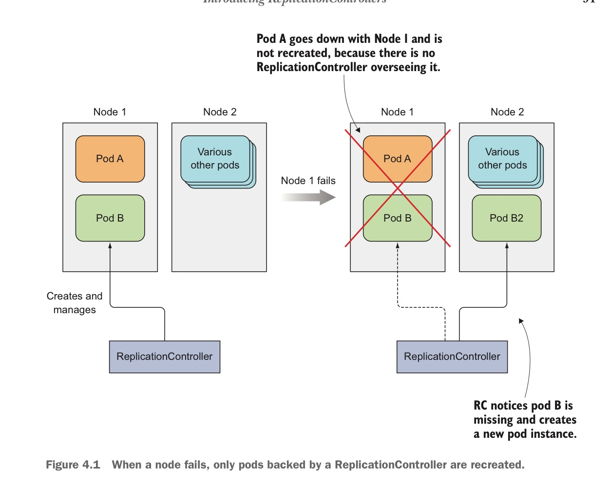
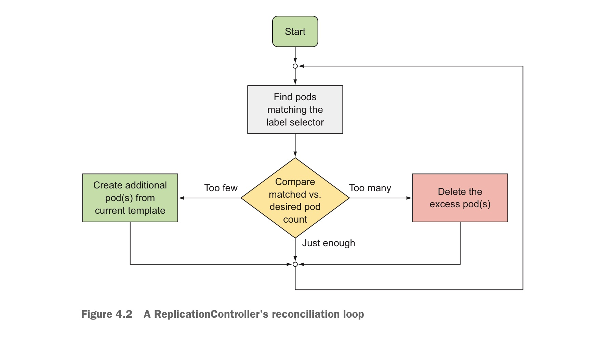
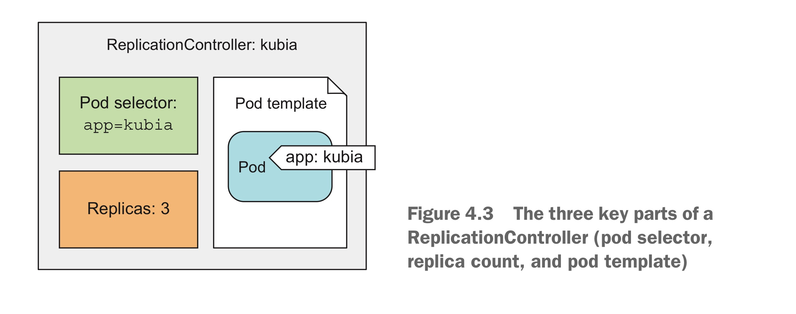

- [ReplicationControllers](#replicationcontrollers)
  - [The operation of ReplicationController](#the-operation-of-replicationcontroller)
  - [ReplicationControllers Loop](#replicationcontrollers-loop)
  - [ReplicationControllers important Parts](#replicationcontrollers-important-parts)
    - [The effect of changing ReplicationControllers' Key Parts](#the-effect-of-changing-replicationcontrollers-key-parts)
  - [The Benefits of Using A ReplicationControllers](#the-benefits-of-using-a-replicationcontrollers)

# ReplicationControllers

`ReplicationControllers`保证运行的pods数目与用户配置的pods数目一致，特别的当某一nodes失效后，若nodes上的Pods由`ReplicationControllers`维护，则该pods由`ReplicationControllers`自动在其他node上创建替代的Pods，保证使用该pods的应用服务正常。

## The operation of ReplicationController

`ReplicationControllers`持续对Pods列表进行监控，确保某一类型的Pods数量与用户配置的数量一致，若，Pods数量低于用户指定的Pods数量，则根据Temple创建Pods；反之删除多余的Pods。

上文中的"某一类型Pods"即Pods labels另一种说法。

> pods数量与用户指定的pods数量不一致可能出于以下几个原因：
> + 其他人创建了具备同样labels的pods
> + 某些人将一些pods的labels修改为ReplicationControllers管理的labels
> + 某些人删除了某一labels的pods

## ReplicationControllers Loop

`ReplicationControllers`的工作循环如图

## ReplicationControllers important Parts

对于`ReplicationControllers`而言，下述三个部分是十分关键的：

+ label selector：
  + 决定该`ReplicationControllers`管理的Pods集合，也即上文中的pods类型
+ replica count
  + 决定最终运行的Pods数量
+ pod template
  + 当Pods数量少于replica count指定的值时，创建的pod参考模板

### The effect of changing ReplicationControllers' Key Parts

对于`ReplicationControllers`而言，修改3个关键部分有不同影响：

+ replica count
  + 直接影响现有pods，改小->删除多余Pods，改大->增加Pods
+ label selector
  + 将当前`ReplicationControllers`管理的Pods集合修改为另一个集合，此时，原有Pods集合中的Pods脱离`ReplicationControllers`控制，`ReplicationControllers`将停止对原有Pods集合中的Pods维护的工作
+ pod temple
  + 影响新创建的Pods，现有Pods不受影响

## The Benefits of Using A ReplicationControllers

ReplicationControllers是一种简单又强大的概念，提供了如下强力特性：

+ It makes sure a pod (or multiple pod replicas) is always running by starting a new pod when an existing one goes missing
+ When a cluster node fails, it creates replacements replicas for all the pods that were running on the failed nod (**those that were under the ReplicationController's control**).
+ It enables easy horizontal scaling of pods - both manual and automatic

> 对于Kubernetes而言，所有新创建的Pods均为新的实体，跟其要取代的Pods实例间无任何联系

