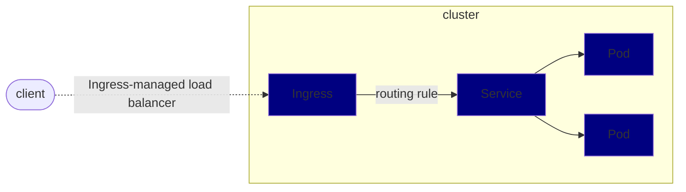

- [Ingress](#ingress)
- [Terminology](#terminology)
- [Ingress用途](#ingress用途)

# Ingress

Kubernetes API对象，用于管理外部访问集群内部的服务，这种访问通常采用http的形式进行。

Ingress可提供load balancing, SSL termination以及基于名称的virtual hosting.

# Terminology

本部分牵涉的术语如下：

+ Node: Kubernetes中的节点
+ Cluster: 由Kubernetes管理的节点集群
+ Edge router: 为集群强制执行防火墙策略的路由器
+ Cluster network: Kubernetes集群中的集群网络
+ Service: Kubernetes service对象

# Ingress用途

Ingress将集群外的HTTP及HTTPs路由暴露给集群内的Service。路由流量由Ingress资源中定义的规则控制.

下图为一个典型的Ingress例子：

Ingress可被配置用来给定一个Service以外部可达的URLs，load balance traffic, terminate SSL/TLS以及提供基于名称的virtual hosting。

Ingress controller负责完成Ingress，其通常使用负载均衡器，当让其可以配置edge router或者其他前端来帮助处理流量。

Ingress并不能选择任意的端口及协议进行暴露，除HTTP，HTTPS外，其他的服务暴露通常使用Kubernetes中的`Service.Type=NodePort`或者`Service.Type=LoadBalnace`。

**使用Ingress之前必须创建一个`Ingress controller`，否则仅创建Ingress router resource将毫无影响。**
