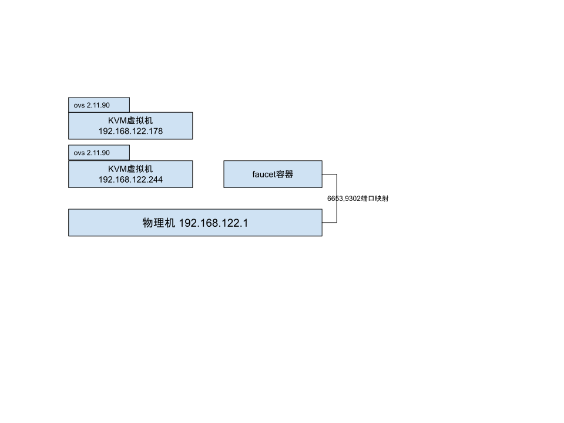

# 实验环境
## faucet配置安装  
本次实验使用容器化安装faucet，具体步骤如下：
1. 使用git clone获取faucet源码
    ```terminal
    git clone https://github.com/faucetsdn/faucet.git
    ```
2. 构建faucet镜像
   ```terminal
   cd faucet
   docker build -f Dockerfile.faucet .
   ```
   在镜像构建完成后，为faucet镜像打上标签
   ```terminal
   docker image tag 9fbc6e439ba5 faucet/faucet:latest
   ```
3. 运行faucet镜像
   ```terminal
   docker run -d --name faucet --restart=always -v ~/WorkSpace/dockeretc/faucet/:/etc/faucet -v ~/WorkSpace/dockeretc/faucet/:/var/log/faucet -p 6653:6653 -p 9302:9302 faucet/faucet:latest
   ```
   该命令实现的工作如下：
   + 将～/WorkSpace/dockeretc/faucet映射到faucet容器的挂载点/etc/faucet以及/var/log/faucet
   + 分别将宿主机6653端口与9302端口映射到容器的6653端口与9302端口
4. 后续可通过配置宿主机的~/WorkSpace/dockeretc/faucet.yaml来配置faucet，通过~/WorkSpace/dockeretc/faucet.log查看faucet的运行状态

## 测试环境节点拓扑
本次环境由两台KVM虚拟机与宿主机组成，KVM虚拟机安装debian9操作系统，运行Open vSwitch的版本为2.11.90
```terminal
# modinfo openvswitch
filename:       /lib/modules/4.14.1/extra/openvswitch.ko
alias:          net-pf-16-proto-16-family-ovs_ct_limit
alias:          net-pf-16-proto-16-family-ovs_meter
alias:          net-pf-16-proto-16-family-ovs_packet
alias:          net-pf-16-proto-16-family-ovs_flow
alias:          net-pf-16-proto-16-family-ovs_vport
alias:          net-pf-16-proto-16-family-ovs_datapath
version:        2.11.90
license:        GPL
description:    Open vSwitch switching datapath
srcversion:     6D0209E4489CE46067CF311
depends:        nf_conntrack,tunnel6,nf_nat,libcrc32c,nf_nat_ipv6,nf_nat_ipv4,nf_defrag_ipv6
name:           openvswitch
vermagic:       4.14.1 SMP mod_unload modversions 
parm:           udp_port:Destination UDP port (ushort)
```
环境图如下所示


使用tunctl创建5个虚拟的tap设备p1~p5，如下：
```terminal
12: p1: <BROADCAST,MULTICAST> mtu 1500 qdisc noop state DOWN group default qlen 1000
    link/ether ee:d9:93:5e:e3:68 brd ff:ff:ff:ff:ff:ff
13: p2: <BROADCAST,MULTICAST> mtu 1500 qdisc noop state DOWN group default qlen 1000
    link/ether 6e:5a:9a:3e:0e:f1 brd ff:ff:ff:ff:ff:ff
14: p3: <BROADCAST,MULTICAST> mtu 1500 qdisc noop state DOWN group default qlen 1000
    link/ether aa:96:39:40:e4:d2 brd ff:ff:ff:ff:ff:ff
15: p4: <BROADCAST,MULTICAST> mtu 1500 qdisc noop state DOWN group default qlen 1000
    link/ether 72:3a:78:d6:45:1c brd ff:ff:ff:ff:ff:ff
16: p5: <BROADCAST,MULTICAST> mtu 1500 qdisc noop state DOWN group default qlen 1000
    link/ether 1e:bc:6f:91:46:11 brd ff:ff:ff:ff:ff:ff
```

## 辅助脚本
本次实验使用辅助脚本如下
1. openvswitch环境变量导入
   ```bash
   export PATH=$PATH:/usr/local/share/openvswitch/scripts
   ```
2. ovs当前流表导出
   ```bash
   #!/bin/bash

   dump-flows () {
     ovs-ofctl -OOpenFlow13 --names --no-stat dump-flows "$@" \
       | sed 's/cookie=0x5adc15c0, //'
   }

   dump-flows $1
   ```
3. ovs流表保存
   ```bash
   #!/bin/bash

   save-flows () {
     ovs-ofctl -OOpenFlow13 --no-names --sort dump-flows "$@"
   }

   save-flows $1
   ```
4. ovs流表比较
   ```bash
   #!/bin/bash

   diff-flows () {
     ovs-ofctl -OOpenFlow13 diff-flows "$@" | sed 's/cookie=0x5adc15c0 //'
   }

   diff-flows $1 $2

   ```