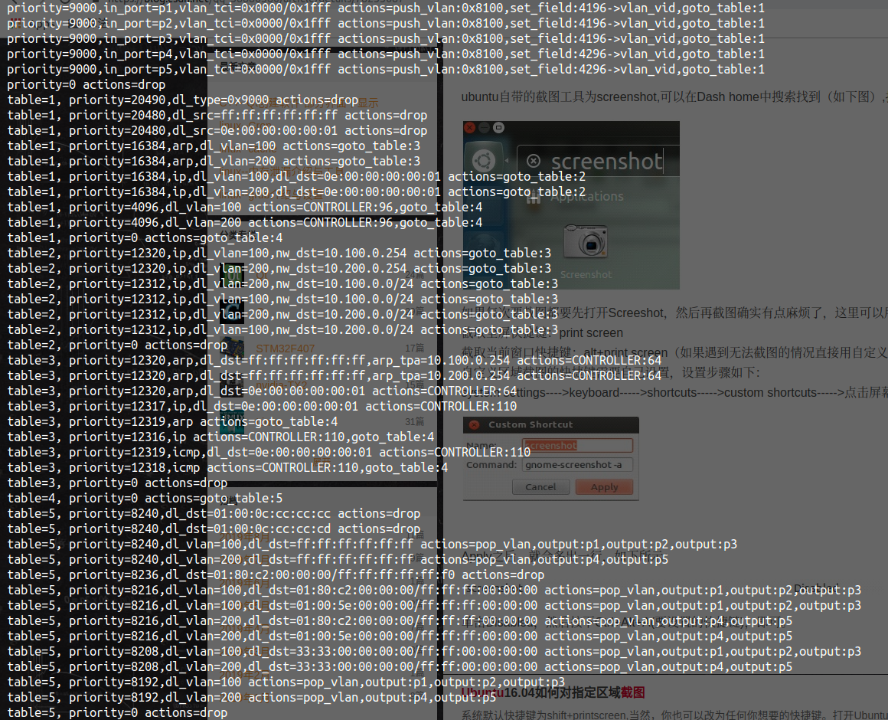

# Route路由实验
## 修改faucet配置
1. *编辑~/workspace/dockeretc/faucet/faucet.yaml*  
```yaml
dps:
    switch-1:
        dp_id: 0x1
        timeout: 3600
        arp_neighbor_timeout: 3600
        interfaces:
            1:
                native_vlan: 100
            2:
                native_vlan: 100
            3:
                native_vlan: 100
            4:
                native_vlan: 200
            5:
                native_vlan: 200
vlans:
    100:
        faucet_vips: ["10.100.0.254/24"]
    200:
        faucet_vips: ["10.200.0.254/24"]
routers:
    router-1:
        vlans: [100, 200]
```

2. *重启faucet容器*  
```terminal
docker restart faucet
```  
3. *通过查看faucet日志确认此时faucet table设置*  
```terminal
lxyustc@lxyustc-TM1701:~/WorkSpace/dockeretc/faucet$ cat faucet.log
Aug 30 09:14:10 faucet.valve INFO     DPID 1 (0x1) switch-1 table ID 0 table config match_types: (('eth_dst', True), ('eth_type', False), ('in_port', False), ('vlan_vid', False)) name: vlan next_tables: ['eth_src'] output: True set_fields: ('vlan_vid',) size: 32 vlan_port_scale: 1.5
Aug 30 09:14:10 faucet.valve INFO     DPID 1 (0x1) switch-1 table ID 1 table config match_types: (('eth_dst', True), ('eth_src', False), ('eth_type', False), ('in_port', False), ('vlan_vid', False)) miss_goto: eth_dst name: eth_src next_tables: ['ipv4_fib', 'vip', 'eth_dst', 'flood'] output: True set_fields: ('vlan_vid', 'eth_dst') size: 32 table_id: 1 vlan_port_scale: 4.1
Aug 30 09:14:10 faucet.valve INFO     DPID 1 (0x1) switch-1 table ID 2 table config dec_ttl: True match_types: (('eth_type', False), ('ipv4_dst', True), ('vlan_vid', False)) name: ipv4_fib next_tables: ['vip', 'eth_dst', 'flood'] output: True set_fields: ('eth_dst', 'eth_src', 'vlan_vid') size: 32 table_id: 2 vlan_port_scale: 3.1
Aug 30 09:14:10 faucet.valve INFO     DPID 1 (0x1) switch-1 table ID 3 table config match_types: (('arp_tpa', False), ('eth_dst', False), ('eth_type', False), ('icmpv6_type', False), ('ip_proto', False)) name: vip next_tables: ['eth_dst', 'flood'] output: True size: 32 table_id: 3
Aug 30 09:14:10 faucet.valve INFO     DPID 1 (0x1) switch-1 table ID 4 table config exact_match: True match_types: (('eth_dst', False), ('vlan_vid', False)) miss_goto: flood name: eth_dst output: True size: 41 table_id: 4 vlan_port_scale: 4.1
Aug 30 09:14:10 faucet.valve INFO     DPID 1 (0x1) switch-1 table ID 5 table config match_types: (('eth_dst', True), ('in_port', False), ('vlan_vid', False)) name: flood output: True size: 32 table_id: 5 vlan_port_scale: 2.1
```  
<p style="text-indent:2em">table id及其对应表名称table name</p>
<table>
    <tr>
        <th>Table ID（表ID）</th>
        <th>Table Name（表名称）</th>
        <th>match_fields(匹配域)</th>
    </tr>
    <tr>
        <td>0</td>
        <td>VLAN</td>
        <td>eth_dst,eth_type,in_port,vlan_id</td>
    </tr>
    <tr>
        <td>1</td>
        <td>ETH_SRC</td>
        <td>eth_dst,eth_src,eth_type,in_port,vlan_id</td>
    </tr>
    <tr>
        <td>2</td>
        <td>IPV4_FIB</td>
        <td>eth_type,piv4_dst,vlan_id</td>
    </tr>
    <tr>
        <td>3</td>
        <td>VIP</td>
        <td>arp_tpa,eth_dst,eth_type,icmpv6,ip_proto</td>
    </tr>
    <tr>
        <td>4</td>
        <td>ETH_DST</td>
        <td>eth_dst,vlan_id</td>
    </tr>
    <tr>
        <td>5</td>
        <td>FLOOD</td>
        <td>eth_dst,in_port,vlan_id</td>
    </tr>
</table>

## 查看此时流表
```terminal
# ./dumps-flows br1  
```  

  
流表内容如下
```terminal
priority=9000,in_port=p1,vlan_tci=0x0000/0x1fff actions=push_vlan:0x8100,set_field:4196->vlan_vid,goto_table:1
priority=9000,in_port=p2,vlan_tci=0x0000/0x1fff actions=push_vlan:0x8100,set_field:4196->vlan_vid,goto_table:1
priority=9000,in_port=p3,vlan_tci=0x0000/0x1fff actions=push_vlan:0x8100,set_field:4196->vlan_vid,goto_table:1
priority=9000,in_port=p4,vlan_tci=0x0000/0x1fff actions=push_vlan:0x8100,set_field:4296->vlan_vid,goto_table:1
priority=9000,in_port=p5,vlan_tci=0x0000/0x1fff actions=push_vlan:0x8100,set_field:4296->vlan_vid,goto_table:1
priority=0 actions=drop
table=1, priority=20490,dl_type=0x9000 actions=drop
table=1, priority=20480,dl_src=ff:ff:ff:ff:ff:ff actions=drop
table=1, priority=20480,dl_src=0e:00:00:00:00:01 actions=drop
table=1, priority=16384,arp,dl_vlan=100 actions=goto_table:3
table=1, priority=16384,arp,dl_vlan=200 actions=goto_table:3
table=1, priority=16384,ip,dl_vlan=100,dl_dst=0e:00:00:00:00:01 actions=goto_table:2
table=1, priority=16384,ip,dl_vlan=200,dl_dst=0e:00:00:00:00:01 actions=goto_table:2
table=1, priority=4096,dl_vlan=100 actions=CONTROLLER:96,goto_table:4
table=1, priority=4096,dl_vlan=200 actions=CONTROLLER:96,goto_table:4
table=1, priority=0 actions=goto_table:4
table=2, priority=12320,ip,dl_vlan=100,nw_dst=10.100.0.254 actions=goto_table:3
table=2, priority=12320,ip,dl_vlan=200,nw_dst=10.200.0.254 actions=goto_table:3
table=2, priority=12312,ip,dl_vlan=200,nw_dst=10.100.0.0/24 actions=goto_table:3
table=2, priority=12312,ip,dl_vlan=100,nw_dst=10.100.0.0/24 actions=goto_table:3
table=2, priority=12312,ip,dl_vlan=200,nw_dst=10.200.0.0/24 actions=goto_table:3
table=2, priority=12312,ip,dl_vlan=100,nw_dst=10.200.0.0/24 actions=goto_table:3
table=2, priority=0 actions=drop
table=3, priority=12320,arp,dl_dst=ff:ff:ff:ff:ff:ff,arp_tpa=10.100.0.254 actions=CONTROLLER:64
table=3, priority=12320,arp,dl_dst=ff:ff:ff:ff:ff:ff,arp_tpa=10.200.0.254 actions=CONTROLLER:64
table=3, priority=12320,arp,dl_dst=0e:00:00:00:00:01 actions=CONTROLLER:64
table=3, priority=12317,ip,dl_dst=0e:00:00:00:00:01 actions=CONTROLLER:110
table=3, priority=12319,arp actions=goto_table:4
table=3, priority=12316,ip actions=CONTROLLER:110,goto_table:4
table=3, priority=12319,icmp,dl_dst=0e:00:00:00:00:01 actions=CONTROLLER:110
table=3, priority=12318,icmp actions=CONTROLLER:110,goto_table:4
table=3, priority=0 actions=drop
table=4, priority=0 actions=goto_table:5
table=5, priority=8240,dl_dst=01:00:0c:cc:cc:cc actions=drop
table=5, priority=8240,dl_dst=01:00:0c:cc:cc:cd actions=drop
table=5, priority=8240,dl_vlan=100,dl_dst=ff:ff:ff:ff:ff:ff actions=pop_vlan,output:p1,output:p2,output:p3
table=5, priority=8240,dl_vlan=200,dl_dst=ff:ff:ff:ff:ff:ff actions=pop_vlan,output:p4,output:p5
table=5, priority=8236,dl_dst=01:80:c2:00:00:00/ff:ff:ff:ff:ff:f0 actions=drop
table=5, priority=8216,dl_vlan=100,dl_dst=01:80:c2:00:00:00/ff:ff:ff:00:00:00 actions=pop_vlan,output:p1,output:p2,output:p3
table=5, priority=8216,dl_vlan=100,dl_dst=01:00:5e:00:00:00/ff:ff:ff:00:00:00 actions=pop_vlan,output:p1,output:p2,output:p3
table=5, priority=8216,dl_vlan=200,dl_dst=01:80:c2:00:00:00/ff:ff:ff:00:00:00 actions=pop_vlan,output:p4,output:p5
table=5, priority=8216,dl_vlan=200,dl_dst=01:00:5e:00:00:00/ff:ff:ff:00:00:00 actions=pop_vlan,output:p4,output:p5
table=5, priority=8208,dl_vlan=100,dl_dst=33:33:00:00:00:00/ff:ff:00:00:00:00 actions=pop_vlan,output:p1,output:p2,output:p3
table=5, priority=8208,dl_vlan=200,dl_dst=33:33:00:00:00:00/ff:ff:00:00:00:00 actions=pop_vlan,output:p4,output:p5
table=5, priority=8192,dl_vlan=100 actions=pop_vlan,output:p1,output:p2,output:p3
table=5, priority=8192,dl_vlan=200 actions=pop_vlan,output:p4,output:p5
table=5, priority=0 actions=drop
```  
可以发现增加了arp协议相关内容如：  
```terminal
table=1, priority=16384,arp,dl_vlan=100 actions=goto_table:3
table=1, priority=16384,arp,dl_vlan=200 actions=goto_table:3
table=3, priority=12320,arp,dl_dst=ff:ff:ff:ff:ff:ff,arp_tpa=10.100.0.254 actions=CONTROLLER:64
table=3, priority=12320,arp,dl_dst=ff:ff:ff:ff:ff:ff,arp_tpa=10.200.0.254 actions=CONTROLLER:64
table=3, priority=12320,arp,dl_dst=0e:00:00:00:00:01 actions=CONTROLLER:64
table=3, priority=12319,arp actions=goto_table:4
```  
此外增加了ip协议相关内容
```terminal
table=1, priority=16384,ip,dl_vlan=100,dl_dst=0e:00:00:00:00:01 actions=goto_table:2
table=1, priority=16384,ip,dl_vlan=200,dl_dst=0e:00:00:00:00:01 actions=goto_table:2
table=2, priority=12320,ip,dl_vlan=100,nw_dst=10.100.0.254 actions=goto_table:3
table=2, priority=12320,ip,dl_vlan=200,nw_dst=10.200.0.254 actions=goto_table:3
table=2, priority=12312,ip,dl_vlan=200,nw_dst=10.100.0.0/24 actions=goto_table:3
table=2, priority=12312,ip,dl_vlan=100,nw_dst=10.100.0.0/24 actions=goto_table:3
table=2, priority=12312,ip,dl_vlan=200,nw_dst=10.200.0.0/24 actions=goto_table:3
table=2, priority=12312,ip,dl_vlan=100,nw_dst=10.200.0.0/24 actions=goto_table:3
table=3, priority=12317,ip,dl_dst=0e:00:00:00:00:01 actions=CONTROLLER:110
table=3, priority=12316,ip actions=CONTROLLER:110,goto_table:4
```  
还有icmp协议相关内容
```terminal
table=3, priority=12319,icmp,dl_dst=0e:00:00:00:00:01 actions=CONTROLLER:110
table=3, priority=12318,icmp actions=CONTROLLER:110,goto_table:4
```
## Tracing跟踪数据包  
+ **实验条件**  
  +   p1上连接一台假定IP为10.100.0.1的假想机器A；
  +   A发送数据至假定IP为10.200.0.1的假想机器B；
  +   B连接至端口p2上；  
  +   A与B之间未发生过通信；

在实验条件下从A发送数据至B，一般而言会经历如下几步：  
1. *主机A 10.100.0.1发送ARP数据包至网关10.100.0.254；*
2. *路由发送arp响应给主机A 10.100.0.1；*
3. *主机A 10.100.0.1发送IP数据包至主机B 10.200.0.1,通过路由的Ethernet address；*
4. *路由广播ARP数据包至端口p4,p5；*
5. *主机B 10.200.0.1发送ARP响应至路由；*
6. *要么路由向主机B 10.200.0.1发送IP数据包，要么由于包过期10.100.0.1重新发送数据包。*  
   
按照上述步骤，通过ofproto/trace应用跟踪数据包全流程。跟踪之前保存流表：
```terminal
# ./save-flows br1 > saveflows2
```

### Step1.主机向router发送ARP数据包
```terminal
# ovs-appctl ofproto/trace br1 in_port=p1,dl_src=00:01:02:03:04:05,dl_dst=ff:ff:ff:ff:ff:ff,dl_type=0x806,arp_spa=10.100.0.1,arp_tpa=10.100.0.254,arp_sha=00:01:02:03:04:05,arp_tha=ff:ff:ff:ff:ff:ff,arp_op=1 -generate
```
输出如下
```terminal
Flow: arp,in_port=1,vlan_tci=0x0000,dl_src=00:01:02:03:04:05,dl_dst=ff:ff:ff:ff:ff:ff,arp_spa=10.100.0.1,arp_tpa=10.100.0.254,arp_op=1,arp_sha=00:01:02:03:04:05,arp_tha=ff:ff:ff:ff:ff:ff

bridge("br1")
-------------
 0. in_port=1,vlan_tci=0x0000/0x1fff, priority 9000, cookie 0x5adc15c0
    push_vlan:0x8100
    set_field:4196->vlan_vid
    goto_table:1
 1. arp,dl_vlan=100, priority 16384, cookie 0x5adc15c0
    goto_table:3
 3. arp,dl_dst=ff:ff:ff:ff:ff:ff,arp_tpa=10.100.0.254, priority 12320, cookie 0x5adc15c0
    CONTROLLER:64

Final flow: arp,in_port=1,dl_vlan=100,dl_vlan_pcp=0,vlan_tci1=0x0000,dl_src=00:01:02:03:04:05,dl_dst=ff:ff:ff:ff:ff:ff,arp_spa=10.100.0.1,arp_tpa=10.100.0.254,arp_op=1,arp_sha=00:01:02:03:04:05,arp_tha=ff:ff:ff:ff:ff:ff
Megaflow: recirc_id=0,eth,arp,in_port=1,vlan_tci=0x0000/0x1fff,dl_src=00:01:02:03:04:05,dl_dst=ff:ff:ff:ff:ff:ff,arp_spa=10.100.0.1,arp_tpa=10.100.0.254,arp_op=1
Datapath actions: push_vlan(vid=100,pcp=0),userspace(pid=3627324943,controller(reason=1,dont_send=0,continuation=0,recirc_id=1,rule_cookie=0x5adc15c0,controller_id=0,max_len=64))

```
查看faucet日志
```
$ cat faucet.log
Sep 02 01:10:42 faucet.valve INFO     DPID 1 (0x1) switch-1 L2 learned 00:01:02:03:04:05 (L2 type 0x0806, L2 dst ff:ff:ff:ff:ff:ff, L3 src 10.100.0.1, L3 dst 10.100.0.254) Port 1 VLAN 100 (1 hosts total)
Sep 02 01:10:42 faucet.valve INFO     DPID 1 (0x1) switch-1 Adding new route 10.100.0.1/32 via 10.100.0.1 (00:01:02:03:04:05) on VLAN 100
Sep 02 01:10:42 faucet.valve INFO     DPID 1 (0x1) switch-1 Resolve response to 10.100.0.254 from 00:01:02:03:04:05 (L2 type 0x0806, L2 dst ff:ff:ff:ff:ff:ff, L3 src 10.100.0.1, L3 dst 10.100.0.254) Port 1 VLAN 100
```  
从faucet日志中可以看到，本次模拟数据包跟踪后，faucet进行了3件事：
1. *学习了port1的mac地址；*
2. *添加了路由规则，并学习了port1上的主机A的mac地址与IP地址的对应关系；*
3. *响应ARP请求。*

对比命令运行前后的流表
```terminal
# ./diff-flows saveflows2 br1
+table=1 priority=8191,in_port=1,dl_vlan=100,dl_src=00:01:02:03:04:05 hard_timeout=7134 actions=goto_table:4
+table=2 priority=12320,ip,dl_vlan=100,nw_dst=10.100.0.1 actions=set_field:4196->vlan_vid,set_field:0e:00:00:00:00:01->eth_src,set_field:00:01:02:03:04:05->eth_dst,dec_ttl,goto_table:4
+table=2 priority=12320,ip,dl_vlan=200,nw_dst=10.100.0.1 actions=set_field:4196->vlan_vid,set_field:0e:00:00:00:00:01->eth_src,set_field:00:01:02:03:04:05->eth_dst,dec_ttl,goto_table:4
+table=4 priority=8192,dl_vlan=100,dl_dst=00:01:02:03:04:05 idle_timeout=10739 actions=pop_vlan,output:1
```
运行该命令后流表变化如下：
1. Table 1，也即ETH_SRC table中增加规则
   > *in_port=1,dl_vlan=100,dl_src=00:01:02:03:04:05 hard_timeout=7134 actions=goto_table:4*
2. Table 2，也即IPV4_FIB table中增加规则
   > *priority=12320,ip,dl_vlan=100,nw_dst=10.100.0.1 actions=set_field:4196->vlan_vid,set_field:0e:00:00:00:00:01->eth_src,set_field:00:01:02:03:04:05->eth_dst,dec_ttl,goto_table:4*
   > *priority=12320,ip,dl_vlan=200,nw_dst=10.100.0.1 actions=set_field:4196->vlan_vid,set_field:0e:00:00:00:00:01->eth_src,set_field:00:01:02:03:04:05->eth_dst,dec_ttl,goto_table:4*  
   
   上述两条规则对匹配所有目的IP为10.100.0.1的数据包，包括两个VLAN（VLAN 100与VLAN 200），将数据包的vid值设置为4196（即vlan id 100），同时设置数据包的源mac地址与目的mac地址，并减少ttl值。
   > *注：*  
   > *0e:00:00:00:00:01应该为faucet设置的vip 10.100.0.254的mac地址*
3. Table 4，也即ETH_DST table中增加规则
   > *priority=8192,dl_vlan=100,dl_dst=00:01:02:03:04:05 idle_timeout=10739 actions=pop_vlan,output:1*

   添加目的mac为00:01:02:03:04:05的数据包转发至port1规则。

### Step2. Router Sends ARP Reply
通常而言，路由发送的ARP回复在默认情况下会被丢弃,如流表规则展示的那样  
```terminal
table=1, priority=20480,dl_src=0e:00:00:00:00:01 actions=drop
```
需通过包捕获配合tcpdump来获取ARP回复消息信息；
> *注：后续步骤在ovs-sandbox中进行*  
>  - [ ] *可能与ovn相关，需要进一步确认*

设置各个port捕获文件
```terminal
# for i in `seq 1 5`; do ovs-vsctl set interface p${i} options:pcap=p${i}.pcap; done
```
对于p1，重新运行主机发送ARP数据包命令
```terminal
# ovs-appctl ofproto/trace br1 in_port=p1,dl_src=00:01:02:03:04:05,dl_dst=ff:ff:ff:ff:ff:ff,dl_type=0x806,arp_spa=10.100.0.1,arp_tpa=10.100.0.254,arp_sha=00:01:02:03:04:05,arp_tha=ff:ff:ff:ff:ff:ff,arp_op=1 -generate
```
在sandbox文件下出现p1的捕获文件p1.pcap，使用tcpdump查看捕获文件p1.pcap
```terminal
# tcpdump -evvvr sandbox/p1.pcap
reading from file sandbox/p1.pcap, link-type EN10MB (Ethernet)
15:27:47.170997 0e:00:00:00:00:01 (oui Unknown) > 00:01:02:03:04:05 (oui Unknown), ethertype ARP (0x0806), length 60: Ethernet (len 6), IPv4 (len 4), Reply 10.100.0.254 is-at 0e:00:00:00:00:01 (oui Unknown), length 46
```
### Step3. Host Sends IP Packets 主机发送IP包
通过step2，主机A获取了路由Router的mac地址，现在主机A可以通过路由Router的mac地址发送IP数据包了  
输入命令
```terminal
# ovs-appctl ofproto/trace br1 in_port=p1,dl_src=00:01:02:03:04:05,dl_dst=0e:00:00:00:00:01,udp,nw_src=10.100.0.1,nw_dst=10.200.0.1,nw_ttl=64 -generate
```
输出如下
```terminal
Flow: udp,in_port=1,vlan_tci=0x0000,dl_src=00:01:02:03:04:05,dl_dst=0e:00:00:00:00:01,nw_src=10.100.0.1,nw_dst=10.200.0.1,nw_tos=0,nw_ecn=0,nw_ttl=64,tp_src=0,tp_dst=0

bridge("br1")
-------------
 0. in_port=1,vlan_tci=0x0000/0x1fff, priority 9000, cookie 0x5adc15c0
    push_vlan:0x8100
    set_field:4196->vlan_vid
    goto_table:1
 1. ip,dl_vlan=100,dl_dst=0e:00:00:00:00:01, priority 16384, cookie 0x5adc15c0
    goto_table:2
 2. ip,dl_vlan=100,nw_dst=10.200.0.0/24, priority 12312, cookie 0x5adc15c0
    goto_table:3
 3. ip,dl_dst=0e:00:00:00:00:01, priority 12317, cookie 0x5adc15c0
    CONTROLLER:110

Final flow: udp,in_port=1,dl_vlan=100,dl_vlan_pcp=0,vlan_tci1=0x0000,dl_src=00:01:02:03:04:05,dl_dst=0e:00:00:00:00:01,nw_src=10.100.0.1,nw_dst=10.200.0.1,nw_tos=0,nw_ecn=0,nw_ttl=64,tp_src=0,tp_dst=0
Megaflow: recirc_id=0,eth,udp,in_port=1,vlan_tci=0x0000/0x1fff,dl_src=00:01:02:03:04:05,dl_dst=0e:00:00:00:00:01,nw_src=0.0.0.0/1,nw_dst=10.200.0.0/25,nw_frag=no
Datapath actions: push_vlan(vid=100,pcp=0),userspace(pid=0,controller(reason=1,dont_send=0,continuation=0,recirc_id=3,rule_cookie=0x5adc15c0,controller_id=0,max_len=110))
```
在上述输出的第2步中通过Router mac地址发送IP包至网络10.200.0.0/24中；  
在第3步中，由于目前不知道10.200.0.1的mac地址，因此需要将数据包上传给controller控制器。此时faucet也不知10.200.0.1对应的mac地址，此时faucet.log信息如下：
```terminal
Sep 02 07:47:10 faucet.valve INFO     DPID 1 (0x1) switch-1 resolving 10.200.0.1 (1 flows) on VLAN 200
Sep 02 07:47:16 faucet.valve INFO     DPID 1 (0x1) switch-1 resolving 10.200.0.1 retry 2 (last attempt was 5s ago; 1 flows) on VLAN 200
Sep 02 07:47:23 faucet.valve INFO     DPID 1 (0x1) switch-1 resolving 10.200.0.1 retry 3 (last attempt was 6s ago; 1 flows) on VLAN 200
```
表明faucet当前在向ovs请求10.200.0.1的ARP消息

### Step4. Router Broadcasts ARP Request 路由广播ARP地址
查看p4, p5的捕获文件p4.pcap及p5.pcap，可发现路由广播ARP
```terminal
# tcpdump -evvvr sandbox/p4.pcap
reading from file sandbox/p4.pcap, link-type EN10MB (Ethernet)
15:47:10.916508 0e:00:00:00:00:01 (oui Unknown) > Broadcast, ethertype ARP (0x0806), length 60: Ethernet (len 6), IPv4 (len 4), Request who-has 10.200.0.1 tell 10.200.0.254, length 46
15:47:16.818857 0e:00:00:00:00:01 (oui Unknown) > Broadcast, ethertype ARP (0x0806), length 60: Ethernet (len 6), IPv4 (len 4), Request who-has 10.200.0.1 tell 10.200.0.254, length 46
15:47:23.240731 0e:00:00:00:00:01 (oui Unknown) > Broadcast, ethertype ARP (0x0806), length 60: Ethernet (len 6), IPv4 (len 4), Request who-has 10.200.0.1 tell 10.200.0.254, length 46
15:47:35.767759 0e:00:00:00:00:01 (oui Unknown) > Broadcast, ethertype ARP (0x0806), length 60: Ethernet (len 6), IPv4 (len 4), Request who-has 10.200.0.1 tell 10.200.0.254, length 46
15:47:59.257626 0e:00:00:00:00:01 (oui Unknown) > Broadcast, ethertype ARP (0x0806), length 60: Ethernet (len 6), IPv4 (len 4), Request who-has 10.200.0.1 tell 10.200.0.254, length 46
# tcpdump -evvvr sandbox/p5.pcap
15:47:10.916610 0e:00:00:00:00:01 (oui Unknown) > Broadcast, ethertype ARP (0x0806), length 60: Ethernet (len 6), IPv4 (len 4), Request who-has 10.200.0.1 tell 10.200.0.254, length 46
15:47:16.818880 0e:00:00:00:00:01 (oui Unknown) > Broadcast, ethertype ARP (0x0806), length 60: Ethernet (len 6), IPv4 (len 4), Request who-has 10.200.0.1 tell 10.200.0.254, length 46
15:47:23.240756 0e:00:00:00:00:01 (oui Unknown) > Broadcast, ethertype ARP (0x0806), length 60: Ethernet (len 6), IPv4 (len 4), Request who-has 10.200.0.1 tell 10.200.0.254, length 46
15:47:35.767796 0e:00:00:00:00:01 (oui Unknown) > Broadcast, ethertype ARP (0x0806), length 60: Ethernet (len 6), IPv4 (len 4), Request who-has 10.200.0.1 tell 10.200.0.254, length 46
15:47:59.257684 0e:00:00:00:00:01 (oui Unknown) > Broadcast, ethertype ARP (0x0806), length 60: Ethernet (len 6), IPv4 (len 4), Request who-has 10.200.0.1 tell 10.200.0.254, length 46
```
查看p3的捕获文件p3.pcap，可发现p3并未收到ARP广播
```terminal
# tcpdump -evvvr sandbox/p3.pcap
reading from file sandbox/p3.pcap, link-type EN10MB (Ethernet)
```

### Step5. Host B Sends ARP reply 主机B发送ARP回复
主机B向faucet controller发送ARP reply  
输入命令如下：
```terminal
# ovs-appctl ofproto/trace br1 in_port=p4,dl_src=00:10:20:30:40:50,dl_dst=0e:00:00:00:00:01,dl_type=0x806,arp_spa=10.200.0.1,arp_tpa=10.200.0.254,arp_sha=00:10:20:30:40:50,arp_tha=0e:00:00:00:00:01,arp_op=2 -generate
```
命令运行结果如下：
```terminal
Flow: arp,in_port=4,vlan_tci=0x0000,dl_src=00:10:20:30:40:50,dl_dst=0e:00:00:00:00:01,arp_spa=10.200.0.1,arp_tpa=10.200.0.254,arp_op=2,arp_sha=00:10:20:30:40:50,arp_tha=0e:00:00:00:00:01

bridge("br1")
-------------
 0. in_port=4,vlan_tci=0x0000/0x1fff, priority 9000, cookie 0x5adc15c0
    push_vlan:0x8100
    set_field:4296->vlan_vid
    goto_table:1
 1. arp,dl_vlan=200, priority 16384, cookie 0x5adc15c0
    goto_table:3
 3. arp,dl_dst=0e:00:00:00:00:01, priority 12320, cookie 0x5adc15c0
    CONTROLLER:64

Final flow: arp,in_port=4,dl_vlan=200,dl_vlan_pcp=0,vlan_tci1=0x0000,dl_src=00:10:20:30:40:50,dl_dst=0e:00:00:00:00:01,arp_spa=10.200.0.1,arp_tpa=10.200.0.254,arp_op=2,arp_sha=00:10:20:30:40:50,arp_tha=0e:00:00:00:00:01
Megaflow: recirc_id=0,eth,arp,in_port=4,vlan_tci=0x0000/0x1fff,dl_src=00:10:20:30:40:50,dl_dst=0e:00:00:00:00:01,arp_spa=10.200.0.1,arp_tpa=10.200.0.254,arp_op=2
Datapath actions: push_vlan(vid=200,pcp=0),userspace(pid=0,controller(reason=1,dont_send=0,continuation=0,recirc_id=6,rule_cookie=0x5adc15c0,controller_id=0,max_len=64))
```

此时faucet.log信息如下
```terminal
Sep 02 08:29:05 faucet.valve INFO     DPID 1 (0x1) switch-1 L2 learned 00:10:20:30:40:50 (L2 type 0x0806, L2 dst 0e:00:00:00:00:01, L3 src 10.200.0.1, L3 dst 10.200.0.254) Port 4 VLAN 200 (1 hosts total)
```
可发现faucet确实在p2端口上学习了10.200.0.1与00:10:20:30:40:50的对应关系  

再次输入下述指令
```terminal
ovs-appctl ofproto/trace br1 in_port=p1,dl_src=00:01:02:03:04:05,dl_dst=0e:00:00:00:00:01,udp,nw_src=10.100.0.1,nw_dst=10.200.0.1,nw_ttl=64 -generate
```
运行结果如下
```terminal
Flow: udp,in_port=1,vlan_tci=0x0000,dl_src=00:01:02:03:04:05,dl_dst=0e:00:00:00:00:01,nw_src=10.100.0.1,nw_dst=10.200.0.1,nw_tos=0,nw_ecn=0,nw_ttl=64,tp_src=0,tp_dst=0

bridge("br1")
-------------
 0. in_port=1,vlan_tci=0x0000/0x1fff, priority 9000, cookie 0x5adc15c0
    push_vlan:0x8100
    set_field:4196->vlan_vid
    goto_table:1
 1. ip,dl_vlan=100,dl_dst=0e:00:00:00:00:01, priority 16384, cookie 0x5adc15c0
    goto_table:2
 2. ip,dl_vlan=100,nw_dst=10.200.0.0/24, priority 12312, cookie 0x5adc15c0
    goto_table:3
 3. ip,dl_dst=0e:00:00:00:00:01, priority 12317, cookie 0x5adc15c0
    CONTROLLER:110

Final flow: udp,in_port=1,dl_vlan=100,dl_vlan_pcp=0,vlan_tci1=0x0000,dl_src=00:01:02:03:04:05,dl_dst=0e:00:00:00:00:01,nw_src=10.100.0.1,nw_dst=10.200.0.1,nw_tos=0,nw_ecn=0,nw_ttl=64,tp_src=0,tp_dst=0
Megaflow: recirc_id=0,eth,udp,in_port=1,vlan_tci=0x0000/0x1fff,dl_src=00:01:02:03:04:05,dl_dst=0e:00:00:00:00:01,nw_src=0.0.0.0/1,nw_dst=10.200.0.0/25,nw_frag=no
Datapath actions: push_vlan(vid=100,pcp=0),userspace(pid=0,controller(reason=1,dont_send=0,continuation=0,recirc_id=8,rule_cookie=0x5adc15c0,controller_id=0,max_len=110))
```
此时faucet.log日志如下：
```terminal
Sep 02 08:39:21 faucet.valve INFO     DPID 1 (0x1) switch-1 Adding new route 10.200.0.1/32 via 10.200.0.1 (00:10:20:30:40:50) on VLAN 200
Sep 02 08:39:21 faucet.valve INFO     DPID 1 (0x1) switch-1 resolving 10.200.0.1 (1 flows) on VLAN 200
```
可以发现faucet已添加10.200.0.1的解析记录，查看此时流表并与原始流表比对
```terminal
. /root/diff-flows ~/saveflows2 br1
+table=1 priority=8191,in_port=4,dl_vlan=200,dl_src=00:10:20:30:40:50 hard_timeout=7184 actions=goto_table:4
+table=1 priority=8191,in_port=1,dl_vlan=100,dl_src=00:01:02:03:04:05 hard_timeout=7134 actions=goto_table:4
+table=2 priority=12320,ip,dl_vlan=100,nw_dst=10.100.0.1 actions=set_field:4196->vlan_vid,set_field:0e:00:00:00:00:01->eth_src,set_field:00:01:02:03:04:05->eth_dst,dec_ttl,goto_table:4
+table=2 priority=12320,ip,dl_vlan=200,nw_dst=10.100.0.1 actions=set_field:4196->vlan_vid,set_field:0e:00:00:00:00:01->eth_src,set_field:00:01:02:03:04:05->eth_dst,dec_ttl,goto_table:4
+table=2 priority=12320,ip,dl_vlan=200,nw_dst=10.200.0.1 actions=set_field:4296->vlan_vid,set_field:0e:00:00:00:00:01->eth_src,set_field:00:10:20:30:40:50->eth_dst,dec_ttl,goto_table:4
+table=2 priority=12320,ip,dl_vlan=100,nw_dst=10.200.0.1 actions=set_field:4296->vlan_vid,set_field:0e:00:00:00:00:01->eth_src,set_field:00:10:20:30:40:50->eth_dst,dec_ttl,goto_table:4
+table=4 priority=8192,dl_vlan=100,dl_dst=00:01:02:03:04:05 idle_timeout=10739 actions=pop_vlan,output:1
+table=4 priority=8192,dl_vlan=200,dl_dst=00:10:20:30:40:50 idle_timeout=10789 actions=pop_vlan,output:4
```

### Step 6. IP Packet Delivery IP数据包传递
在第6步实验时有两种情况：
1. Faucet 路由缓存触发ARP解析的IP数据包，这样，此时缓存的IP数据包直接发送至目的地，可通过tcpdump与捕获的包缓存来确认。  
   输入命令
   ```terminal
   tcpdump -evvvr sandbox/p4.pcap ip
   ```
   输出如下
   ```terminal
   reading from file sandbox/p4.pcap, link-type EN10MB (Ethernet)
   ```
   说明此时不时情况1，Faucet路由并未缓存触发ARP解析的IP数据包；
2. 重新发送IP数据包，完成IP数据包传输过程。  
   输入命令
   ```terminal
   ovs-appctl ofproto/trace br1 in_port=p1,dl_src=00:01:02:03:04:05,dl_dst=0e:00:00:00:00:01,udp,nw_src=10.100.0.1,nw_dst=10.200.0.1,nw_ttl=64 -generate
   ```
   输出如下
   ```terminal
   Flow: udp,in_port=1,vlan_tci=0x0000,dl_src=00:01:02:03:04:05,dl_dst=0e:00:00:00:00:01,nw_src=10.100.0.1,nw_dst=10.200.0.1,nw_tos=0,nw_ecn=0,nw_ttl=64,tp_src=0,tp_dst=0

   bridge("br1")
   -------------
    1. in_port=1,vlan_tci=0x0000/0x1fff, priority 9000, cookie 0x5adc15c0
       push_vlan:0x8100
       set_field:4196->vlan_vid
       goto_table:1
    2. ip,dl_vlan=100,dl_dst=0e:00:00:00:00:01, priority 16384, cookie 0x5adc15c0
       goto_table:2
    3. ip,dl_vlan=100,nw_dst=10.200.0.1, priority 12320, cookie 0x5adc15c0
       set_field:4296->vlan_vid
       set_field:0e:00:00:00:00:01->eth_src
       set_field:00:10:20:30:40:50->eth_dst
       dec_ttl
       goto_table:4
    4. dl_vlan=200,dl_dst=00:10:20:30:40:50, priority 8192, cookie 0x5adc15c0
       pop_vlan
       output:4

   Final flow: udp,in_port=1,vlan_tci=0x0000,dl_src=0e:00:00:00:00:01,dl_dst=00:10:20:30:40:50,nw_src=10.100.0.1,nw_dst=10.200.0.1,nw_tos=0,nw_ecn=0,nw_ttl=63,tp_src=0,tp_dst=0
   Megaflow: recirc_id=0,eth,ip,in_port=1,vlan_tci=0x0000/0x1fff,dl_src=00:01:02:03:04:05,dl_dst=0e:00:00:00:00:01,nw_src=0.0.0.0/1,nw_dst=10.200.0.1,nw_ttl=64,nw_frag=no
   Datapath actions: set(eth(src=0e:00:00:00:00:01,dst=00:10:20:30:40:50)),set(ipv4(ttl=63)),4
   ```
    通过输出可知，IP 数据包正常完成数据传输

    观察Megaflow
    ```terminal
    Megaflow: recirc_id=0,eth,ip,in_port=1,vlan_tci=0x0000/0x1fff,dl_src=00:01:02:03:04:05,dl_dst=0e:00:00:00:00:01,nw_src=0.0.0.0/1,nw_dst=10.200.0.1,nw_ttl=64,nw_frag=no
    ```
    该Megaflow生成的规则针对源IP地址为0.0.0.0/1目的地址为10.200.0.1，源mac地址为00:01:02:03:04:05，目的mac地址为0e:00:00:00:00:01的一类数据包，这类数据包下次可直接使用Megaflow规则，迅速抵达目的地。